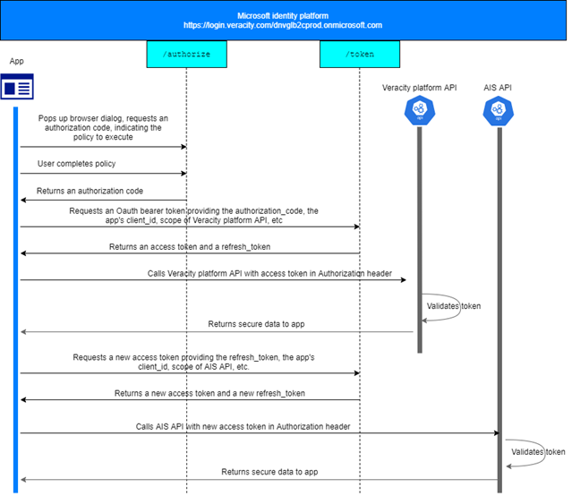
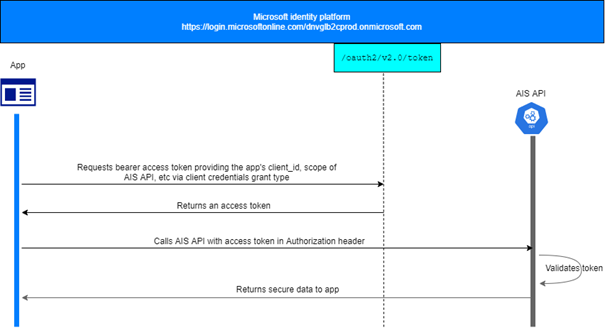

# AIS API INTRODUCTION

## 1.PURPOSE
The purpose of this document is to provide overview and detailed design spec on AIS API that is acting as a proxy api for the whole company.

## 2.INTENDED AUDIENCE
The intended audience of this document is the person who manage, develop or operate the api from DataFactory team. Some part of this document might also be useful for api user to know how to use it.

## 3.DEFINITION
AIS API is an azure function deployed on Azure to provide AIS data and other AIS related data. It is configured as a backend service in API Management, which is used to centrally control the security and access management.

## 4.SECURITY
AIS API is protected by Veracity Identity, so it supports OAuth 2.0 for authorization.
The entire authentication flow looks a bit like this (App behaves as users’ application):

<figure>
	
	<figcaption>Authentication flow.</figcaption>
</figure>

If the application is a backend running job without user interaction involved, then it should use client credentials grant type as below:

<figure>
	
	<figcaption>Backend running job flow.</figcaption>
</figure>


## 5.AUTHORIZATION
Authorization is handled by AIS API function app itself. It will verify the token to check if the token is valid, or if the token is expired, or if the audience and issuer are consistent or not. To acquire a valid token, make sure an application is registered on developer.veracity.com, and it is granted to have access to AIS API with proper scope.

## 6.THROTTLING
AIS API does not allow unlimited number of calls, there are soft limit and hard limit functions built in this function app for throttling. Please configure a record to CallsLimitConfig table in storage account sapdfaisapibindnvwe1 with proper values as below (subscription key is provided by API Management team)

Property|Type|Value
-|-|-
PartitionKey|String|'[endpoint_name]'
RowKey|String|'[subscription_key]'
app_name|String|'[application_name]'
call_hard_limit|Int64|'2500'
call_soft_limit|Int64|'2000'
limit_time_span|String|'[h,d,w]'
status|String|'[active]'

## 7.AIS API SERVICE ENDPOINT
Base URL:
```
# Base URL
https://apim-dev-df-aisapi-we1.azure-api.net/df/ais-api
```

API list:

Endpoint|Description
-|-
vessellist|'Simple function used to obtain key vessel identifiers required for the more detailed endpoints.'
vesseleta|'Historic and future ETA's e.g. where a vessel is due to arrive.'
aispositioncurrent|'Latest AIS position information used to track where vessels currently are.'
aispositionhistory|'Historic AIS for tracking a vessels' location during a given time period.'
Polygonsearch|'Obtain either current or historic AIS positions by an area.'
vesselmovements_v3|'Vessel movement'

## 8.ONBOARDING NEW USER OR APPLICATION
To onboard a new user, the following steps need to be check:
1.	Make sure there is an application registered on developer.veracity.com to represent the client.
2.	Add user’s application with scope (e.g. Position_Read) that is going to call AIS API to “Authorized client applications” section of AIS API.
3.	Request a subscription key from Veracity API Management.
4.	Distribute subscription key to user.
5.	Add a record to CallsLimitConfig table

## 9.KNOWN ISSUE
AIS API is simply to forward request to LLI API with a dedicated account, which means response from AIS API will be the same even if different users or applications are calling it.
