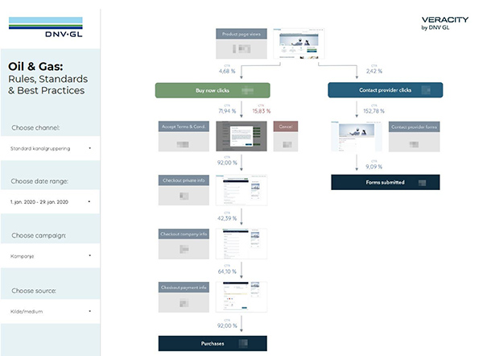
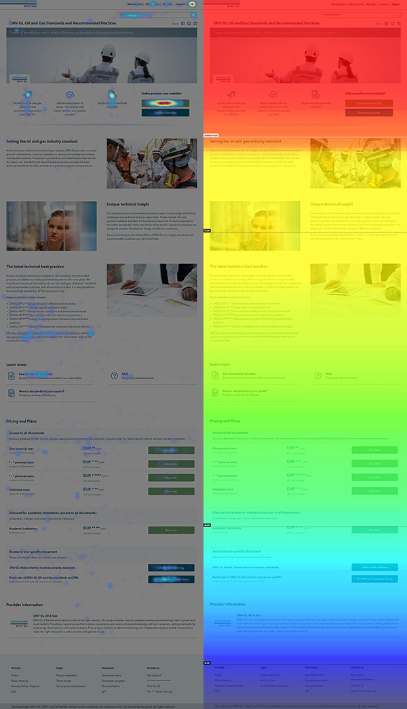
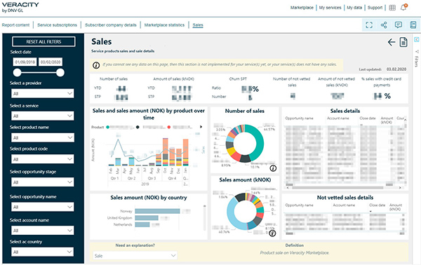

# Get insights on your customers’ sales journey through the Veracity analytics reports.

How many visitors are interested in my services? How many converts to a lead or a digital sale? Which of my marketing efforts paid off? Where are we losing prospects?

As Socrates once put it: ‘The only good is knowledge and the only evil ignorance’. We have put his good saying to heart and truly believe in data and analytics as an important means to understand the digital footprints of the Veracity visitors. 

The advantage of a digital sales channel is the ability for instrumentation to capture granular data. We have taken several measures on the Veracity marketplace to collect anonymized data from visitors, so that you can learn how people consume content and proceed down the sales funnel. This insight can be further used to test assumptions, get more feedback from visitors and further improve how content is offered.

## Visualizing the sales funnel
Behind the scenes, we have put Google Tag Manager and Google Analytics to work. The systems are gathering anonymized web statistics about visitors and their activities, which is subsequently filtered, structured and presented in a visual report. In the report you can see how many:

* Came to your product page
* Contacted you through forms
* Proceeded through the checkout process
* Originated and converted as part of a marketing campaign

In the checkout process you can see the number and percentage of people proceeding to the next step in the funnel. E.g. the number of people accepting or rejecting terms and conditions, proceeded through the personal, company and payment steps, and all the way to a – hopefully – confirmed purchase.

<figure>
	
	<figcaption>Example of a sales funnel</figcaption>
</figure>

## Complementing insights through Hotjar
In addition to the insights provided by the sales funnel reports, we offer complimentary analytics through Hotjar. Hotjar is a user behaviour tracking tool that provides heatmaps on how users clicked, scrolled and moved around on your product page. 

Through recordings of visitor behaviour, it is possible to get an even deeper understanding of how they interact with your content. You can then use the aggregated statistics as a basis for testing assumptions and if there are elements that should be changed. 

Are they not scrolling down to your key value proposition? Consider moving the paragraphs. Not clicking the link to your demo? Consider making it available in the banner area or as a clickable paragraph image.

<figure>
	
	<figcaption>Example from Hotjar</figcaption>
</figure>

## Sales and subscriptions report
For confirmed purchases and usage, you will find these details in the Service Provider Report. The report enables you to easily track the service/services you have on the Marketplace, giving you data analytics through an easy-to-use dashboard. 

With the Service Provider Report you're able to;

* Keep an overview of your service subscriptions (filtering by users, companies, and time)
* See the number of page views over time, or by country, for your Marketplace page 
* Monitor the sales you receive
* Monitor the licences sold vs usage (Beta version) 
* Monitor the user activity (Beta version)

<figure>
	
	<figcaption>Example of a dashboard in the Service Provider Report</figcaption>
</figure>

## Report availability
All of this is available if you have a digital sales-ready service on the marketplace – e.g. a priced service which can be purchases on the marketplace through credit card or invoice.

If you are interested in knowing more, please reach out to Head of Digital Sales and Operations in Veracity Tore Frihagen (<Tore.Frihagen@dnvgl.com>), Product Manager for Analytics Anders Walløe (<Anders.Walloe@dnvgl.com>) or Digital Marcom Manager Joacim Vestvik-Lunde (<Joacim.Vestvik-Lunde@dnvgl.com>).
