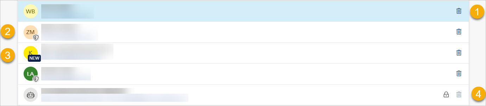
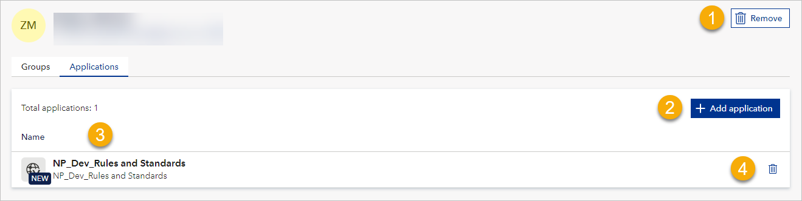
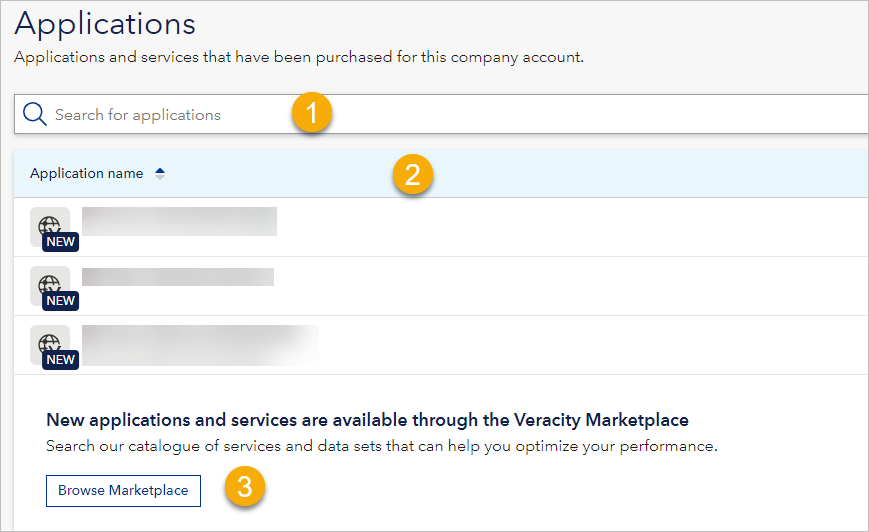
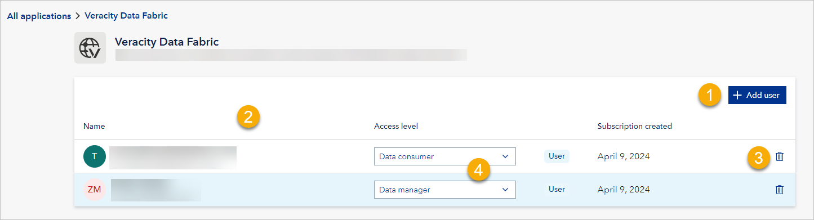
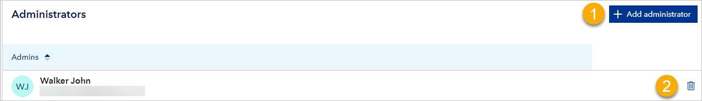

--- 
author: Veracity 
description: Veracity Access Hub Guide 
---

# Veracity Access Hub Guide 

## Overview

[Veracity Access Hub (VAH)](https://accesshub.veracity.com/) lets you manage access to your applications and the apps you are subscribing to in the Veracity ecosystem.

For developer documentation, go [here](../tenantmanagement/tenantmanagement.md).

It is up to you how much access control you delegate to VAH. Veracity Access Hub offers three types of access control:

* Fully managed by Veracity - You configure access rights only in Veracity.
* Hybrid access control – You configure basic access rights in Veracity and the details in an application.
* Complex access models – The application handles access rights, and Veracity shows you the applications, the users who have access to them, and some other general information.

For hybrid and complex access, note that some applications do not support user groups, so you cannot grant bulk access with groups. However, you can still grant access to individual users.

## With or without user groups?
User groups can be beneficial when you have a large user count in your company account. It is a good way to group and administrate application access based on different roles and functions for users.

By default, user groups are disabled in your VAH. However, you can enable them in Settings > User groups > Current settings. If you do this, go to [the version of this guide that includes user groups](accesshub2.md).

## Sample use case

Suppose you are a ship owner with five ships, and you bought an application called Emission Connect to account for your emissions according to the European Emissions Trading System (EU ETS).

Then, to give your users access to Emissions Connect:

1. In Veracity Access Hub, go to your company account.
2. On the **Users** page, select the **Add users** button, and add relevant people to your company account.
3. On the **Application** page, select an application (in this case, Emissions Connect).
4. Select the **Add user** button.
5. Select the user that should get access to the application.
 
Note that for applications that are fully managed by Veracity and use access levels, you set access levels for users when you give them access to the application. Access level defines what the user can do in the application, and each application may have different access levels. 

## Choosing company account

If you have access to more than one company account, when you go to Veracity Access Hub, you must select which account you want to sign in to.

Later, if you want to switch to another company account:

1.  In the top right corner, select your profile picture.

2.  Select **Switch company account**. Select the company account you want to go to.

## Home

The Home page shows you an overview of data related to your company account and offers quick access to popular actions.

## Users

To manage users, go to the **Users** page. You will see a list containing all the users in your company account. To find a user, type their name or email in the search box.

Note that:

-   You see each user's email address and display name as configured in their Veracity account (User Profile > Personal Information > Display name). This does not apply to DNV users.
-   For each user, you see the profile picture they uploaded to their Veracity account, or if they have not uploaded a photo, you see their initials on a random background colour.

Next to a user, you may see the following symbols:

-   If you are an admin, a garbage can icon (1) that, when selected, removes the user from the company account and causes them to lose access to the applications to which they were given access. Note that this does not delete the user's account in Veracity.

-   Shield icon (2) means the user is an administrator.

-   NEW (3) meaning the user has been recently added to the company account.

-   Padlock symbol (4) means you can’t remove this user because it is a machine user (service principal) performing necessary tasks in the background.

<figure>
	
</figure>

### To add user

If you are an admin, to add a user:

1.  In the top right corner, select the **Add** **users** button.

2.  Enter the email address of the person you want to add.

3.  To confirm, select the **Add** button.

Note that:

-   You can add multiple people but separate each email address by tab or space.

-   Users who do not have a Veracity account will get email invitations to create it. It is recommended that they create their Veracity accounts, but this is not strictly necessary for using Veracity Access Hub.

### To manage user’s application subscriptions

If you are an admin, select a user and go to the Applications page where you can:

-   Remove the user from the company account (1).

-  Give the user access to an application (2).

-   See all the applications the user can access (3). If you select an application, you navigate to its details. For details, see
    [Applications.](#_Applications )

-   Revoke user's access to an application (4).

<figure>
	
</figure>

## Applications 

This page shows the applications available to the company account. Here, you can:

-   Search for available applications (1).

-   See available applications (2).

-   Browse Marketplace to find and buy subscriptions to new applications
    (3).

<figure>
	
</figure>

When you select an application, you can:

-   Add users to this application so that they can use it (1).
-   See the users with access to the application (2).
-   Revoke the user's access to an application (3).
-   For an application with access levels, see and set user's access level (4). This is possible only for apps that are fully managed by Veracity and have application levels built in.

Note that some users are service principals meaning they are machines performing necessary background tasks. Because of that, you cannot revoke their access which is indicated by a padlock symbol next to the garbage can icon used for revoking acces.

<figure>
	
</figure>

## Pending requests

This page shows user requests to join the company account. If you are an admin, you can **Approve** or **Reject** them.

Note that you will see this page only if joining your account is set to require admin approval (Settings > Discoverability > Apply for).

## Settings 

### Name
Under Name, you can change the name of your company account.

### Icon
Under Icon, you can change the logo of your company account. The logo appears together with the company name in applications that support company accounts.

### Discoverability
Under Discoverability, you can choose how users can join your company account:

-   Restricted – Users cannot find your company account, but you can invite them to join.  

-   Apply for – Users can see that your company account exists and request to join it.   

-   Automatic – Everyone registered with your email domain is automatically added to the company account. For example, for DNV, everyone with a Veracity account registered for an email in @dnv.com domain would be added to the company account.  

Note that your default discoverability is set to Restricted. If you want to change it, [contact Veracity support](https://support.veracity.com/?loggedin=1) so we can confirm that you own the email domain you wish to use. After confirming your domain ownership, you can change your account's discoverability settings.

If you want to switch to Automatic discoverability:

-   Consider doing it outside regular working hours, for example, at the weekend or night. The reason is that this job may take a long time to complete, and your company account might not work properly until the job is finished.
-   If the change affects a significant number of users (currently,
    500), you will not be able to do this change on your own. Instead, you can apply for help from Veracity. 

### User groups
User groups can be beneficial when you have a large user count in your company account. It is a good way to group and administrate application access based on different roles and functions for users.

If you want to use them, under **Current setting**, select the toggle so that it becomes blue and says 'On'. Then, start using [the version of this guide that includes user groups](accesshub2.md).

#### Administrators
This section shows the administrators of the company account. Here, you can:

-   Add administrator (1).
-   Revoke the administrator’s access from a user (2).

<figure>
	
</figure>