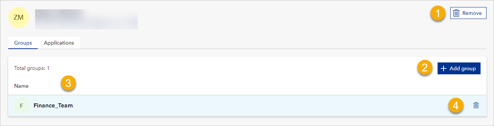
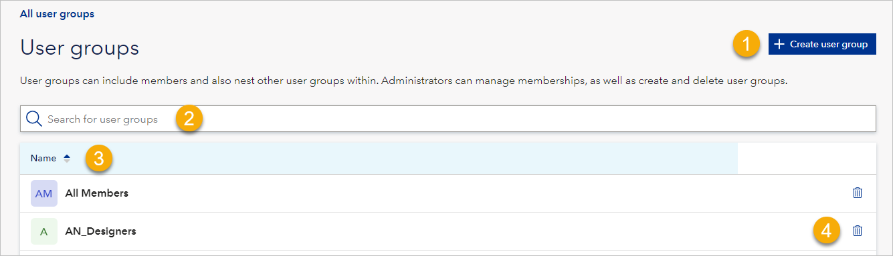
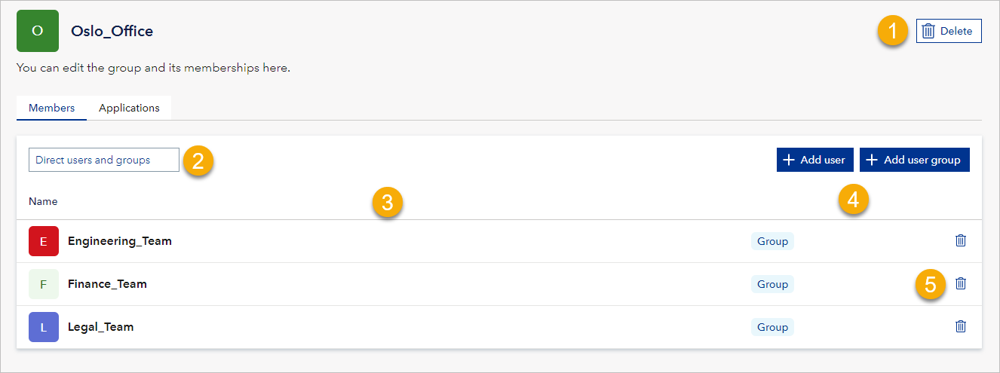
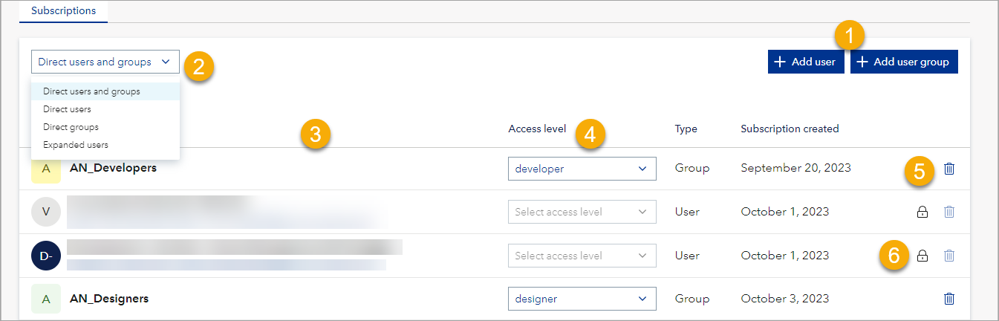
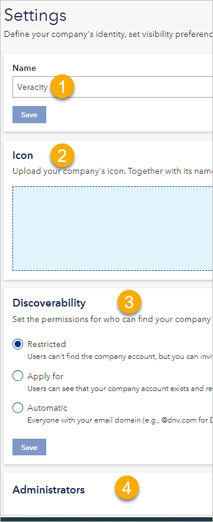

# Veracity Access Hub Guide 

## Overview

Veracity Access Hub (VAH) lets you manage access to your applications
and the apps you are subscribing to in the Veracity ecosystem.

For developer documentation, go here.

It is up to you how much access control you delegate to VAH. Veracity
Access Hub offers three types of access control:

* Fully managed by Veracity 
* You configure access rights only in Veracity.
* Hybrid access control – You configure basic access rights in Veracity and the details in an application.
* Complex access models – The application handles access rights, and Veracity shows you the applications, the users having access to them, and some other general information.

For hybrid and complex access, note that some applications do not
support user groups, so you cannot grant bulk access with groups.
However, you can still grant access to individual users.

## Terminology

This document uses the following terms:

-   User – A person added to a company account.

-   To subscribe to an application – To give access to an application.

-   To unsubscribe from an application – To revoke access to an
    application.

-   To add a user (group) to a user group – To make the user (group) a
    member of the user group. Note that this gives them a subscription
    to the applications from the group they join.

-   To remove a user from a group – To revoke user’s membership in a
    group.

-   To remove a user from the company account – To revoke user’s
    membership in the company account. This does not delete their user
    account.

-   To delete a user group – To make a user group disappear from the
    company account.

## Sample use case

Suppose you are a ship owner with five ships, and you bought an
application called Emission Connect to account for your emissions
according to the European Emissions Trading System (EU ETS).

Then, to give your users access to Emissions Connect:

1.  In Veracity Access Hub, you go to your company account.

2.  In the Users tab &gt; Add users, you add relevant people to your
    company account.

3.  In the User groups tab &gt; Create user group, you create a user
    group and add people to it.

4.  In the User groups tab, you select the user group which opens the
    detailed view of the group.

5.  In the Application subtab, you select the Add application button,
    then under Application you select Emissions Connect, and you confirm
    with the Add button.

Now, the group and everybody who is its member has access to Emissions
Connect.

Note that, for applications that are fully managed by Veracity and use
access levels, you can set access levels for users and groups from your
company account. You do that in the Applications tab.

## Choosing company account

If you have access to more than one company account, when you go to
Veracity Access Hub, you will have to select which company account you
want to sign in to.

Later, if you want to switch to another company account:

1.  In the top right corner, select your profile picture.

2.  Select **Switch company account**.Select the company account you
    want to go to.

## Home

The Home tab shows you an overview of data related to your company
account and offers quick access to popular actions.

## Users

To manage users, go to the **Users** tab and you will see a list
containing all the users in your company account. To find a user, in the
search box, type their name or email.

Note that:

-   For each user, you see their email address and their display name as
    configured in their Veracity account (User Profile &gt; Personal
    Information &gt; Display name). This does not apply to DNV users.

-   For each user, you either see the profile picture they uploaded in
    their Veracity account or, if they have not uploaded a picture, you
    see their initials on a background in random colour.

Next to a user, you may see the following symbols:

-   If you are an admin, a garbage can icon (1) that, when selected,
    removes the user from the company account.

-   Shield icon (2) meaning the user is an administrator.

-   NEW (3) meaning the user has been recently added to the company
    account.

-   Padlock symbol (4) meaning you can’t remove this user because it is
    a machine user (service principal) performing necessary tasks in the
    background.

### 

### To add user

If you are an admin, to add a user:

1.  In the top right corner, select the **Add** **users** button.

2.  Enter the email address of the person you want to add.

3.  To confirm, select the **Add** button.

Note that:

-   You can add multiple people but separate each email address with Tab
    or Space.

-   Users who do not have a Veracity account will get email invitations
    to create it. It is recommended that they create their Veracity
    accounts, but this is not strictly necessary for using Veracity
    Access Hub.

### To manage user’s membership in a group

If you are an admin, to add, edit, or remove user’s membership in a
group, select a user. This will open their details in the Group tab
where you can:

-   Remove the user from the company account (1).

-   Add the user to a group (2).

-   See all the groups the user belongs to (3). If you select a group,
    you navigate to its details. For details, see [User
    groups](#user-groups).

-   Remove the user from a group (4).

### To manage user’s application subscriptions

If you are an admin, select a user and go to the Applications tab where
you can:

-   Remove the user from the company account (1).

-   Subscribe the user to an application (2).

-   See all the applications the user is subscribed to (3). If you
    select an application, you navigate to its details. For details, see
    [Applications.](#_Applications )

-   Unsubscribe the user from an application (4).

### 

### User Groups

User groups are a convenient and scalable way of managing access to
applications. For each user group, you decide which applications it has
access to and who should be a member of the group. Being a member of the
group gives access to the application(s) the group is subscribed to.

In the User group tab, you can:

-   Create a new user group (1).

-   Search for a user group (2).

-   See existing user groups (3).

-   Delete a group (4).

Note that only admins can create, edit, and delete user groups. When
creating user groups, be consistent in their naming. You can see a
[sample naming](#_Naming_user_groups ) convention here.

### 

### To manage applications available for user groups

If you are an admin, select a user group. This will open its details in
the Applications tab where you can:

-   Delete the group (1).

-   Give the group access to an application (2).

-   See all the applications the group has access to (3). If you select
    an application, you navigate to its details. For details, see
    [Applications.](#_Applications )

-   Revoke access to an application from the group (4).

Note that you can subscribe the group only to the applications your
company account has access to. If you need to add a new application
subscription to your account, [go to
Marketplace](https://store.veracity.com/).

### 

### To manage group's membership in a group

If you are an admin, after opening a group in Members tab, you can:

-   Delete the group (1).

-   Change the members view to Direct users and groups or Expanded
    users. For details, [see the section
    below.](#direct-users-and-groups-vs-expanded-users) (2)

-   See all the groups and members that belong to the group (3).

-   Add a user or user group to the group (4).

-   Remove a member (user group or user) from the group (5).

#### Direct users and groups vs expanded users

Groups can be added to other groups, and we call it nesting. To each
group, you can add up to five groups. All nested groups get access to
the applications the top group is subscribed to.

‘Direct users and groups’ were added directly to the group you are
viewing, and they get their application access from this group.

‘Extended users’ means both ‘direct user and groups’ and the users and
groups that have access from the group you are viewing because the group
they belong to was nested in this group.

To illustrate who are expanded users, see the screenshot above where we
have a group called Oslo\_Office and we have added to it the following
three other groups (they are members of the Oslo\_Office).

The groups are:

-   Engineering\_Team

-   Finance\_Team

-   Legal\_Team

Now, imagine that:

-   Not everyone in those groups works from the Oslo office, but
    everyone visits it regularly.

-   The office uses an application for booking meeting rooms and desks
    and we give access to this application to everyone who belongs to
    the Oslo\_Office group.

So, people from the groups above and anyone who happens to be added
directly to the Oslo\_Office group will have access to this app and we
will see all of them under Expanded users.

So, as you see, people in those three groups get access to this
application because their groups were added (as members) to the
Oslo\_Office. Also, anyone who was added directly to the Oslo\_Office
group would have access to the booking app.

####  Naming user groups 

When naming user groups, inform who should belong to them (either by
role or by subscriptions they give) and avoid ambiguous names. To reach
these goals, be consistent in naming groups and consider adding
explanatory descriptions for each group.

Veracity suggests following your own naming convention. However, you
might base it on the following suggestions:

-   The name should describe for whom the group is meant and what they
    can do. For example, 'Finance\_Department', 'Auditors', or
    'MPP\_Admins'. 

-   Avoid using spaces, special characters, and reserved words\* in User
    Group names. Spaces and special characters can cause problems with
    some applications and scripts that interact with Veracity Access
    Hub.  

-   Establish a naming convention across your company account, document
    it, and follow it to ensure consistency and avoid conflicts and
    errors. For example, you can use a format like
    '\[Prefix\]\_\[Name\]\_\[Suffix\]' for all User Groups and define
    what each element means and how to use it. 

\* Reserved words are words that have a specific meaning or function in
Veracity Access Hub or Windows, such as 'Administrator', 'Domain', or
'Everyone'. Using these words in User Group names can cause confusion.
Instead, use underscores (\_) or hyphens (-) to separate words in User
Group names, and avoid using reserved words or abbreviate them. 

## Applications 

This tab shows the applications available to the company account. Here,
you can:

-   Search for available applications (1).

-   See available applications (2).

-   Browse Marketplace to find and buy subscription to new applications
    (3).

When you select an application, you can:

-   Subscribe users and user groups to this application (1)

-   Change the subscriptions' view (2). Direct users or groups have been
    given access to this app directly while Expanded users lists all the
    users with access to the application including those that got it
    from being members of a [nested
    group](#direct-users-and-groups-vs-expanded-users).

-   See the groups and users who subscribed to this application (3).

-   Control Access level that users and groups have in the application
    (4). This is possible only for apps that are fully managed by
    Veracity and have application levels built in.

-   Unsubscribe users and user groups from this application (5).

Note that some users are service principals meaning they are machines
performing necessary background tasks. You cannot unsubscribe them from
the application which is indicated by the padlock symbol (6).

## Pending requests

This tab shows user requests to join the company account. If you are an
admin, you can **Approve** or **Reject** them. Note that you will see
this tab only if joining your account is set to require admin approval.

## Settings 

### Company account settings

Here, you can:

-   Rename your company account (1).

-   Upload your company’s icon (2).

-   Set Discoverability for the account (3). For details, go
    [here](#_Discoverability ).

-   Manage administrators and their permissions (4). For details, go
    [here](#administrators).

#### Discoverability 

This tab shows your company account’s discoverability setting meaning
who can see your company account and join it.  

You can choose one of the following settings: 

-   Restricted – Users cannot find your company account, but you can
    invite them to join.  

-   Apply for – Users can see that your company account exists and
    request to join it.   

-   Automatic – Everyone registered with your email domain is
    automatically added to the company account. For example, for DNV,
    everyone with a Veracity account registered for an email in @dnv.com
    domain would be added to the company account.  

If you want to switch to Automatic discoverability:

-   Consider doing it outside normal working hours, for example, at the
    weekend or at night. The reason is that this job may take a long
    time to complete, and your company account might not work properly
    until the job is finished.

-   If the change affects a significant number of users (currently,
    500), you will not be able to do this change on your own. Instead,
    you can apply for help from Veracity. 

#### Administrators

This section shows the administrators of the company account. Here, you
can:

-   Add administrator (1) and decide on their access level. Note that
    you can only add existing users as administrators.

-   See administrators and access level they have (2).

-   Edit administrator’s access level (3).

-   Revoke administrator’s access from a user (4).

Administrators can have the following types of access:

-   Full access:

    -   Can change the account’s name, icon, and discoverability.

    -   Can grant and revoke administrator’s rights.

    -   Can grant and revoke access to the company account.

    -   Can manage users, their membership in groups, and their
        subscriptions to applications.

    -   Can manage user groups and their subscriptions to applications.

-   Limited access that can be 'Can manage users and groups' and 'Can
    assign application access'. An admin can have one or both types of
    permissions.

    -   For 'Can manage users and groups', admin can:

        -   Grant access to the company account.

        -   Manage users and user groups.

    -   For 'Can assign application access', admin can:

        -   Grant and revoke user and user group access to applications.
