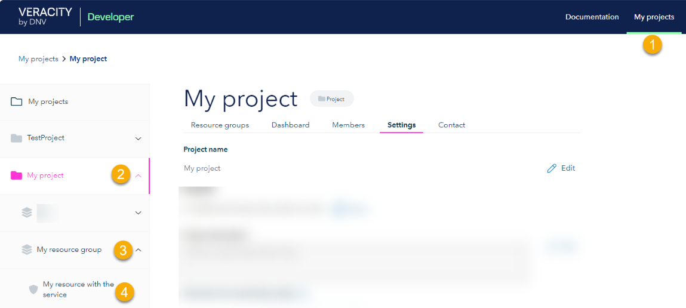
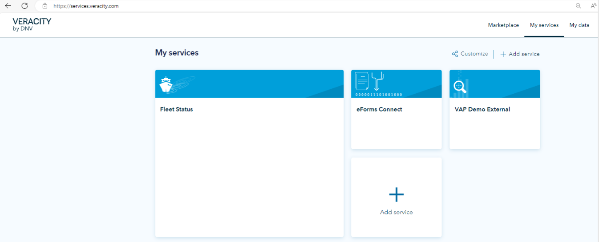

# MyAdmin Administrator Guide
Most of [MyDNVGL admin](https://myadmin.dnv.com/) has become read-only and we have moved most of its functionalities to the Developer portal > My projects where you can manage services and subscriptions. However, some things are still done in MyDNVGL and the details are in the section below. 

For help with creating and managing resources on Developer Portal, go [here](https://developer.veracity.com/docs/section/developerexperience/introduction). 

## Prerequisites 

To manage services and subscriptions, your service must be registered in the Developer portal. If your service is not on the Developer portal, do the following: 

On the Developer portal, create a project and resource group ([see help](https://developer.veracity.com/docs/section/developerexperience/introduction)) and ask the onboarding team at onboarding@veracity.com to import it. 

 

## What you still do in MyDNVGL admin 

Still, use MyDNVGL admin for: 

* Managing Channels and sending notifications (‘Send Message’). Do it in Services > Channels. 
* Editing administrator’s role for a service, mainly for sending notifications and managing channels. Do it in Services > Administrators. 
* Editing the settings for managing read directory access for service principle. Do it in Settings > Administrator. 

## Manage user roles 

To manage user roles for your service: 

1. In the Developer portal > My projects, select your project. 
2. Select the Members tab. 
3. From the dropdown next to the user, select their role. 

Note that each role grants different permissions that are described below its name. Also, users have those permissions for every resource group and resource (service) that is grouped under this project. 

## Manage your service 

To manage your service, sign into your Veracity account: 

1. In the Developer Portal, in the top corner, select Sign in. 
2. Sign into your Veracity account. 

Then, go to your service: 

* In the top menu, select My projects (1). 
* Select the project (2), resource group (3), and resource (4) that represents your service. 

<figure>
	
</figure>

After selecting the resource representing your service, you can use the following tabs: 

* Configure 
* Widgets 
* Advanced  
* Settings  
* History 
* My Users 

## Configure 
Here, for a Veracity service, you can set the service name and URL, decide whether to open the link in a new tab, decide whether to let users find the service in My services ("Service visible in MyServices?"). 

If your resource is an app/API, you can:
* Change application/API name. 
* Select its client application type (none, confidential, public, native, ClientCredentials, Spa). 
* Select "This is an API" that defines the resource as an API and lets you specify its scopes. 
* For an API, manage its scope names and descriptions. 

## Widgets 

Here, for a Veracity service, you can add widgets that would represent your service. They can be links or images (with pictogram and logo). On the [My services page](https://services.veracity.com/), users see the widgets of the services they have access to. They can also rearrange the widgets and add new services. See an example below.

<figure>
	
</figure>

## Advanced 

Here, for a Veracity service, you can set password expiration policy or set access levels for your service. 

Note that the default access level is the access level that every user gets in the app by default. 

If your resource is an app/API, you can manage the API products it contains (delete and add subscriptions to APIs). You can also add and manage client applications authorized yo access your API and its scopes. 

 

## Settings 

Here, for a Veracity service, you can see the Service ID or delete the resource (service). Note that deleting cannot be undone. 

If your resource is an app/API, you can see its ID, Subscription keys, Scopes, Clear this resource cache, and delete the resource. 

## History 

Here, for a Veracity service, you can see the logs for your resource (service). 

## My users 

Here, for a Veracity service, you can manage the users of your resource (service). You can add, edit, and remove them. So, if you add a user, they become subscribed to the service. If you remove them, they are unsubscribed from the service and lose access to it. 

If your service uses access levels, for each user you will see the **Access** column where you can select which access level this user should have. 

Also, if joining your service requires sending an access request, you will see potential users and their access requests in this tab. You can approve their requests (giving them subscription to the service) or reject them. 