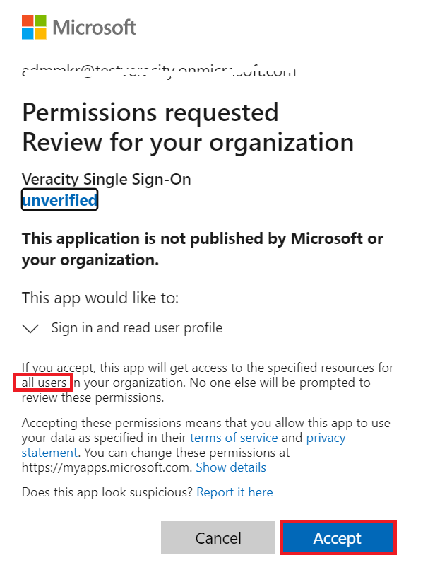
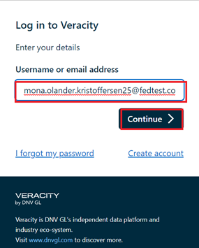
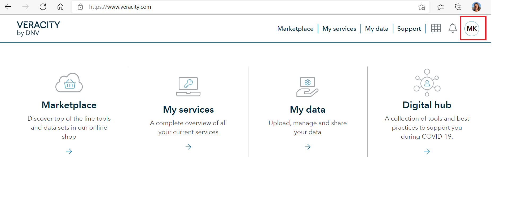

# Setting up Single Sign-On with Veracity

## General information
Veracity offers a Single Sign-On (SSO) solution where you can log in to Veracity with your company accounts making the logon process very smooth.

The setup applies to all users with email address matching the email domain that has been configured for SSO.

The SSO setup is between the Veracity **platform** and your company, thus applies to all services on the Veracity-integrated services.

The following protocols are supported:
- Open ID Connect 1.0
- SAML 2.0

Setup of SSO is free of charge. It will give access to log in with your company accounts to the Veracity platform and your users will have access to the free services on the Veracity platform. If users want to use some of the paid services, they can buy a license for those in the [Veracity Marketplace](https://store.veracity.com).

## Identity Providers other than Azure AD

If you use an Identity Provider other than Azure AD, please send a request for SSO to support@veracity.com with the following information:

- Name of **email domain(s**) where the SSO should be implemented (example: @dnv.com)
- What **Identity Provider** you have (example: Ping Idenity, ADFS) and what **protocol** will be used (OpenID Connect 1.0 or SAML 2.0)
- **Metadata URL** for the Identity Provider
- The **name of the claims** sent back in the token to us that contain the following information:
    - First name
    - Last name
    - Email
    - Unique identifier within the federated domain
    - A claim indicating that MFA was done within customer company (optional)
    

## Azure AD
We implement SSO by using the Open ID Connect 1.0 protocol, and all configuration is pre-configured by installing the **Veracity Single Sign-On** app from **Azure AD App Gallery**.

### Implementation
1. Log in to the Azure Portal with an account in your Azure AD that has the **Application administrator** or **Global administrator** role (this is required to do Admin Consent of the application that configures the SSO with Veracity).
2. Go to **Azure Active Directory** -> **Enterprise applications** and click on **New application**
3. **CHECK**: Find the app called **Veracity Single Sign-On** and click on **Sign up for Veracity Single Sign-On**
4. You will see a picture similar to the one below.
    - What you consent to is that this app is allowed to sign user in and read profile data for the signed-in user. This is necessary for Veracity to get back necessary data on which user is logging in.
    - Handling of the profile data is controlled by the [Veracity Terms of use](https://id.veracity.com/terms-of-use "Veracity Terms of use") and [Privacy statement](https://services.veracity.com/PrivacyStatement "Veracity Privacy statement") which all users must personally accept before they can use the Veracity platform.
    - When you click **Accept**, an app will be installed in your **Enterprise applications** blade in your Azure AD with the name **Veracity Single Sign-On**. This is the app that controls the trust relationship between Veracity and your Azure AD. In order to remove the admin consent that was granted above, you can just delete this app.
     - Make sure the message states **all users** and then click **Accept**:

        

5. Once the previous steps are done, you will be redirected to a page where we will gather more information from you and also perform an analysis of your (if any) existing user base in Veracity. The main steps are the following:
    - You will be asked to input the email domain(s) for which you want the SSO to be set up
        - Note that these domains must match what is in the **mail** attribute of your users' accounts in Azure AD
    - To prove that you own the domain, you will be asked to register a TXT record in your DNS. The verification of this may take some time.
    - You will be asked to input your company name, technical contact and support contact email addresses.
    - A process will be started to analyze your (if any) existing user base in Veracity. If we find any issues that might not work well with SSO, we will stop the process and contact you for manual cleanup.
    - If no issues are found and the DNS records are verified, you will be able to proceed with the SSO setup. The whole process, after clicking the **Submit** button, should take 5-10mins.

## Verification
When the SSO is set up, you can verify that it works as follows:

1. Re-start your browser (to make sure you can log in with an ordinary account and not your admin account) and go to the Veracity Home page [https://www.veracity.com](https://www.veracity.com)
2. Press **Log in** in the upper right corner:
    
2. Specify the email address of your ordinary account and click **Continue**:

    
3. You should now be redirected to your Identity Provider and be authenticated there.
4. If you have never logged on to Veracity before, you will see an enrollment page where you need to specify your country and thereafter accept terms of use. This step is required for all users logging in to Veracity for the first time:

    
    
5. You should then see the logged-in version of the Veracity Home page where your initials are shown in the top right:
    

## Support
If you have any issues with the above, please contact us at [support@veracity.com](mailto:support@veracity.com).

## Provisioning of users
When users log in, they will automatically get a profile in Veracity, there is no need to provision users in advance. We plan to support user provisioning later so that you will be able to upload users in advance and manage their permissions. This will be implemented through an API endpoint that will support the SCIM protocol.