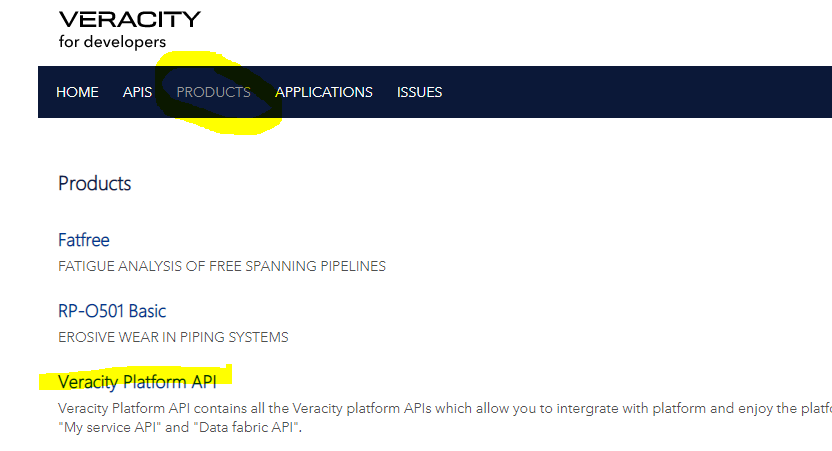

# Veracity Api Portal
Visit the Veracity API Portal: https://api-portal.veracity.com/
If you already have a user from before, please click directly at "Sign In". 

## New users
1. In case you are not registered from before , please click at "Sign Up".  You will then be navigated to a page where you can either sign in or register a new user

<figure>
	
	<figcaption>Sign up for Veracity</figcaption>
</figure>

2. You will shortly receive an email to complete the registration. Follow the process.

3. After registration is complete, please navigate back to https://api-portal.veracity.com/ and sign in with the newly created user.

4. Select "PRODUCTS" option in menu 

<figure>
	
	<figcaption>Sign up for Veracity</figcaption>
</figure>

5. Select **Veracity Platform API**. This api contains all the Veracity platform APIs which allow you to integrate with platform and enjoy the platform features by calling related API.
6. Select Subscribe
7. After subscription, your API Keys should be visible (Primary & Secondary).

## Browse api  and "try it"
1. Select “APIS” in the top-menu
2. Select desired api: 
 - Ingest events:  [Data Fabric IoT Event Broker Ingest API](https://api-portal.veracity.com/docs/services/DataFabric-IoTEventBrokerIngestAPI)
 - Query events [Data Fabric IoT Event Broker Query API](https://api-portal.veracity.com/docs/services/DataFabric-IoTEventBrokerQueryAPI)
 - Query sensor-data: [Data Fabric IoT Time Series Query API V2](https://api-portal.veracity.com/docs/services/DataFabric-IoT-TimeSeriesAPI-V2) 
 
4. Group the endpoint in the api by selecting the "group" button (top left menu).
5. Go into any API endpoint and click at the button "Try it".
6. Now you should see your Ocp-Apim-Subscription-Key on the page
7.  On the same page, you can authenticate yourself to obtain an Access Token. To do so, select
Authorization Code in the menu of B2C PROD Oauth – V2 Endpoint.
<figure>
	
	<figcaption>Authentication</figcaption>
</figure>
8. If your user has access to assets in veracity IoT, it should now be possible to make requests from the API portal. Just make desired 
changes to the Request Body and click at Send on bottom of page. 
 

