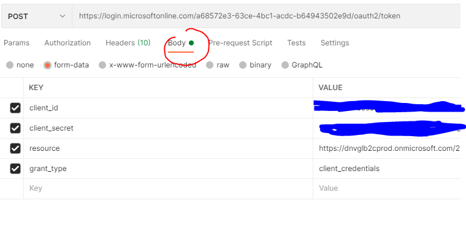

# How to authenticate

There are two ways of making requests to the Veracity Iot & Events API endpoints:
* You can request as a user through using B2C authentication, or
* as application using client credentials (i.e. from Postman or application) 

When you request the endpoints as user, then your personal token and API Key are being used. On the other hand, when you make requests as application then application token and API key are being used.


## Application client
The following credentials will be sent in a separate encrypted email
- client_id: will be sent in a separate encrypted email
- client_secret: will be sent in a separate encrypted email
- subscriptionkey 

## Get token
The following example shows how do get token from Postman

<figure>
	
	<figcaption>get token using postman</figcaption>
</figure>

Thereafter click at «Send» and copy the Access Token between the quotes in response.

- IDP auth: https://login.microsoftonline.com/a68572e3-63ce-4bc1-acdc-b64943502e9d/oauth2/token
- resource: https://dnvglb2cprod.onmicrosoft.com/29a8760a-d13a-41ce-998e-0a00c3d948d5
- client_id: will be sent in a separate encrypted email
- client_secret: will be sent in a separate encrypted email
- grant_type: client_credentials

### C# Code example
```cs
async Task<string> GetToken()
{
    var url = "https://login.microsoftonline.com/dnvglb2cprod.onmicrosoft.com/oauth2/token";
    var client_id = "[client id]";
    var client_secret = "[secret]";
    var grant_type = "client_credentials";
    var resource = "https://dnvglb2cprod.onmicrosoft.com/29a8760a-d13a-41ce-998e-0a00c3d948d5";

    var postData = new Dictionary<string, string>
       {
           {"grant_type", grant_type},
           {"client_id", client_id},
           {"client_secret", client_secret},
           {"resource", resource},
       };
    using HttpClient httpClient = new HttpClient();
    httpClient.BaseAddress = new Uri(url);
    HttpRequestMessage request = new HttpRequestMessage(HttpMethod.Post, httpClient.BaseAddress);
    request.Content = new FormUrlEncodedContent(postData);
    HttpResponseMessage authResponse = httpClient.PostAsync(url, new FormUrlEncodedContent(postData)).Result;
    var result = await authResponse.Content.ReadAsStringAsync();
    var token = (string)JToken.Parse(result)["access_token"];
    return token;
}
```
## Use Veracity SDK
When using the SDK, the token handling is done automatically.
