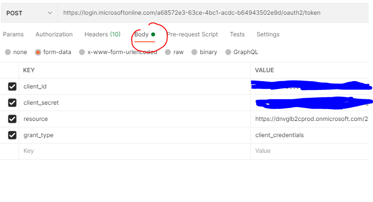
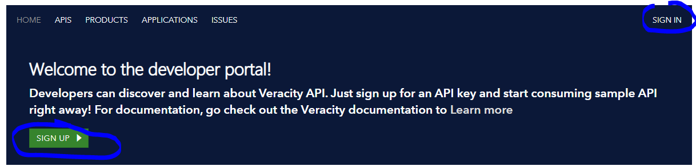
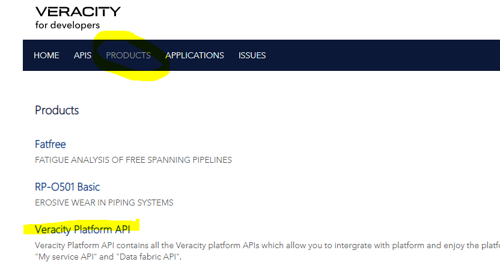
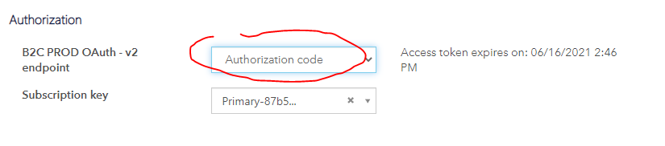

# Authenticate for Veracity IoT Api and Event api

- Events are ingested into Veracity using API and requested using API. 
- Sensor data supports several ingest methods, but query of sensor-data is done using API.
- The apis are accessible from [api-portal](https://api-portal.veracity.com/). 

## API overview
 - Data Fabric IoT Event Ingest API V2 (Ingest events)
 - Data Fabric IoT Event Query V2 (Query API for events)
 - Data Fabric Time Series API V2 (Query API for timeseries data)

 
## How to authenticate
There are two ways of making requests to the Veracity Iot & Events API endpoints:
* You can request as a user through using B2C authentication, or
* as application using client credentials (i.e. from Postman or application) 

When you request the endpoints as user, then your personal token and API Key are being used. On the other hand, when you make requests as application then application token and API key are being used.

## Api request as application (client application credentials)
The rest api can be invoked directly from you application. An SDK is provided for .Net and for Python.

### Get token
For each api call you need to provide a token.

Receive token from IDP

- IDP auth: https://login.microsoftonline.com/a68572e3-63ce-4bc1-acdc-b64943502e9d/oauth2/token
- resource: https://dnvglb2cprod.onmicrosoft.com/29a8760a-d13a-41ce-998e-0a00c3d948d5
- client_id: will be sent in a separate encrypted email
- client_secret: will be sent in a separate encrypted email
- grant_type: client_credentials

The following example shows hot do get token from Postman

<figure>
	
	<figcaption>get token using postman</figcaption>
</figure>

Thereafter click at «Send» and copy the Access Token between the quotes in response.

## SDK
See how this can be done using SDK or using  Microsoft.Identity.Client [click here]( sdk.md)

## API request as user (User credentials - B2C token)

1. Visit the Veracity API Portal: https://api-portal.veracity.com/
2. If you already have a user from before, please click directly at “Sign In”. In case you are not registered from before , please click at “Sign Up”.
3. You will then be navigated to a page where you can either sign in or register a new user

<figure>
	
	<figcaption>Sign up for Veracity</figcaption>
</figure>

4. For new users: You will shortly receive an email to complete the registration. Follow the process.
5. After registration is complete, please navigate back to https://api-portal.veracity.com/ and sign in with the newly created user.
6. Select "PRODUCTS" option in menu 

<figure>
	
	<figcaption>Sign up for Veracity</figcaption>
</figure>

7. Select Veracity Platform API. This api contains all the Veracity platform APIs which allow you to integrate with platform and enjoy the platform features by calling related API, it contains all the legacy "My service API" and "Data fabric API".
8. Select Subscribe
9. After subscription, your API Keys should be visible (Primary & Secondary).
10. Select “APIS” in the menu
11. Select the api:
 - Data Fabric IoT Event Ingest API
 - Data Fabric IoT Event request
 - Data Fabric Time Series API
12. Go into any API endpoint and click at the button “Try it”
13. Now you should see your Ocp-Apim-Subscription-Key on the page
14. When signing in to api portal, you authenticate yourself with username and password. After authentication succeed you 
will see that an access token is obtained. 
15. On the same page you can authenticate yourself to obtain an Access Token. Please select
Authorization Code in the menu of B2C PROD Oauth – V2 Endpoint
<figure>
	
	<figcaption>Authentication</figcaption>
</figure>
16. It should now be possible to make requests from the API portal. Just make desired 
changes to the Request Body and click at Send on bottom of page. 
 

### Use Postman instead of API Portal

You can copy the value of Ocp-Apim-Subscription-Key and Authorization from API Portal. 
Please paste those values in the header of any endpoint. In this case your personal API key and token
are being used from Postman.

### Use Postman or code

4. Click at «Authorization» in the «Request» window and select «Bearer Token» and use the access token from step 2
5. Click at the «Headers» tab. Please fill in the Ocp-Apim-Subscription-Key (Ocp-Apim-Subscription-Key has been sent out in separate email 

