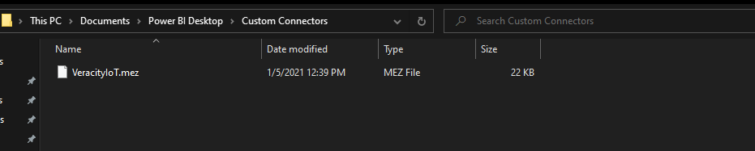
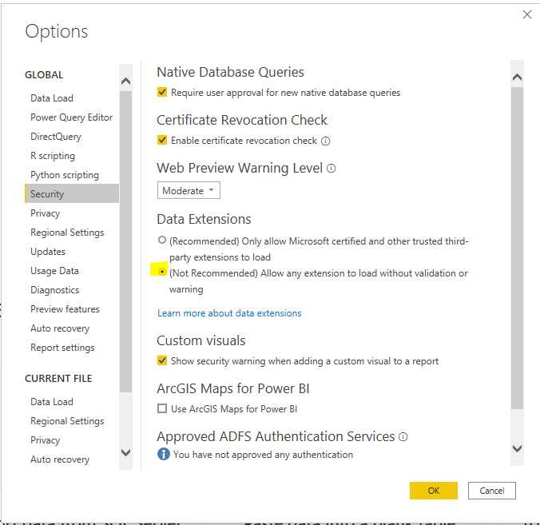
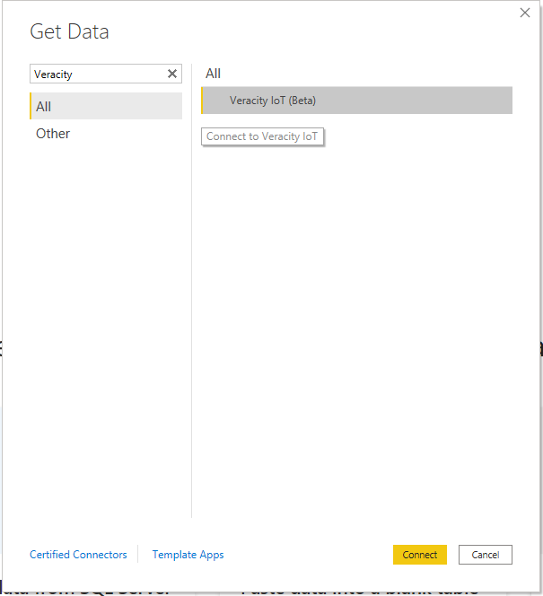
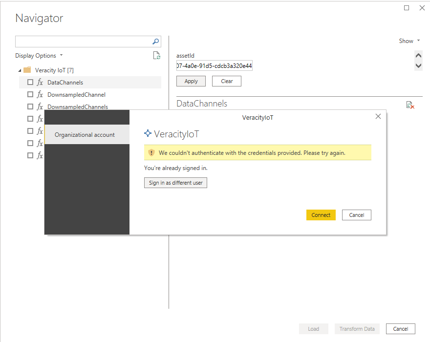
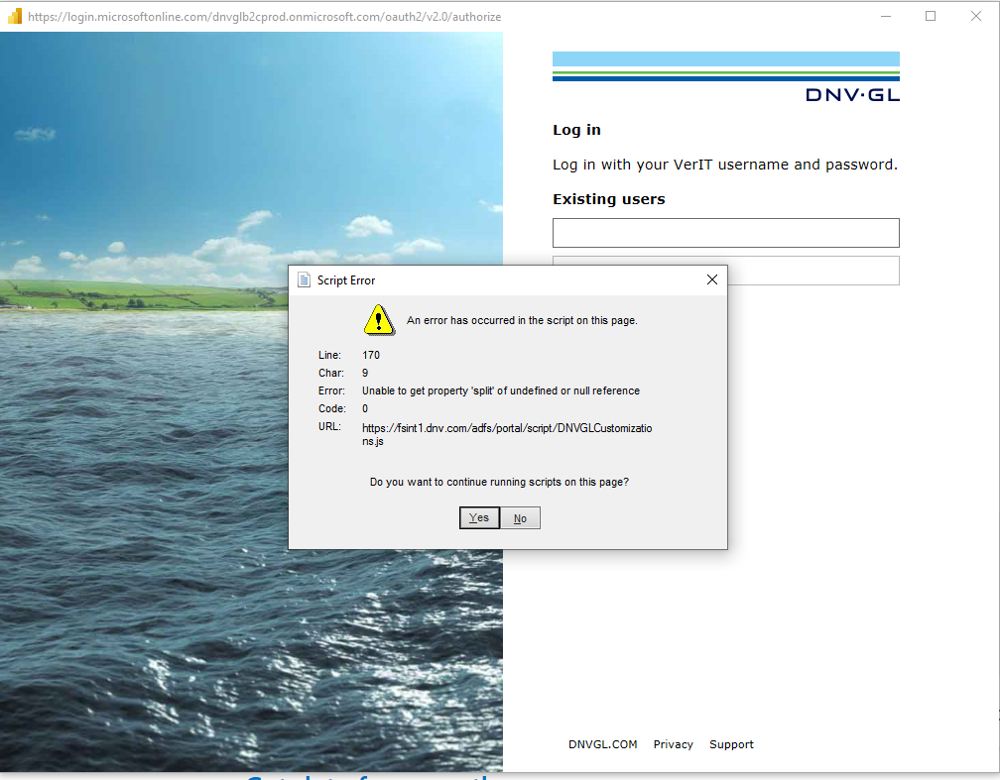

# Veracity IoT Power BI Connector
The Veracity IoT Power BI Connector is a custom data connector for Power BI that enables fetching data on behalf of the user from the Veracity IoT APIs.

## On the IoT API
The Veracity IoT API is a core platform offering on Veracity that services requests for timeseries data on assets and responds

The API is ip-firewalled in higher environments to only service requests inbound from API Management. The API also requires a valid bearer token issued for the user, which it validates and authenticates before serving the user data. The user request for data is scoped down only to the assets / channels the user has access to.

In addition, the API can also service requests from applications. Applications get a bearer token from the IDP (B2C) using client credentials grant. The API does the same validation and authentication checks on these calls as well and will only service data which the application has access to (assets and channels).

## IoT API Authentication
In order to fetch data from the IoT API incoming requests must contain a bearer token. This token is issued by the identity provider (Azure B2C) using one of the supported oauth2 flows on Veracity, either implicit flow, authorization code flow or client credentials.

## Veracity IoT Power BI Connector User Guide

## Installation
### Installing the mez file
The Veracity IoT Power BI Connector will be delivered to you as a .mez file. In order to install it for use with Power BI Desktop you must put the file under `Documents/Power BI Desktop/Custom Connectors`. If the folder(s) do not exist, you must create them.

<figure>
	
	<figcaption>Installing the connector</figcaption>
</figure>

### Enabling custom connectors
Since the iot connector is -- as of yet -- not certified by Microsoft, in order to use you must enable the usage of custom connectors in Power BI Desktop.
In Power BI Desktop, go to `options and settings` -> `options` -> `Security` then under `Data Extensions` make sure `Allow any extension to load without validation or warning` is selected then press `Ok` to persist the change in settings.

<figure>
	
	<figcaption>Enabling the connector</figcaption>
</figure>

## Using the connector
### Finding the connector
Once installed and enabled you can fetch data from the Veracity IoT API by either making a direct m query (see below) or by clicking the `Get Data` ribbon and selecting `Veracity IoT (beta)` under `All` or `Other` or alternatively just searching for Veracity

<figure>
	
	<figcaption>Connecting</figcaption>
</figure>

### Login
Once connected to Veracity IoT you will be presented with a set of functions for importing data. If you are not logged in or it has been 60 minutes since your last login you will be presented with the login screen for the connector. To proceed click `Sign in as different users`. This will take you to the Veracity login where you will be providing your Veracity user credentials in order to proceed.

<figure>
	
	<figcaption>Login</figcaption>
</figure>

You may get a popup warning about a script error, this can be safely ignored (click yes), and is caused by a script issue by the Microsoft login service.
<figure>
	
	<figcaption>Login Credentials</figcaption>
</figure>

### Functions
A short description of the functions available through the connector follows, for full documentation refer to the section below on functions, and you can find more information at our [developer portal](https://developer.veracity.com/docs/section/datafabric/iot/overview).

**[DataChannels](#datachannels)** - Returns the list of data channels that are available for the given asset (parameter) and which you have access to.

**[DownSampledChannel](#downsampledchannel)**  - Returns the timeseries data available for the given channel over the requested time window, which is downsampled (binned) by the rate given (parameter).

**[DownSampledChannels](#downsampledchannels)** - Returns the timeseries data available for the given *channels* over the requested time window, which are downsampled (binned) by the rate given (parameter). Can as input take one or more channels, the return from this function (at the time of writing this guide) is a `Record` type and must be unpacked for the timeseries data.

**[LatestChannel](#latestchannel)** - Returns the latest `N` timeseries available for the given channel, the data is not downsampled.

**[MyAssets](#myassets)** - Returns the list of assets you have access to, and for which timeseries data is available.

**[RawChannel](#rawchannel)** - Returns the timeseries available for the given channel over the requested timewindow, the data is not downsampled.

**[RawChannels](#rawchannels)** - Returns the timeseries available for the given *channels* over the requested timewindow, the data is not downsampled.

## Functions
The functions available in the connector, with detailed input description

### DataChannels
Returns the list of data channels that are available for the given asset, which you have access to, inaccessible channels - due to defined permissions - are filtered out.

Parmeters:
- assetid: text, UUID (GUID) of the asset we are requesting metadata for

Return:
- Table of the metadata (channel list) available for the input parameter asset.

### DownSampledChannel
If high resolution of data is not required or can be traded off for less dense data (and performance benefits) this is the recommended way of getting timeseries. Essentially the timeseries is binned by the duration specified in the parameter and the min/max/average of the data per bin is returned.

Parameters:
- assetid: text, UUID (GUID) of the asset we are requesting timeseries data for.
- channel: text, UUID or ShortId of the channel we are requesting timeseries for.
- offset: datetime, Relative point in time to either start from or end at the requested timeseries data.
- before: logical (true/false), if true then the timeseries will end at the offset, if false the timeseries will start from the offset.
- includeOffsetBoundary: logical (true/false), include data from/to offset inclusive. 
- limit: number, number of data points to take from/to offset.
- includeHeader: logical (true/false), include metadata in response, currently not in use by connector but must be set.
- iso8601durationDownSampleInterval: text, ISO8601 duration value (eg PT30S), the value to bin by.

Return:
- Table of timeseries (timestamp, channel, min, max, average) for the channel over the requested window.

### DownSampledChannels
Batch version of `DownSampledChannel`, allows for requesting data for multiple channels at the same time, recommended for performance if timeseries is needed for more than a few channels.

Parameters:
- assetid: text, UUID (GUID) of the asset we are requesting timeseries data for.
- channels: text, UUIDs or ShortIds, comma separated, of the channel(s) we are requesting timeseries for. Note that all the channels must be specified by UUID or ShortId, cannot combine the two types.
- start: datetime, start timestamp for window
- end: datetime, end timestamp for window
- limit: number, number of datapoints to take from start of window.
- dataChannelIdType: text, enumerated value that can be either `ShortId` or `DataChannelUuid`, must match the type in the `channels` parameter.
- includeStartBoundary: logical, include data from start timestamp inclusive.
- includeEndBoundary: logical, include data up to end timestamp inclusive.
- typeOption: text, enumerated value, can be `Sdd`, `SddData` or `Data`, `Sdd` returns metadata only, `Data` returns timeseries only and `SddData` combines them, for maximum performance consider `Data` only.
- iso8601durationDownSampleInterval: text, ISO8601 duration value (eg PT30S), the value to bin by.
- dimensions: text, optional, reserved for future use.

Return:
- Record containing the timeseries for the requested *channel(s)* over the requested window. Each `DataSet` record in the `tabulardata` inside the response record contains an array per timestamp for average, min, max where the order in the array is the order of the channel as specified in the `dataChannelId` list in the `tabulardata` record.
- An unpacked table of this data is on the roadmap.

### LatestChannel
Returns the `N` latest datapoints for the requested asset and channel.

Parameters:
- assetid: text, UUID (GUID) of the asset we are requesting timeseries data for.
- channel: text, UUID or ShortId of the channel we are requesting timeseries for.
- limit: number, number of data points to take.
- dataChannelIdType: text, enumerated value that can be either `ShortId` or `DataChannelUuid`, must match the type in the `channels` parameter.
- dimensions: text, optional, reserved for future use.

Return:
- Table of timeseries (timestamp, channel, value)

### MyAssets
Returns the set of assets which you have access to, and for which timeseries data is available.

Parameters: None

Return:
- Table of assets and their properties

### RawChannel
Returns the raw (not downsampled) timeseries data for the requested asset and its channel, if high resolution and no aggregation is required this function can be used. For larger windows where downsampling is ok please use the downsample function instead as it performs much better and supports longer windows.

Parameters:
- assetid: text, UUID (GUID) of the asset we are requesting timeseries data for.
- channel: text, UUID or ShortId of the channel we are requesting timeseries for.
- offset: datetime, Relative point in time to either start from or end at the requested timeseries data.
- before: logical (true/false), if true then the timeseries will end at the offset, if false the timeseries will start from the offset.
- includeOffsetBoundary: logical (true/false), include data from/to offset inclusive. 
- limit: number, number of data points to take from/to offset.
- includeHeader: logical (true/false), include metadata in response, currently not in use by connector but must be set.

Returns:
- Timeseries (timestamp, channel, value) for the requested window.

### RawChannels
Bulk version of `RawChannel`, supports multiple channels in the same request, recommended when more raw data is needed for more than a few channels.

Parameters:
- assetid: text, UUID (GUID) of the asset we are requesting timeseries data for.
- channels: text, UUIDs or ShortIds, comma separated, of the channel(s) we are requesting timeseries for. Note that all the channels must be specified by UUID or ShortId, cannot combine the two types.
- start: datetime, start timestamp for window
- end: datetime, end timestamp for window
- limit: number, number of datapoints to take from start of window.
- dataChannelIdType: text, enumerated value that can be either `ShortId` or `DataChannelUuid`, must match the type in the `channels` parameter.
- includeStartBoundary: logical, include data from start timestamp inclusive.
- includeEndBoundary: logical, include data up to end timestamp inclusive.
- typeOption: text, enumerated value, can be `Sdd`, `SddData` or `Data`, `Sdd` returns metadata only, `Data` returns timeseries only and `SddData` combines them, for maximum performance consider `Data` only.
- dimensions: text, optional, reserved for future use.

Return:
- Timeseries of the requested channels and window

