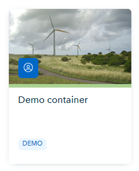
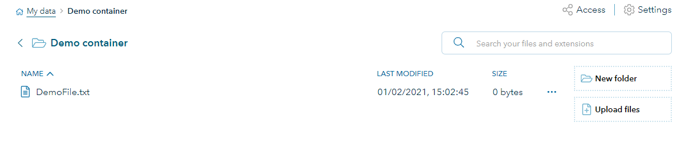
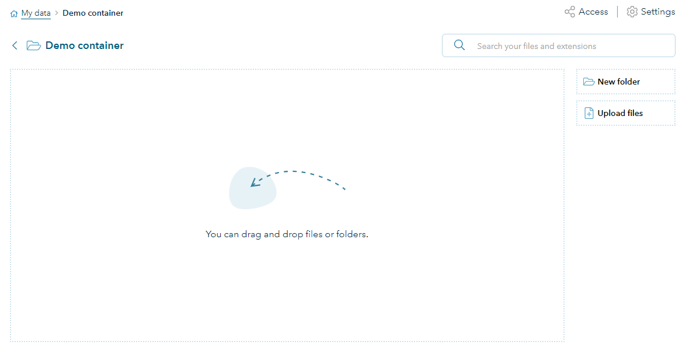
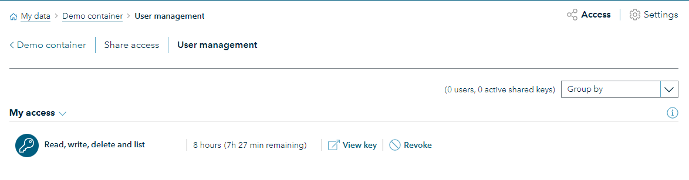
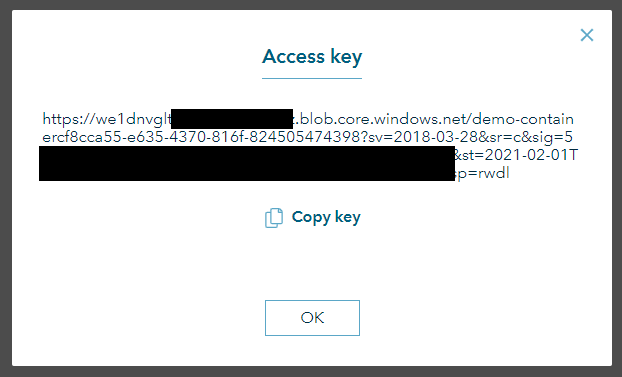
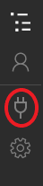
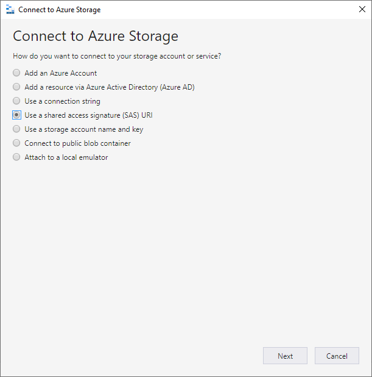
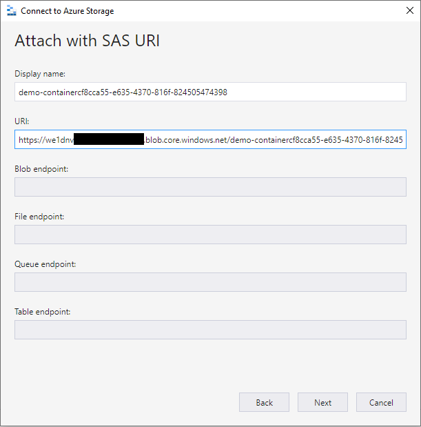
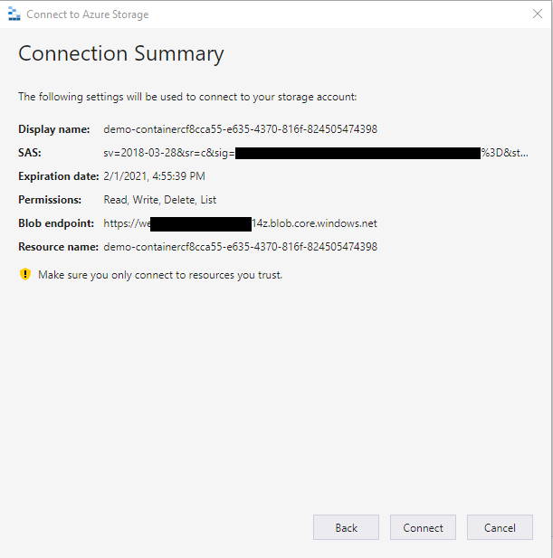

# Access container and upload files
There are various ways of accessing your data container. This page describes a few common ways of accessing a data container and interact with the files in the container.

## My Data - Web access to container
The easiest way to access your container is via your browser (use Chrome for the best experience).

Go to [My Data](https://data.veracity.com/) on Veracity. This should give you an overview of all the containers you have access to.

1. Click on the container you want to access. In the example below this is the `Demo container`.
<figure>
    
    <figcaption>Demo container</figcaption>
</figure>
1. You are now in the container and can see the files in the container. 
<figure>
    
    <figcaption>Container contents</figcaption>
</figure>
1. To download a file, press the file name and the download will start.
2. To make changed to the file, press the `...` at the end of the file line and choose the action you want to perform.
3. On the right you will see a button `Upload files` which can be used to upload files. 
    > **!** If you plan to upload large files (> 100MB) it is recommended to use the [Microsoft Azure Storage Explorer](#microsoft-azure-storage-explorer), especially when your connection can be unstable.

## Veracity Connected
You can also access your Veracity My Data containers via the Veracity Connected app, available for iOS and Android. 

1. Start the Veracity Connected App. 
1. Go to the first tab `My data`.
1. Click on the container you want to access. You will now see the files in the container.
1. To upload new files, press the + icon in the right bottom corner and select the source you want the upload a file from. 


## Get access token
To connect to you storage account via either the [Microsoft Azure Storage Explorer](#microsoft-azure-storage-explorer) or [programmatically](#programmatically-access-container) you need to have an access token, also known as a SAS-token. You can retrieve this either via My Data in your browser or via the Data API.

> **!** Carefully handle the SAS-Token, store it save and do not share to others. Use the access share functionality to safely share your container.

### Browser
1. Go to [My Data](https://data.veracity.com/) and click on the container you want to access. 
<figure>
    
    <figcaption>Demo container</figcaption>
</figure>
2. Click on `Access` in the right corner.
<figure>
    
    <figcaption>Container Contents</figcaption>
</figure>   
3. Click on the tab `User management`.
<figure>
    
    <figcaption>Access page</figcaption>
</figure>
4. Click on `View key` to retrieve the SAS token. 
<figure>
    
    <figcaption>Access key</figcaption>
</figure>
    

### Data API 
The Data API exposes endpoints to retrieve an access token for your container.

1. First you need to retrieve the id of the container. There are various ways of 
    1. Via My Data, go into the container and navigate to the `settings` of the container. Here the `Container ID` is shown.
    1. Via My Data, go into the container. In the URL you will now find a guid, this represents the container id. For example: in the url `https://data.veracity.com/containers/cf8cca55-e635-4370-816f-824505474398/content` the container id is `cf8cca55-e635-4370-816f-824505474398`.
    1. In the Data API, call the endpoint: `GET` `Fetches all storage resources that you can claim keys for` at url `/api/1/resources`. This will return you all the containers you have access to. Find the container with that you want to access. The `id` property is the container id.
 1. Get the access you want to use to access the container. If you have multiple access with different permissions like read, write, list or delete, then you can pick the key accordingly. To get the possible access, call endpoint `GET` `Retrieves a list of Providers that have access to a specified resource.` at url `/api/1/resources/{resourceId}/accesses[?pageNo][&pageSize]`. This will return you a list of all the access to teh container. If you are owner of the container, you will also see the access that other users to the container. In that case make sure filter out your own user id `userId`. Copy the `accessSharingId` from the response.
 1. Call the API `PUT` `Fetch a SAS key to access the storage item shared with you` at url `/api/1/resources/{resourceId}/accesses/{accessId}/key` to get a valid SAS key to access the container. The `resourceId` is the container id you retrieved in step 1. The `accessId` is the `accessSharingId` that you retrieved in step 2.

## Microsoft Azure Storage Explorer
In case you are transferring large files, using the Microsoft Azure Storage Explorer for file transfers is recommended over the file upload functionality in My Data via the browser. The storage explorer application is better in handling possible hick-ups during the file transfer. 

1. Press the `Connect to Azure Storage` button to bring up the connection pane.
<figure>
    
    <figcaption>Connect to storage</figcaption>
</figure>
2. Select `Use a shared access signature (SAS) URI` and press `Next`.
<figure>
    
    <figcaption>Connect to Azure Storage</figcaption>
</figure>    
3. Get a SAS token (see [Get Access Token](#get-access-token)) and paste it in the field `URI`. The `Display name` field will now automatically be populated. Change this in case you want a more readable reference to the container. Press `Next` to continue.
<figure>
    
    <figcaption>Attach with SAS URI</figcaption>
</figure>
4. Now you will see a connection summary. This lists when the key expires, what permissions it has and to which container it connects. Press `Connect` to connect to your container.
<figure>
    
    <figcaption>Connection Summary</figcaption>
</figure>
5. A new tab is opened and you should see the contents of the container. Depending on the permissions of your access token, you can upload, download, delete files and folders here now. 


## Programmatically access container
It is also possible to connect via to your container programmatically. For example in C#, you can use the NuGet packages [Azure.Storage.Blobs](https://www.nuget.org/packages/Azure.Storage.Blobs) or [WindowsAzure.Storage](https://www.nuget.org/packages/WindowsAzure.Storage), where the latter is now marked as deprecated.

For example write to a file in a blob container using `Azure.Storage.Blobs` package: 
```cs
var blobContainerClient = new BlobContainerClient(new UriBuilder("<SAS-Token>").Uri);
var blockBlobClient = blobContainerClient.GetBlockBlobClient("exampleFile.txt");
await using var stream = blockBlobClient.OpenWriteAsync(true);
```

For more details on how to connect to the container and interact with the files, have a look at the [Quick Start](quick-start.md).