# Download my data manually
To download data from Data Fabric manually, there are two ways to do it.
1) Download directly from the Data Fabric website.
2) Download with Azure Storage explorer.

If you have a lot of data/files to download, option 2 will suit you better.

## Download directly from the Data Fabric website
### Individual files
If you do not have any folders, these are the steps needed. Note if you have a lot of files you want to download directly on the root of the container, using the Azure Storage Explorer might suit you better.

1) Navigate to https://data.veracity.com and login with your username and password.
2) Find the container for which you would like to download data. In the list of containers below, the container we will use for this demo is _Test234_.
<figure>
    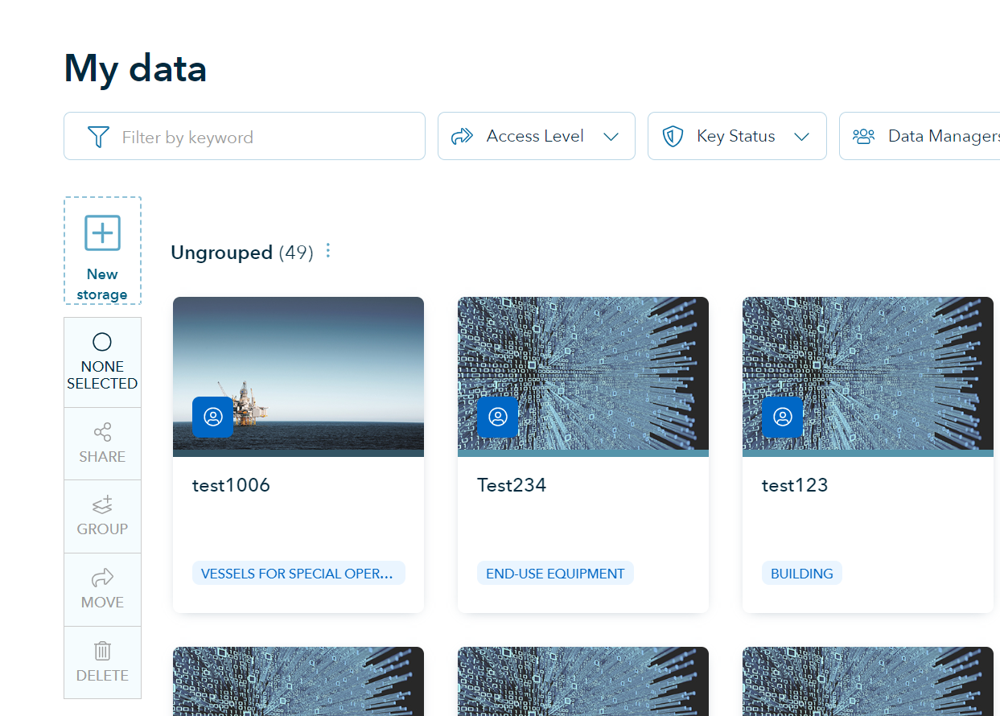
    <figcaption>List of containers</figcaption>
</figure>

3) Click the container, in our case _Test234_ and the contents of the container will be displayed.
<figure>
    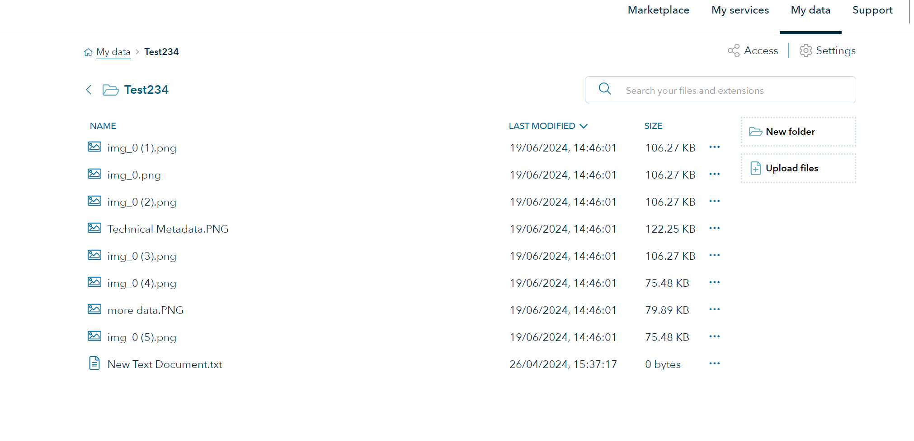
    <figcaption>List of containers</figcaption>
</figure>

4) To download a file, click on the three dots on the right hand side in the list of files
<figure>
    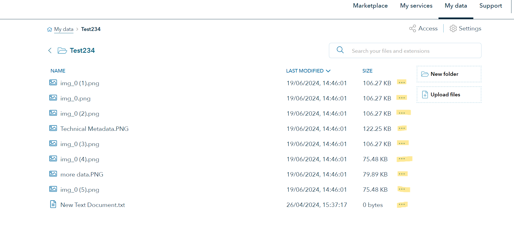
    <figcaption>Three dotted button highlighted in yellow</figcaption>
</figure>

5) By clicking on the three dots a menu opens
<figure>
    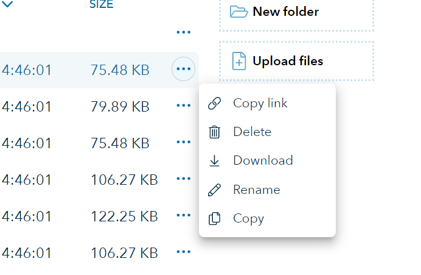
    <figcaption>File menu opens</figcaption>
</figure>

6) Click _Download_ and notice a blue popup in the bottom right corner
<figure>
    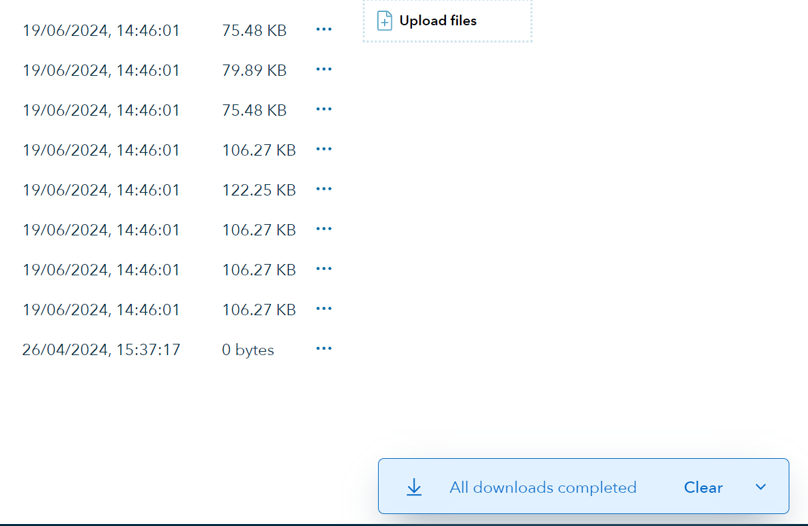
    <figcaption>File menu opens</figcaption>
</figure>

7) If you are using a chromium based browser, the download can be viewed by navigating to the button in the top right side of the browser
<figure>
    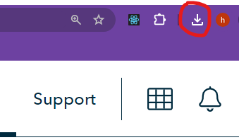
    <figcaption>Browser downloads button</figcaption>
</figure>

8) By clicking the downloads button you can see the file that was downloaded.
<figure>
    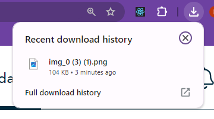
    <figcaption>Browser downloaded files</figcaption>
</figure>

9) To download more files from the list, just repeat the above steps.

### Files in folders
If your files are stored in folders inside the container, then the process is similar to the one above, but you would not need to download each inidividual file, you would instead download the entire folder as shown below.

1) Click on the three dots on the right hand side of the folder to download
<figure>
    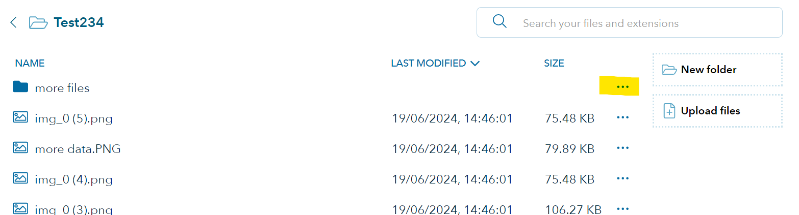
    <figcaption>Three dotted button highlighted in yellow</figcaption>
</figure>

2) A similar menu to those of files are shown
<figure>
    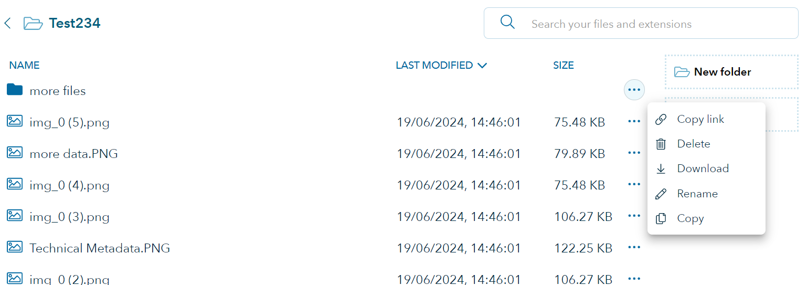
    <figcaption>Folder menu</figcaption>
</figure>

3) Click _Download_ and notice a blue popup in the bottom right corner
<figure>
    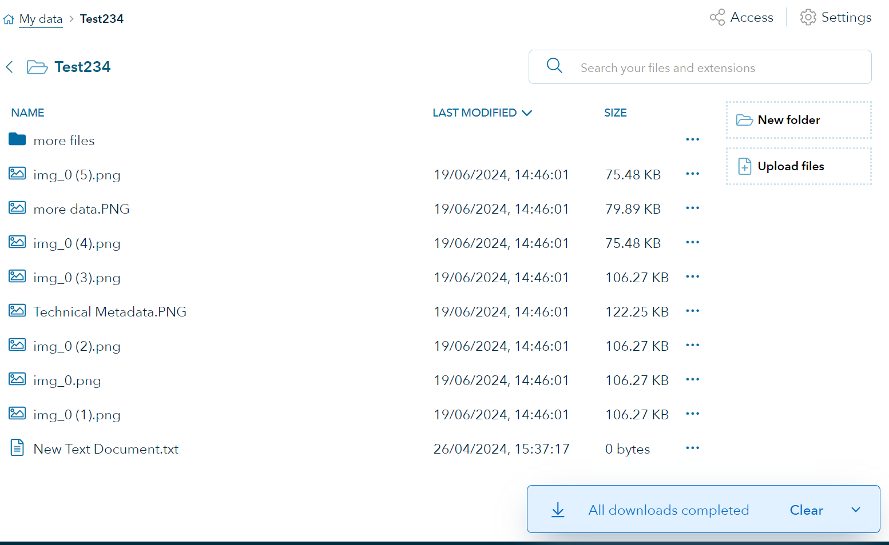
    <figcaption>Folder menu</figcaption>
</figure>

4) If you are using a chromium based browser, the download can be viewed by navigating to the button in the top right side of the browser
<figure>
    
    <figcaption>Browser downloads button</figcaption>
</figure>

5) By clicking the downloads button you can see the file that was downloaded.
<figure>
    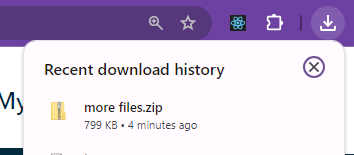
    <figcaption>Browser downloaded files</figcaption>
</figure>

6) __NOTE__ When you are downloading a folder, you will actually download a zip file which contains all the files in the folder. To get your files, click the _Show in folder_ button on the browser download menu.
<figure>
    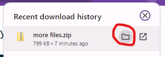
    <figcaption>Show in folder</figcaption>
</figure>

7) This will open the folder on your machine containing the zip file.
<figure>
    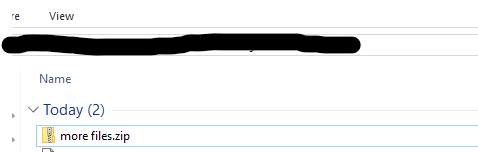
    <figcaption>Show in folder</figcaption>
</figure>

8) Now you can double click the file directly to view the files, or you can extract the files by right clicking on the file and select _Extract All_
<figure>
    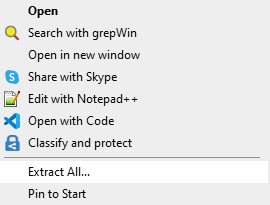
    <figcaption>Extract All</figcaption>
</figure>

## Download using Azure Storage Explorer
As previously mentioned, if you have a lot of files or lots of data, using Azure Storage Explorer is the recommended solution. It involves a few more steps, but it has better support for downloading multiple files.

1) Navigate to https://azure.microsoft.com/en-us/products/storage/storage-explorer and download the Azure Storage Explorer for your operating system. (Windows, macOS and Linux are supported)

2) Install the Azure Storage Explorer

3) Open Azure Storage Explorer, it will look similar to the image below
<figure>
    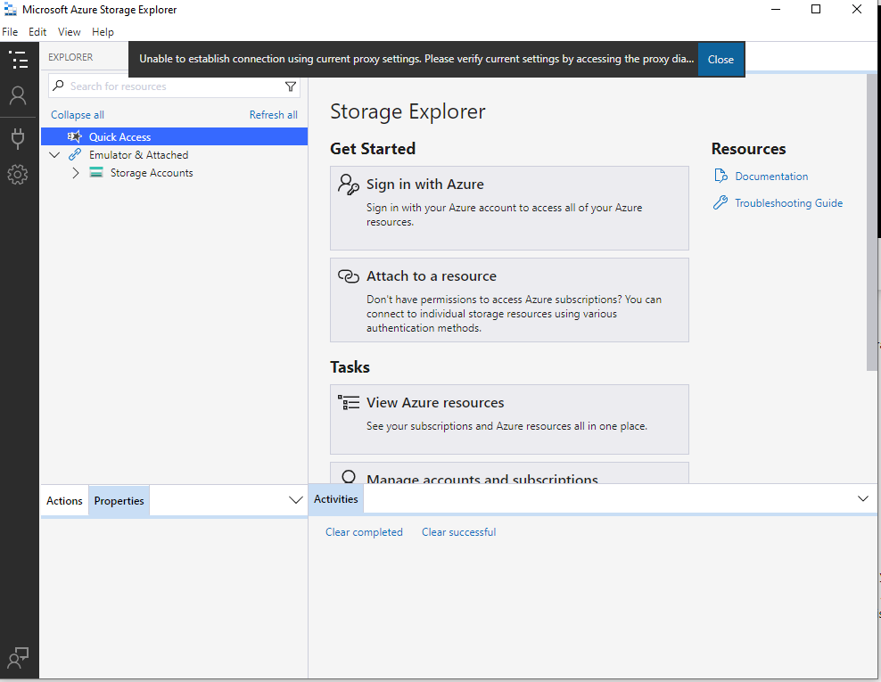
    <figcaption>Open Storage Explorer</figcaption>
</figure>

4) Click _Attach to a resource_
<figure>
    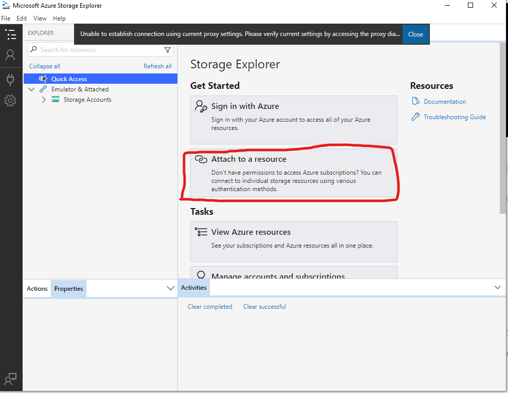
    <figcaption>Attach to a resource</figcaption>
</figure>

5) Select _Blob container_
<figure>
    
    <figcaption>Blob container</figcaption>
</figure>

6) Select _Shared access signature URL (SAS)_
<figure>
    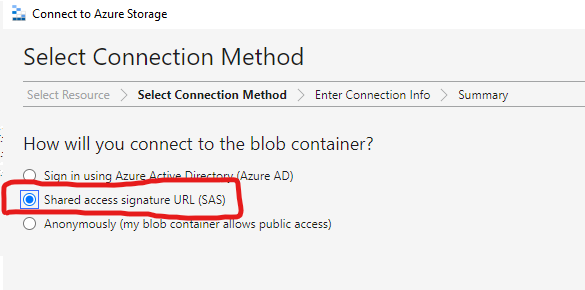
    <figcaption>SAS</figcaption>
</figure>

7) It will display a window with two empty input fields. _Display name_, in which you can enter the name by which you want to refer to the container you want to download the files from. This is just used inside the Azure Storage Explorer app. In the _Blob container SAS URL_ we will enter the SAS key which we will find on the Data Fabric web site.
<figure>
    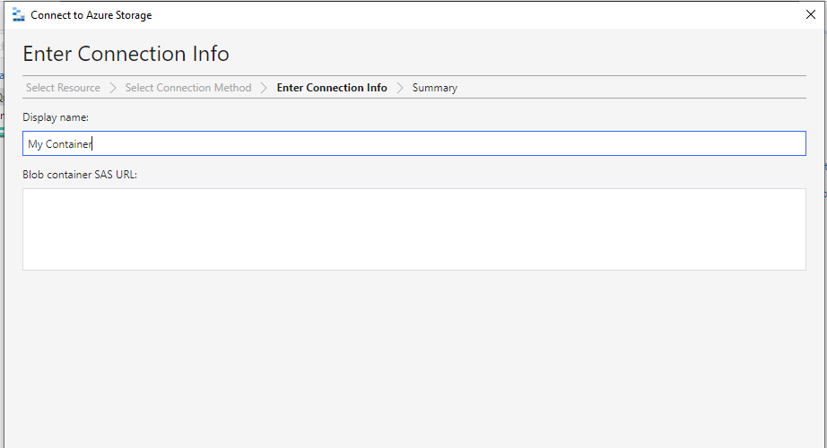
    <figcaption>SAS</figcaption>
</figure>

8) Open https://data.veracity.com and navigate to the container you want to download data from.
<figure>
    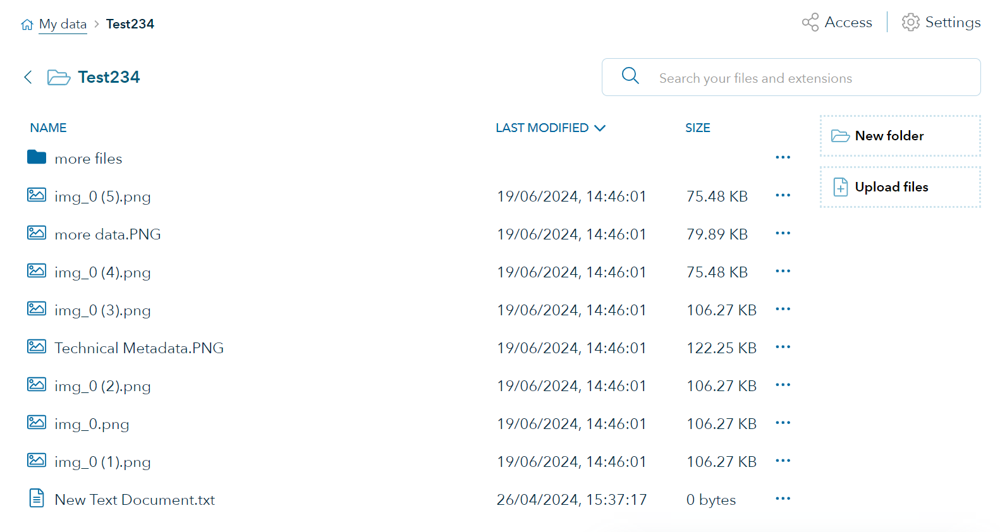
    <figcaption>Data Fabric container to download data from</figcaption>
</figure>

9) Click the _Access_ button in the top right area of the site
<figure>
    
    <figcaption>Data Fabric access button</figcaption>
</figure>

10) Click the _User management_ button
<figure>
    
    <figcaption>Data Fabric user management</figcaption>
</figure>

11) Click the _View key_ button
<figure>
    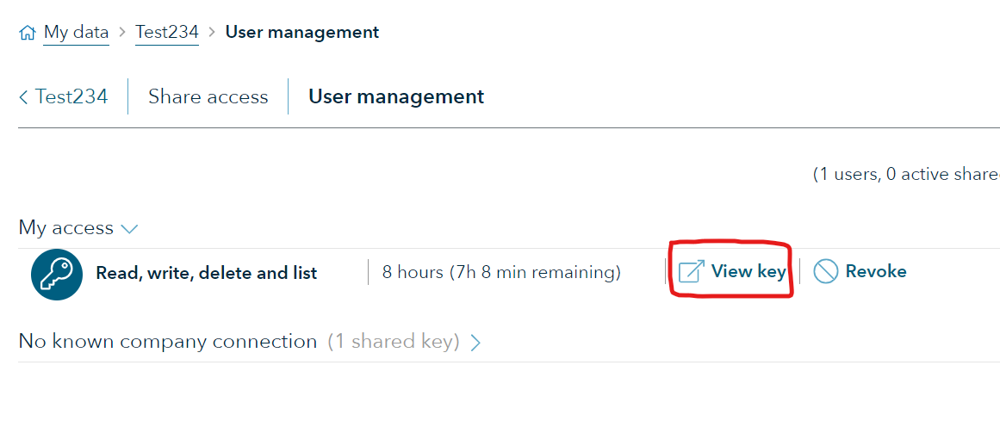
    <figcaption>Data Fabric view key button</figcaption>
</figure>

12) Click the _Copy key_ button
<figure>
    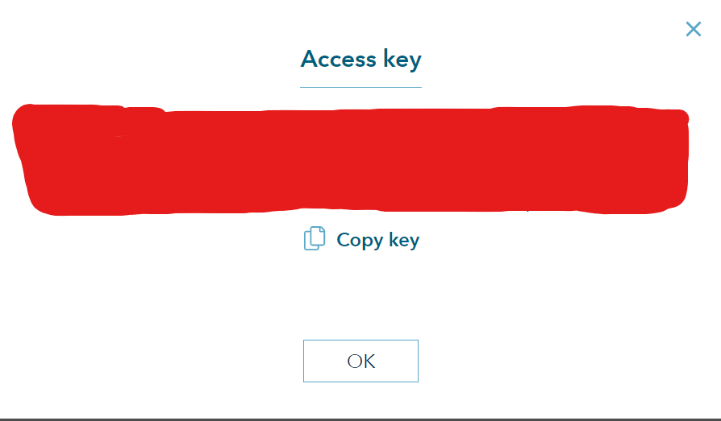
    <figcaption>Data Fabric copy key button</figcaption>
</figure>

13) Navigate back to the Azure Storage Explorer and paste the key, which is on the clipboard, inside the _Blob container SAS url:_ and click _Next_
<figure>
    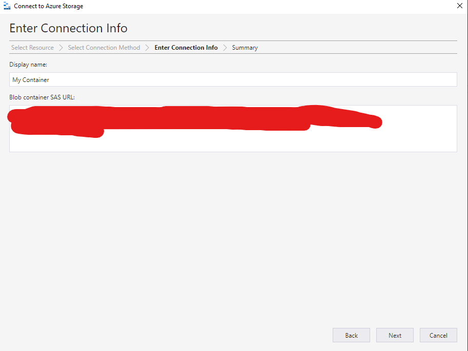
    <figcaption>Storage explorer next button</figcaption>
</figure>

14) Click _Connect_ and then the contents of the container will be displayed in the Storage Explorer.
<figure>
    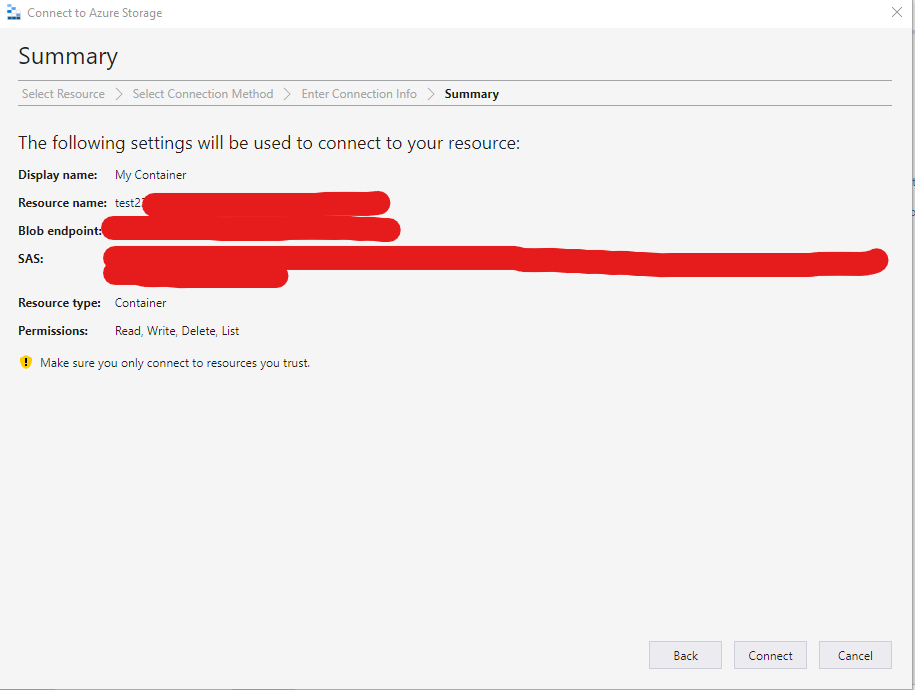
    <figcaption>Storage explorer conntect button</figcaption>
</figure>

15) The contents of the container
<figure>
    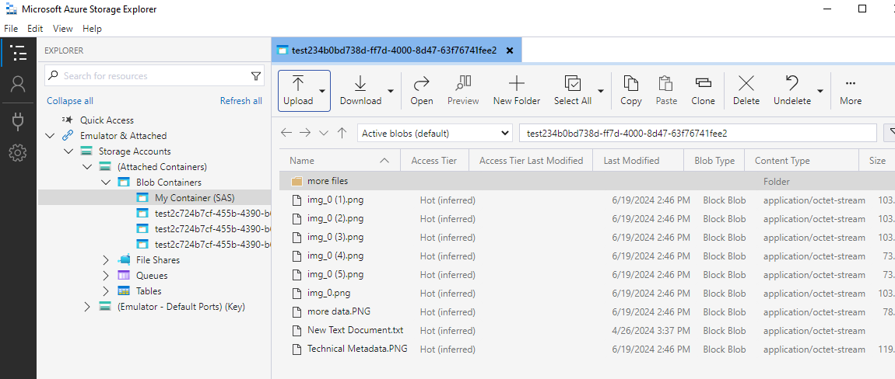
    <figcaption>Storage explorer files in the container</figcaption>
</figure>

16) Use the functionality of the storage explorer. For instance in the menu on the top, click the little arrow next to the _Download_ button. And select _Download all_ which will download everything in the container to a folder you choose.
<figure>
    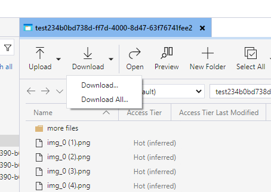
    <figcaption>Storage explorer download all</figcaption>
</figure>

