# How to move data from Veracity Data Fabric to Veracity Data Workbench
There are multiple ways of moving data from Veracity Data Fabric to Veracity Data Workbench
1) Download files from Veracity Data Fabric to your computer and reupload them to Veracity Data Workbench.
2) Move files with Microsoft Azure Storage Explorer.
3) Move files with Microsoft AzCopy.

Option 1 is good if you would like to reorganize the data, only re-upload parts of the data etc. For download and upload please see our documentation here [Data Fabric Download my data manually](https://developer.veracity.com/docs/section/datafabric/tutorials/download-my-data) and here [Data Workbench File storage](https://developer.veracity.com/docs/section/dataworkbench/filestorage)

Option 2 and 3 is fitting when you want to move large amount of data from Veracity Data Fabric to Veracity Data Workbench without changing too much of the structure. These approaches moves the data directly from Veracity Data Fabric to Veracity Data Workbench without having to first download it onto your machine. This saves time and resources and is the recommended way for moving a lot of data.

Note: Moving data from Veracity Data Fabric to Veracity Data Workbench requires a Veracity Data Workbench storage subscription. It can be ordered in the Veracity Marketplace here: https://store.veracity.com/veracity-file-storage-data-workbench 

## Key differences in terms of storage
In Veracity Data Fabric your data is organized in containers. Folders are virtual and only part of the file name. This means that you can not have empty folders. Since folder support is lacking it is common to create new containers when you want to separate your data and share it with other groups of people.

In Veracity Data Workbench there is no concept of a container, but there is now good support for folders. Folders can be created and do not need files in them to exist, so a folder structure can be created ahead of time and there is possibility of sharing on folder level.

When moving data from Veracity Data Fabric containers to Veracity Data Workbench storage, we suggest you create new folders with the same name as the containers, and move data from the containers into the respective folders to maintain the logical structure of your data.

We also suggest you add a folder on the root and put your data in subfolders beneath the root folder for easier management.

## Move files with Microsoft Azure Storage Explorer
To move the files with Microsoft Azure Storage Explorer we are going to utilize SAS-tokens. You will need to create a token for a Veracity Data Fabric container and a Read/Write token for a Veracity Data Workbench storage folder.

The main idea is that we will use the two SAS tokens, connect to both resources in the _same Azure Storage Explorer instance_ and copy the files from Veracity Data Fabric to Veracity Data Workbench.

### Generate SAS-token in Veracity Data Fabric
1) Open Veracity Data Fabric and navigate to the container for which you want to move data
<figure>
    
    <figcaption>Selected DataMoveDemo as the container for which to move data</figcaption>
</figure>

2) Click the _Access_ button
<figure>
    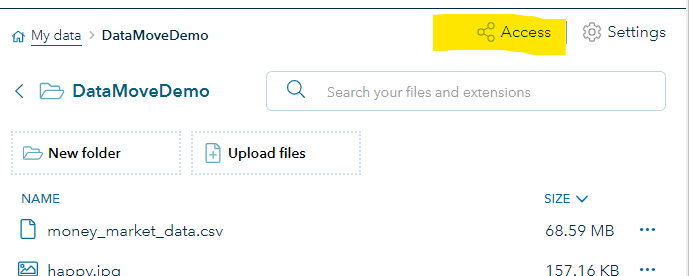
</figure>

3) Click _User management_
<figure>
    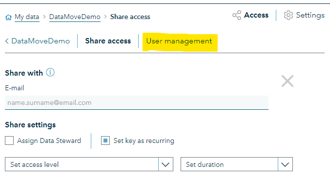
</figure>

4) Click _View key_
<figure>
    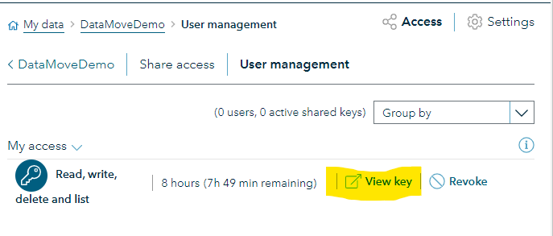
</figure>

5) Click _Copy key_
<figure>
    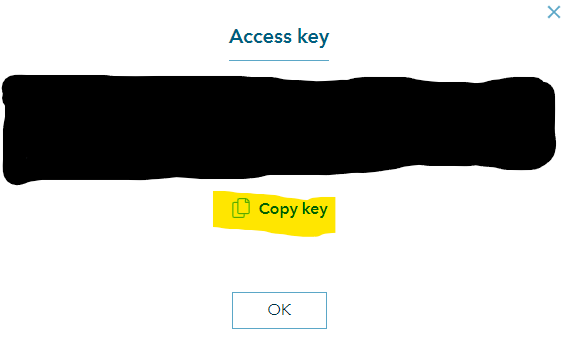
</figure>

6) Use the key to connect to the container from Azure Storage Explorer (described below)

### Connect to Azure Storage Explorer using SAS-token from Veracity Data Fabric

1) Navigate to https://azure.microsoft.com/en-us/products/storage/storage-explorer and download the Azure Storage Explorer for your operating system. (Windows, macOS and Linux are supported). Note you will need a newer version of Azure Storage Explorer, so make sure to upgrade if you have an old version. You will need minimum 1.36.0
<figure>
    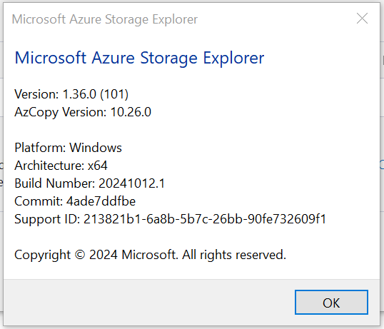
</figure>

2) Install the Azure Storage Explorer

3) Open Azure Storage Explorer
<figure>
    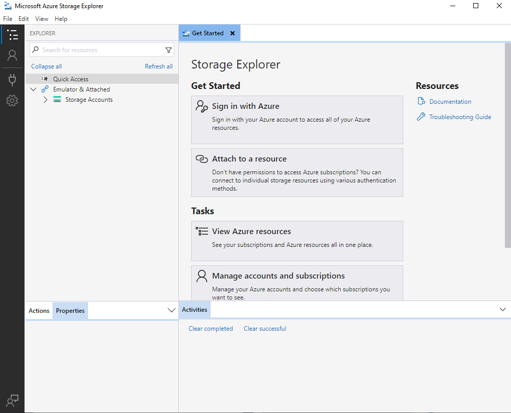
</figure>

4) Right click on _Storage Accounts_, click _Connect to Azure Storage_
<figure>
    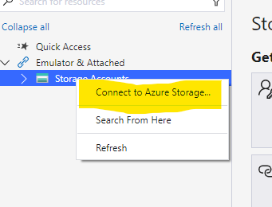
</figure>

5) Select _Blob container_
<figure>
    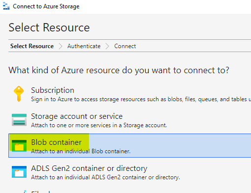
</figure>

6) Select _Shared access signature URL (SAS)
<figure>
    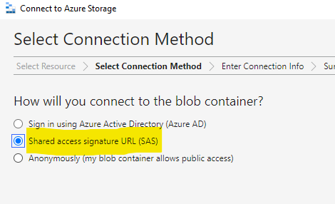
</figure>

7) Paste the SAS token you copied from Veracity Data Fabric into the highlighted textbox under the text _Blob Container SAS URL:_ and click _Next_
<figure>
    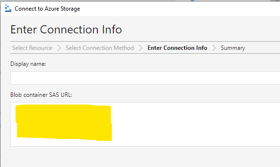
</figure>

8) Then click _Connect_

9) Microsoft Storage Explorer's view will now be updated and show the contents of your selected container.
<figure>
    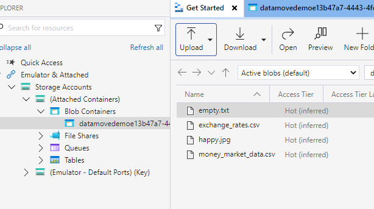
</figure>

Now let's go ahead and repeat the process and create a SAS token for Veracity Data Workbench and add it to the Azure Storage Explorer as well, process is outlined in the next two sections.

### Generate SAS-token in Veracity Data Workbench

1) Open Veracity Data Workbench and navigate to the _Data catalogue_
<figure>
    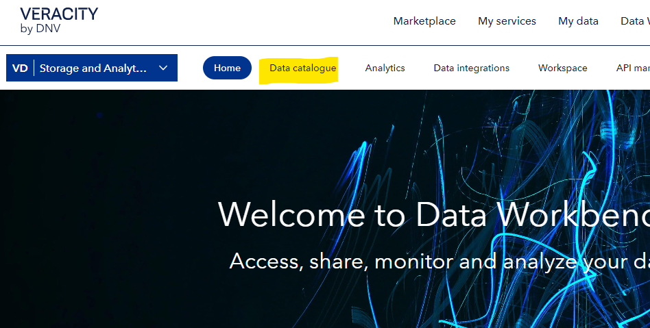
</figure>

2) Select _File storage_
<figure>
    
</figure>

3) Click _Create folder_
<figure>
    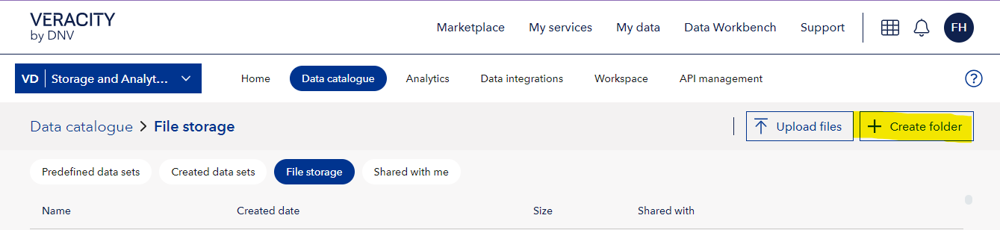
</figure>

4) We will create a root folder that will contain subfolders for each container we want to move. We will call ours: DataFabricContainers
<figure>
    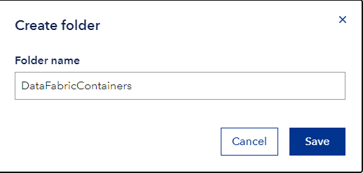
</figure>

5) Notice that the Veracity Data Workbench storage view updates and show the new folder. Click the folder you created and navigate inside.
<figure>
    
</figure>

6) When inside the root folder we created, we will create another folder and give it the same as our Veracity Data Fabric container for which we are moving data. Note: The name does not need to be the same for the move to work.
<figure>
    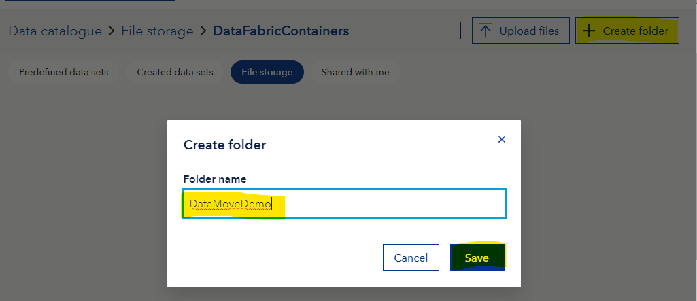
</figure>

7) Click the three dots on the right side for the folder we just created
<figure>
    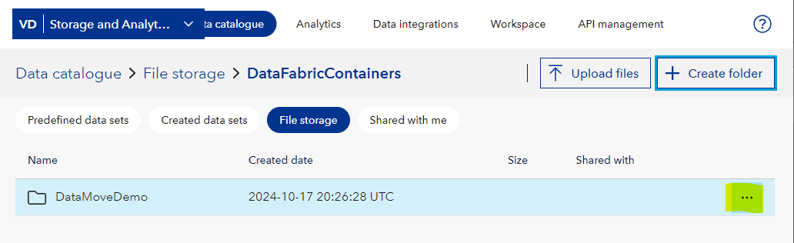
</figure>

8) Click _Generate keys_
<figure>
    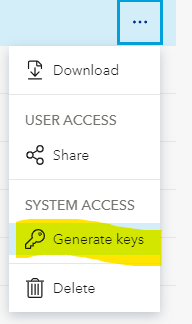
</figure>

9) Make sure to select _Read and write_ from the _Set access level_ option. In the _Set access end_ option, make sure to select a future date that will ensure the SAS token is valid long enough for you to move the data. This time will depend on the size of the data that is being moved. Click _Generate key_ when access level and access end has been configured.
<figure>
    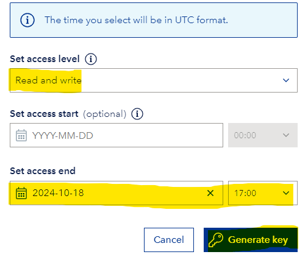
</figure>

10) When the key has been generated click _Copy key_
<figure>
    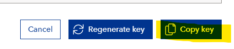
</figure>

We now got the SAS token from Veracity Data Workbench and can add it in the Azure Storage Explorer. The key needs to be added a little differently from how we added it for Veracity Data Fabric, so see steps in the next section

### Connect to Azure Storage Explorer using SAS-token from Veracity Data Workbench

1) Your Azure Storage Explorer should already be downloaded, installed, opened and connected to your Veracity Data Fabric container, if it's not, then please follow the steps in the previous sections outlining how to do this.

2) Right click _Storage accounts_ and click _Connect to Azure Storage_
<figure>
    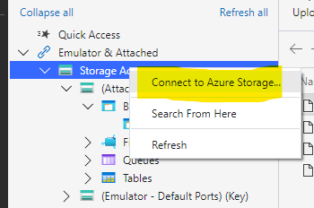
</figure>

3) From thew view that pops up, make sure to select the _ADLS Gen2 container or directory_ option
<figure>
    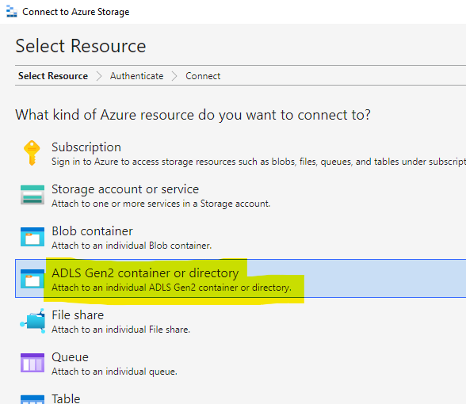
</figure>

4) Select _Shared access signature URL (SAS)_
<figure>
    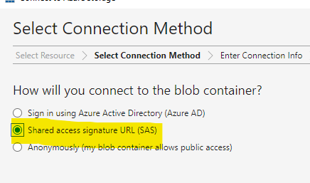
</figure>

5) Paste the SAS token you copied from Veracity Data Workbench in the highlighted input field below the text _Blob container or directory SAS URL:_
<figure>
    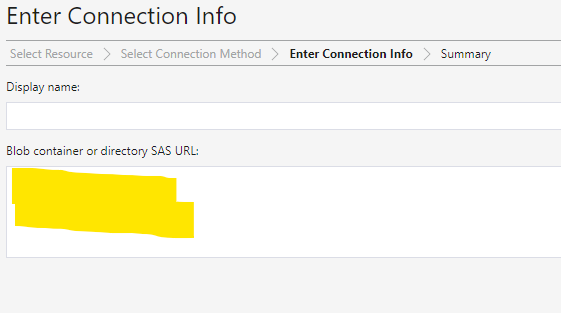
</figure>

6) Click _Connect_

7) You should now see that Azure Storage Explorer is connected to two containers. One of them should be empty, this is the folder we just created in Veracity Data Workbench, the other one has the files which we want to move.
<figure>
    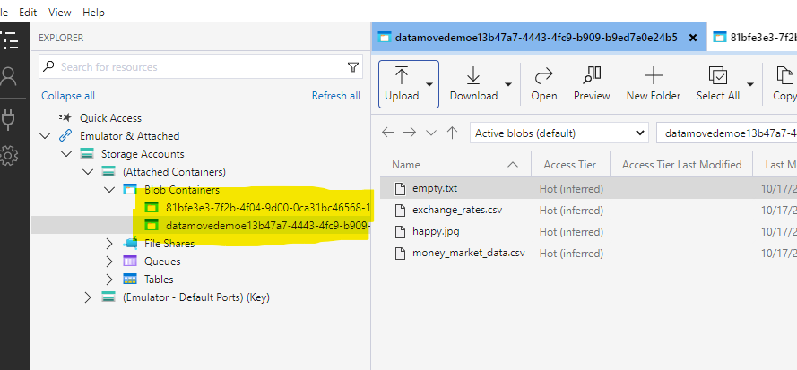
</figure>

Now the Azure Storage Explorer has been connected to both the Veracity Data Fabric container and the Veracity Data Workbench folder, the data can be moved. The steps are outlined in the next section.

### Move the files from Veracity Data Fabric container to Veracity Data Workbench storage folder

1) Navigate to the Veracity Data Fabric container in Azure Storage Explorer (in our example it's the one that has the files in it)
<figure>
    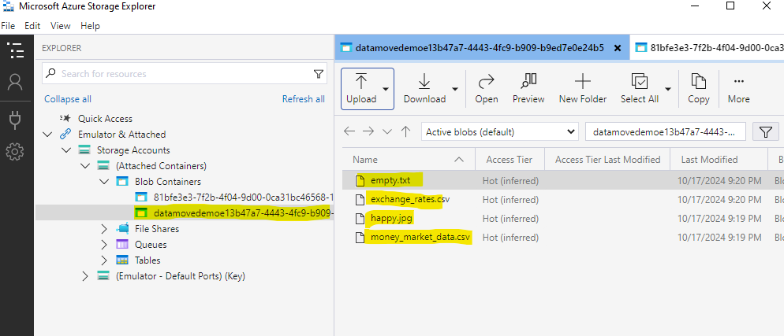
</figure>

2) Click _Select All_ and note that all files are selected
<figure>
    
</figure>

3) Click _Copy_
<figure>
    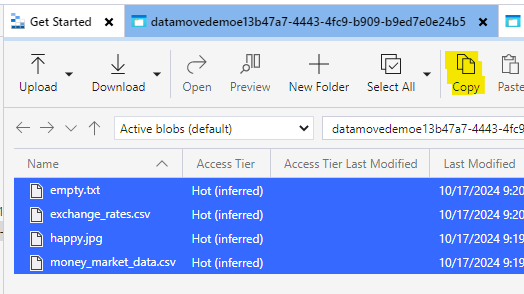
</figure>

4) Navigate to the container in Azure Storage Explorer representing the folder you want to move the data to in Veracity Data Workbench storage. In our example it is empty.
<figure>
    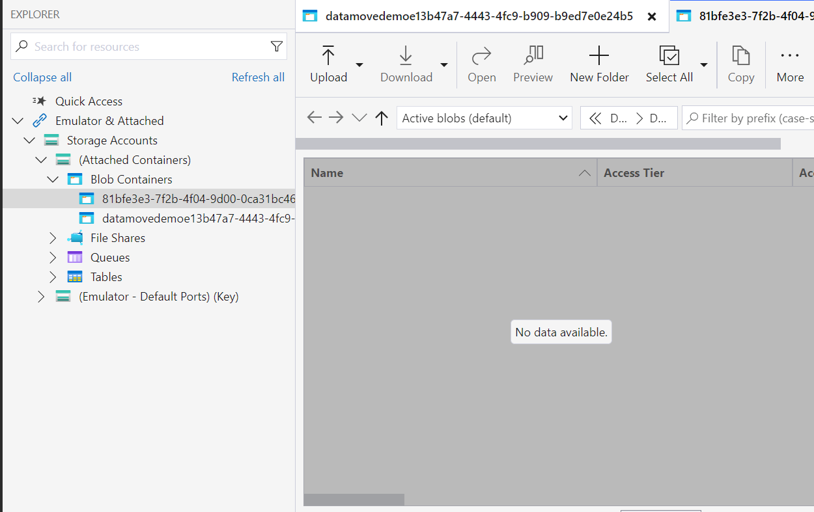
</figure>

5) Click _Paste_ (_If you have an older version of Azure Storage Explorer than the recommended 1.36.0, this step might not work for you, in that case, upgrade to at least 1.36.0_)
<figure>
    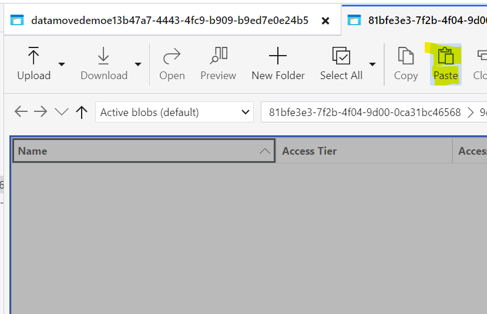
</figure>

6) We'll leave these checkboxes checked in the pop-up, adjust to your needs. Click _OK_.
<figure>
    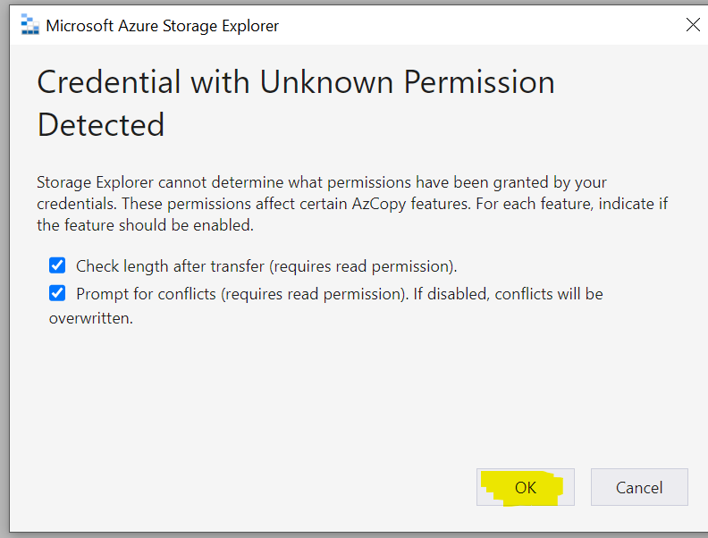
</figure>

7) Note that log messages appear in the _Activities_ window below the file view. Here you can keep track of the progress of the file transfer.
<figure>
    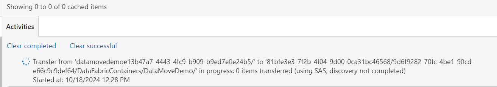
</figure>

8) When all files are transferred the log messages will turn green and inform that all items were transferred successfully
<figure>
    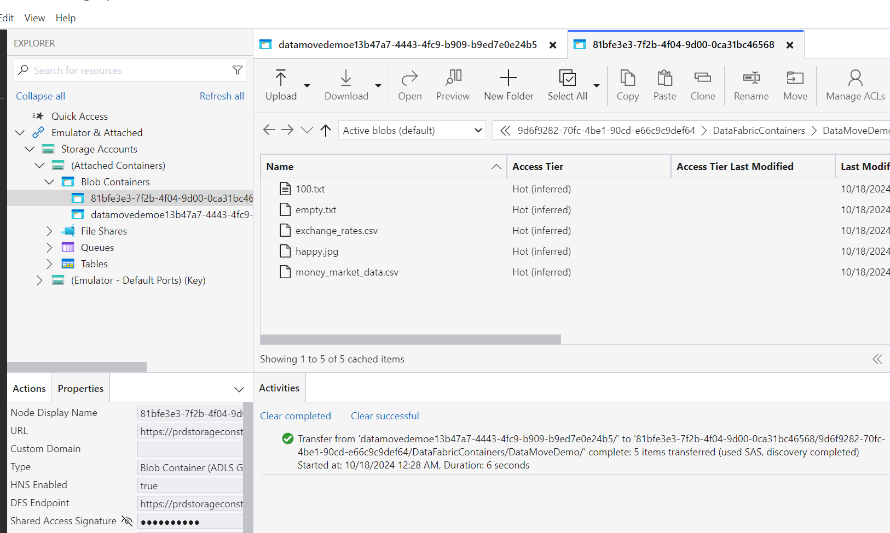
</figure>

9) Open the Veracity Data Workbench storage web page and navigate to the folder you have moved the data to. See the files are there. They can now be shared with others using the mechanisms of Veracity Data Workbench storage.
<figure>
    
</figure>


## Move files with Microsoft AzCopy
Azure Storage Explorer is a good tool to use when you want to move data in a straight forward fashion. But if you have more complex needs which require greater control of what is moved, where it should move to and you also want to move a lot of data, the command line tool AzCopy is a great option. AzCopy allows you to script the copying of data without having to download the data onto your local machine.

Azure Storage Explorer uses AzCopy as the underlying technology for copying data.

AzCopy have a lot of options and adjustment possibilities. In this guide we will focus on moving files from a Veracity Data Fabric container to a Veractiy Data Workbench storage folder. Please refer to this page for more guidance on AzCopy: https://learn.microsoft.com/en-us/azure/storage/common/storage-use-azcopy-v10?tabs=dnf

### Instructions
1) Download AzCopy. https://learn.microsoft.com/en-us/azure/storage/common/storage-use-azcopy-v10?tabs=dnf#download-the-azcopy-portable-binary If you already have AzCopy make sure it is up to date, at least using v10.
&nbsp;
2) Extract the AzCopy, we have chosen to extract it to c:\tools\azc\
&nbsp;
3) Open powershell or the command line. Note in powershell please use single quotes (we will be using single quotes in our examples), if you are using cmd.exe please use double quotes " where we are using single quotes.
&nbsp;
4) Navigate to the AzCopy folder: ```cd c:\tools\azc```
&nbsp;
5) Generate SAS tokens for Veracity Data Fabric by following the steps outlined in the [previous section](#generate-sas-token-in-veracity-data-fabric) and store it temporarily in a text file or similar.
&nbsp;
6) Generate SAS token for a Veracity Data Workbench folder by following the steps outline the [previous section](#generate-sas-token-in-veracity-data-workbench) and store it temporarily in a text file or similar.
&nbsp;
7) The basic command that we are going to run is: ```AzCopy 'data-fabric-sas' 'data-workbench-sas'```. Depending on what shell you are using, you might need to prefix AzCopy with a dot and a back-slash like this ```.\AzCopy```.
&nbsp;
8) If you just add the SAS tokens to the command mentioned in 7) AzCopy will complain about the following ```failed to perform copy command due to error: failed to initialize enumerator: cannot use directory as source without --recursive or a trailing wildcard (/*)```. If you add ```--recursive``` to the command it will generate a new folder inside your existing Data Workbench storage folder with the system-name of the container as illustrated below. This may or may not be ok according to your specifications. To copy the files without the contanier subfolder, please se next step.
<figure>
    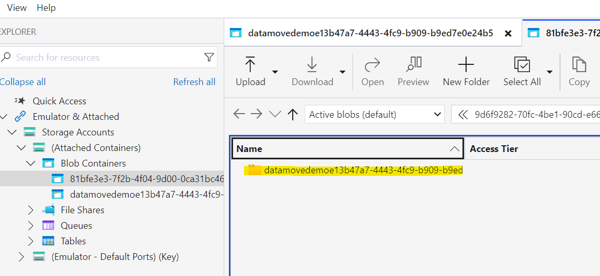
    <label>Subfolder with container system name created</label>
</figure>

9) To copy the files to Data Workbench storage folder without creating the subfolder we need to do the other thing that was suggested in the error message of the previous step. We need to add a trailing wildcard ```/*```. This wildcard must be placed at the end of the path in the Veracity Data Fabric sas token. Essentially before the question mark in the SAS token. As illustrated in the code block.
```https://....blob.core.windows.net/datamove...4b5/*?sv=2018-03...sp=rwdl```
&nbsp;
10) Now we are ready to copy the files from Veracity Data Fabric to Veracity Data Workbench storage using AzCopy. We are using powershell so our command will be ```.\azcopy copy 'https://ne1dnvglpstgcus0000e.blob.core.windows.net/datamovedemoe13b47a7-4443-4fc9-b909-b9ed7e0e24b5/*?sv=2018-03-28&sr=c...snipped...' 'https://prdstorageconst01weu.dfs.core.windows.net/81bfe3e3-7f2b-4f04-9d00-0ca31bc46568/9d6f9282-70fc-4be1-90cd-e66c9c9def64/DataFabricContainers/DataMoveDemo?sv=2023-11-03&sp...snipped...' ```. Please replace the sas-tokens with your own tokens, starting with the modified Veracity Data Fabric token (you have added the /*) and then giving the Veracity Data Workbench storage token as the second parameter.
&nbsp;
11) When the command has finished executing you will be given a summary of what has happened
<figure>
    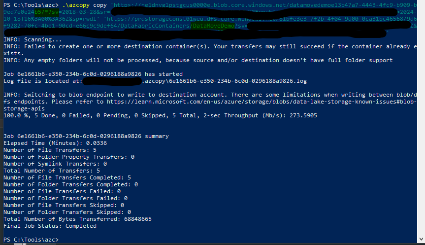
    <label>Our total number of transfers is 5</label>
</figure>

12) Now when we navigate to the Veracity Data Workbench storage folder we see that the data that was previously in Veracity Data Fabric is now also in Veracity Data Workbench
<figure>
    
</figure>


