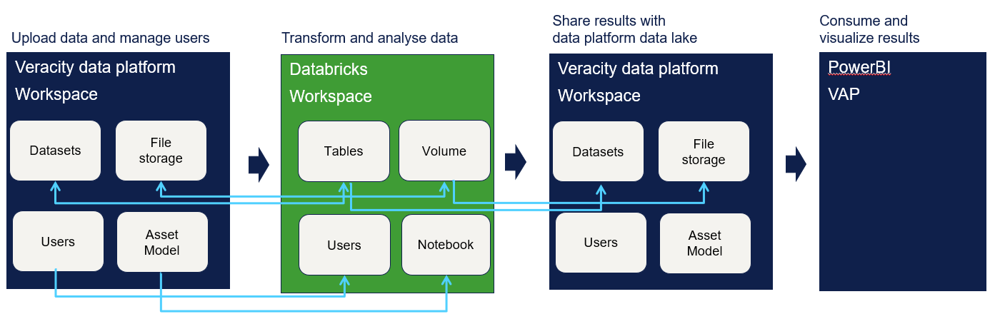

# Veracity Analytics Environment

Veracity enables an advanced analytics environment using Azure Databricks and ensuring compliance with security best practices.

Azure Databricks is a unified, open analytics platform for building, deploying, sharing and maintaining analytics and AI solutions at scale. Databricks allows you to do large scale analytics, data engineering processes, workflows, AI and machine learning. In Azure Databricks, notebook is the primary tool for creating data science and machine learning workflows.

[Azure Databricks documentation](https://learn.microsoft.com/en-us/azure/databricks/)

## How does Databricks connect to Veracity data platform storage

A dedicated Databricks environment is enabled for a single workspace in Veracity Data Workbench on request. Veracity managed Databricks environments enable Unity Catalog, a unified governance solution for data and AI assets on Databricks.

<figure>
    
</figure>


All structured data (datasets) and all files stored in the Data Workbench workspace are available in the databricks catalog and can be processed. New datasets and files can be created and synched back to Veracity Data Workbench datalake.


To buy subscription for Analytics Environment, contact support@veracity.com

## Data management 

A Databricks Catalog is created for each Data workbench workspace you have access to that has Analytics enabled. You will see these  under **Catalog** as **vdp_tenant_workspaceName**

Databricks uses two primary securable objects to store and access data:

- Tables govern access to tabular data: This is were all datasets from your Veracity workspace will be listed
- Volumes govern access to non-tabular data: This is where all files from Veracity filestorage is listed.

**For more information**
- [The unity catalogue model](https://docs.databricks.com/aws/en/data-governance/unity-catalog)
- [Datbase objects](https://docs.databricks.com/aws/en/database-objects/)

Users can not create new catalogs since share is not enabled.

## Users and access
When users are added to Data Workbench, they will be synced with databricks user group (Readers or Admins Group).

**Note:** Only internal user(dnv.com ) will be granted access to databricks environment.

The role the user has in the Veracity Data Workbench workspace [affects permissions in Databricks](matrix.md).

## Workspace
With the Databricks workspace browser you can create, browse, and organize Databricks objects, including notebooks, libraries, experiments, queries, dashboards, and alerts, in a single place. 

You can create private folders or shared folders.  When organizing work under shared, all users in Veracity Data Workbench workspace can see the folder.

A private folder can be shared with individual users.

## Development

Developing in the workspace is a great way to quickly get familiar with Databricks APIs. Databricks supports Python, SQL, Scala, R, and other developer-focused features in the workspace, including helpful tools and utilities.

Notebooks are a common tool in data science and machine learning for developing code and presenting results. In Azure Databricks, notebooks are the primary tool for creating data science and machine learning workflows.

**Note**: R is disabled in this managed instance.

[How to get started](https://learn.microsoft.com/en-us/azure/databricks/developers/)


### Read datasets

Use Sql Editor or Notebook with Sql to query dataset from tables.

```
%sql
SELECT * FROM `vdp_<workspaceName>`.`default`.`b<datasetName>` limit 100

```
This result is stored as _sqldf and can be used in other Python and SQL cells.


### Read files

The choice between Pyspark or Pandas depends on the size and complexity of your dataset and the nature of your application. If you are working with small to medium-sized datasets, Pandas is a good choice. If you are dealing with big data or real-time processing, Pyspark is a better option. Pandas loads data in memory before running queries, so it can only query datasets that fit into memory. Spark can query datasets that are larger than memory by streaming the data and incrementally running computations

openpyxl provides fine-grained control over reading and writing Excel files. The read_only mode significantly improves performance when reading large files

Read CSV is faster that reading XLSX

```
var filepath = ""
df2= pd.read_csv(filepath)
```
Navigate to the file and use copy path


## Synchronize files with Data workbench
There is no action required to synchronize files between Veracity data platform file storage and the Databricks environment. Files uploaded to Veracity data platform filestorage are visible in Databricks. New files stored in Volume in databricks are visible in data platform file storage in same sub-folders.

### Write files
If creating a new file in Volume, you can create a new directory from workspace or from notebook

**Example:**
```py
import os
os.mkdir('/Volumes/<path>/default/filestorage/MyDir')
df.to_csv("/Volumes/<path>/default/filestorage/MyDir/<filename>.csv", index= False) 
```

## Synchronize datasets with Data workbench
Datasets uploaded to Veracity Data Workbench is available in Databricks tables. 

First release of this Analytics environment does not synch new tables made in databricks or modified tables back to Data Workbench. 
Data shared from other workspaces are not available in Databricks in this release.  These features are planned released in Q1-2025.

## Variables
Use variables to make your script more dynamic. DECLARE variable is a user-defined variable that can hold a single value. It acts as a container to store and manipulate data during the execution of a script or code. By using DECLARE variables, you can enhance the readability and efficiency of your Databricks scripts.

[For more information](https://learn.microsoft.com/en-us/azure/databricks/sql/language-manual/sql-ref-syntax-ddl-declare-variable)

[Identifier Clause](https://learn.microsoft.com/en-us/azure/databricks/sql/language-manual/sql-ref-names-identifier-clause)

### Connect to Asset model
How to connect to Asset model from Python

[Explore Asset Model Query API](https://developer.veracity.com/docs/section/api-explorer/76904bcb-1aaf-4a2f-8512-3af36fdadb2f/developerportal/DataFabric-MMS-Query-API-swagger.json)

This example; use client id and secret from API-integration and retrieves a token which is used in the following apis.

```
import requests
import json

# Token URL for authentication 
token_url = "https://login.microsoftonline.com/dnvglb2cprod.onmicrosoft.com/oauth2/token"
clientId = "CLIENT_ID"
secret =  "SECRET"
# define the request payload    
payload = {"resource": "https://dnvglb2cprod.onmicrosoft.com/83054ebf-1d7b-43f5-82ad-b2bde84d7b75",
          "grant_type": "client_credentials",
          "client_id": clientId,
          "client_secret" :secret
          }
response = requests.post(token_url, data=payload)   
if response.status_code == 200:
        access_token = response.json().get("access_token")
else:
        print(f"Error: {response.status_code}")

````

Retrive site information
```
tenantId = "DNVES"
siteId = SITE_ID  (get from variable)
subscriptionKey = SUBKEY
queryurl = f"https://api.veracity.com/veracity/mms/query/{tenantId}/api/v1/sites/{siteId}"

header = {"Authorization": f"Bearer {access_token}", "Ocp-Apim-Subscription-Key": subscriptionKey,
          "Content-Type": "application/json"}
response = requests.get(queryurl, headers=header)

```

Get devices 
```
tenantId = "DNVES"
siteId = SITE_ID  (get from variable)
subscriptionKey = SUBKEY

queryurl = f"https://api.veracity.com/veracity/mms/query/{tenantId}/api/v1/sites/{siteId}/devices?start=0&pageSize=1000&sortColumn=Description&sortDirection=0&productTypeFilter=Inverter"

header = {"Authorization": f"Bearer {access_token}", "Ocp-Apim-Subscription-Key": subscriptionKey,
          "Content-Type": "application/json"}
response = requests.get(queryurl, headers=header)

```

