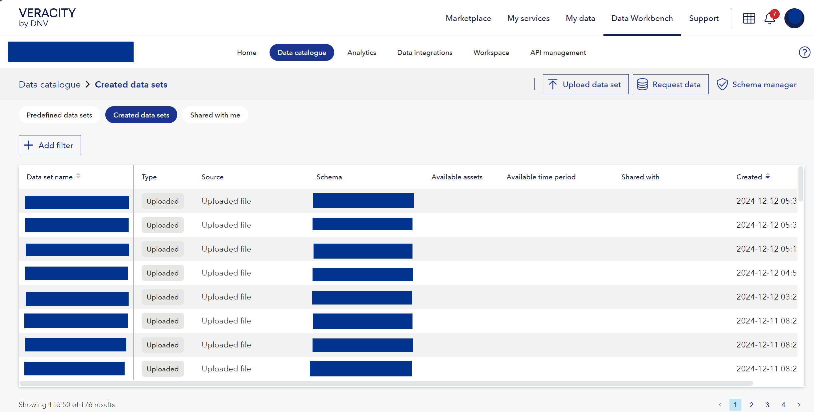

# Visualize analytic results

Analytics can write their output to a dataset in data workbench. 
You can see the new dataset in the same workspace you executed the script of Dataworkbench UI.
<figure>
	
</figure>

