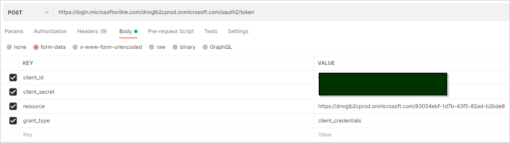

# Authentication
Authenticate your API calls with an API key and a bearer token (`tokenUrl`) placed in the header of your API call.

## API key
To get the API key:
1. In your Data Workbench workspace, select the **API Integrations** tab.
2. In the left sidebar, select a service account or [create a new service account](apiintegrations.md).
3. Find the **API key**, and copy it.

When you construct an API request, put the API key into an HTTP header `Ocp-Apim-Subscription-Key`.

## Bearer token

There are two ways of making requests to the Veracity dataplatform endpoints:
* You can request as a user through using B2C authentication, or
* as application using client credentials (i.e. from Postman or application) 

When you request the endpoints as user, then your personal token and API Key are used. On the other hand, when you make requests as application then application token and API key are being used.

### Client Credentials /Service principle
To get the bearer token, call the URL https://login.microsoftonline.com/dnvglb2cprod.onmicrosoft.com/oauth2/token with the POST method.
Use the following request body:
* `client_id` - this is the Service account ID for your app.
* `client_secret` - this is the Service account secret for your app.
* `resource` - use the scope for Services API: https://dnvglb2cprod.onmicrosoft.com/83054ebf-1d7b-43f5-82ad-b2bde84d7b75
* `grant_type` - client_credentials

<figure>
	
	<figcaption>An application with direct user interaction can redirect the user to the login page to authenticate them.</figcaption>
</figure>

To get `client_id` and `client_secret`:
1. In your Data Workbench workspace, select the **API Integrations** tab.
2. In the left sidebar, select a service account or [create a new service account](apiintegrations.md).
3. Find and copy the values. The **Service account ID** is the `client_id`. The **Service account secret** is the `client_secret`.

### C# Code example
```cs
async Task<string> GetToken()
{
    var url = "https://login.microsoftonline.com/dnvglb2cprod.onmicrosoft.com/oauth2/token";
    var client_id = "[client id]";
    var client_secret = "[secret]";
    var grant_type = "client_credentials";
    var resource = "https://dnvglb2cprod.onmicrosoft.com/83054ebf-1d7b-43f5-82ad-b2bde84d7b75";

    var postData = new Dictionary<string, string>
       {
           {"grant_type", grant_type},
           {"client_id", client_id},
           {"client_secret", client_secret},
           {"resource", resource},
       };
    using HttpClient httpClient = new HttpClient();
    httpClient.BaseAddress = new Uri(url);
    HttpRequestMessage request = new HttpRequestMessage(HttpMethod.Post, httpClient.BaseAddress);
    request.Content = new FormUrlEncodedContent(postData);
    HttpResponseMessage authResponse = httpClient.PostAsync(url, new FormUrlEncodedContent(postData)).Result;
    var result = await authResponse.Content.ReadAsStringAsync();
    var token = (string)JToken.Parse(result)["access_token"];
    return token;
}
```

### Python example
```(python)
token_url = "https://login.microsoftonline.com/dnvglb2cprod.onmicrosoft.com/oauth2/token"

# Token payload for authentication request
token_payload = {
    "grant_type": "client_credentials",
    "client_id": client_id,
    "client_secret": client_secret,
    "resource": "https://dnvglb2cprod.onmicrosoft.com/83054ebf-1d7b-43f5-82ad-b2bde84d7b75"
}

# Function to retrieve access token
def get_token():
    try:
        response = requests.post(token_url, data = token_payload)
        return response.json()["access_token"]
    except Exception as e:
        print(f"Failed to retrieve access token: {e}")
```

### Node.ds example

## User credentials 


