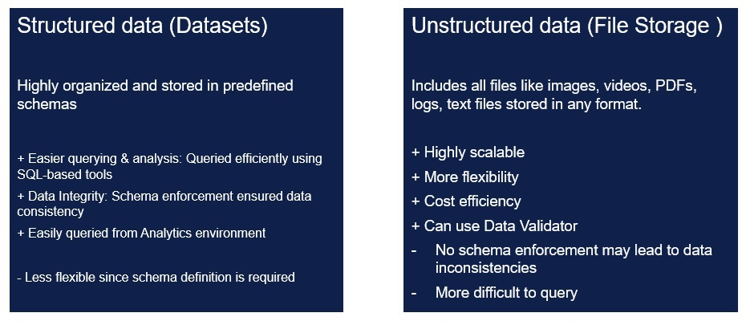

# Datalake and Storage

Veracity is a cloud-based, enterprise-grade data lake solution, currently built on Azure Data Lake Storage Gen2 (ADLS Gen2). ADLS Gen2 is fully integrated with the Azure Blob Storage platform, offering a robust set of capabilities, including:

* Managed identity (Veracity Idp) for secure identity and access management
* Encryption at rest to ensure data protection
* High availability and disaster recovery for business continuity
* Automated lifecycle management to optimize storage costs
* Storage account firewalls for enhanced security and compliance (Verit VNet)

To efficiently process structured data during ingestion, Veracity utilizes a Spark and SQL engine. This enables scalable data transformation and validation, and ensures efficient storage as Delta Tables, which are optimized for fast and reliable querying.

This infrastructure provides a secure, scalable foundation for managing large volumes of data, supporting advanced analytics, AI services, and collaborative data sharing across industries.

## Structured datasets or file storage

Data can be stored in two main ways: structured or unstructured. Structured data follows a clear format, like rows and columns in a table, making it easy to organize and analyze. Unstructured data, on the other hand, stores files in its original form (like documents, images, or videos) and is only processed when it’s needed.

<figure>
    
    <figcaption>Structured and unstructured data storage</figcaption>
</figure>

## How to

* [How to query structured data using apis](../query/datasetquery.md)
* [How to query files using apis](../query/filequery.md)
* [How to view data using Web portal (Data Workbench)](https://developer.veracity.com/docs/section/dataworkbench/datacatalogue)
