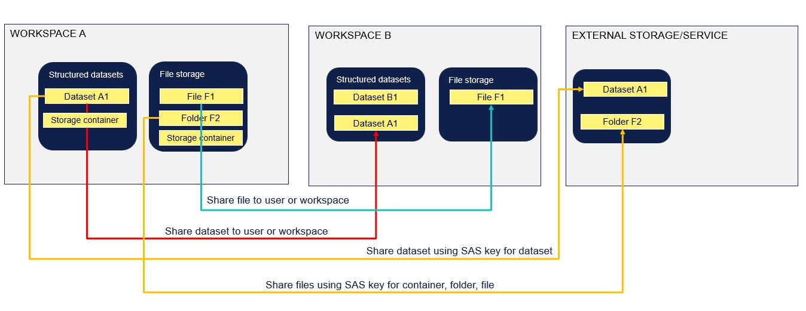

# Datasharing

Vertacity dataplatform supports several types of secure sharing of data:

**Invite users into workspace**
* Invite users to workspace. User have read or write acceess to data depending on role.
* Create a service principle within the workspace. To be used for applicaiton integration. Service priniple has by default Read access to all data in workspace.

**Share data to any user using email**
* Share selected dataset to a user using email. 
* Share selected file or folder  to a user using email. 

**Share data to a workspace**
* Share selected dataset to a workspace
* Share selected file or folder to a workspace (not yet released)

**Share access using SAS keys**
* Share access to selected dataset, or all datasets, by generating SAS key for dataset
* Share access to files by generating SAS key for workspace, folder or file


<figure>
    
    <figcaption>Structured and unstructured data storage</figcaption>
</figure>


### Share single dataset to individual user (B2C sharing)
From Data Catalog, select dataset and share to user using email. User can be external to the tenant. 
The receiver will receive an email and when opening the workspace they can only see the dataset shared to them. Dataset can be viewed and downloaded.

If receiver is already member of one or several workspaces; shared data is visible in each of his workspaces from **Data Catalogue/Shared-to-me**. This dataset is not visible in Analytics environment. The shared dataset using this sharing is not visible for other users in the receivers workspaces.

Receiver can chose to add the shared dataset into current workspace and make the shared dataset available for all users in this workspace.
Select dataset from shared to me and then button "Add to Workspace". The dataset is now shared with a B2B sharing and this sharing is available the next time someone shares from the orginal workspace.  The dataset is now available in Analytic Environment  (if environemtn is enabled). 

### Share single dataset to another workspace (B2B sharing)
If a dataset is shared from workspace A to a user and receiver adds this dataset to his workspace B, a workspace sharing is enabled between workspace A and B. Next time someone shares from workspace A, the "sharer" can select workspace B automatically from the dropdown list. All users in workspace B, can see the shared dataset in Data Catalog. The dataset is now available in Analytic Environment (if environemtn is enabled).

### Share datasets using SAS key
Select dataset and Generate SAS access kyes. This key is Read only and last until given end-date.
From api you can generate sas token for whole workspace or for individual dataset.

### Share single file or folder to individual user (B2C sharing)
Select single file or whole folder and select share icon. User can be external to the tenant.
The receiver will receive an email and when opening the workspace they can only see the files/folders shared to them. 

If receiver is already member of one or several workspaces; shared data is visible in each of his workspaces from **Data Catalogue/Shared-to-me**. 
These files are not visible in Analytics environment. The shared files using this sharing is not visible for other users in the receivers workspace(s).

*Adding shared files to a workspace will soon be available.

### Share single file or folder to another workspace (B2C sharing)
Soon to be available.

### Share files using SAS key
From Filestorage SAS keys can be generated for single file, folder or workspace level.
To generate a SAS token, call the endpoint:
```POST: https://api.veracity.com/veracity/dw/gateway/api/v2/workspaces/{workspaceId:guid}/storages/sas```


**Code Example**
[See how to receive SAS keys using apis](https://developer.veracity.com/docs/section/dataplatform/storage/files#ingest-process)

## Revoke sharing
Sharing to user or to workspace can be revoked and receiver will no longer see the shared data.


## Share using API endpoints
To browse the api, go [here](https://developer.veracity.com/docs/section/api-explorer/76904bcb-1aaf-4a2f-8512-3af36fdadb2f/developerportal/dataworkbenchv2-swagger.json).
(see subsection Shares)

### Baseurl
See [overview of base urls](https://developer.veracity.com/docs/section/dataplatform/apiendpoints)

### Authentication and authorization
To authenticate and authorize your calls, get your API key and a bearer token [here](auth.md).

## Get share owner info

```
POST {baseurl}/workspaces/{workspaceId}/schemas endpoint. 
```
BODY

```json
{
  "datasetIds": [
    "string"
  ]
}
```

