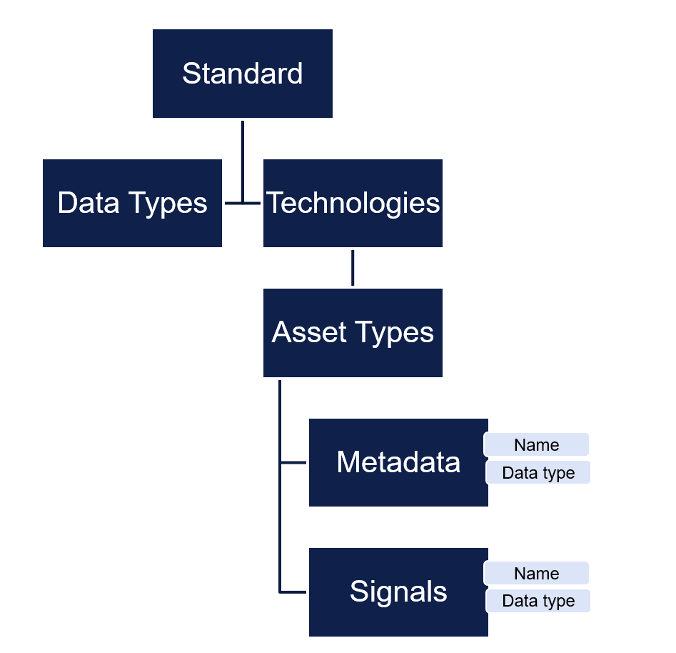

# Asset Model

Veracity Asset Model is a platform feature that allows services to store metadata about any asset such as solar plant, wind farm, vessel, etc. 
The purpose of Veracity Asset Model is to offer a single Asset registry enabling multiple services to access data about same asset. 

The asset is described using metadata names, signals names and datatypes defined in the standard for selected technology.

## Standard

The standard describes all asset-types available to represent a power station, site or project.  Each asset type is described with a set of metadata and, if applicable, a set of sensor metadata (signals).  Examples of asset types are Meter, Inverter, Turbine. 

### Technologies
The standard is divided into different technologies such as Solar, Wind, Storage, Wind preconstruction etc. Each technology has a defined set of asset types.

The standard consists of all asset-types and all datatypes defined.  Datatypes defined are used across technologies.

<figure>
	
	<figcaption>Asset types and data types</figcaption>
</figure>

Site is an Asset type representing the root node.  All Asset types not being root node, are subtypes of “Device”.
Sub-types of Site can also be defined representing differnet site types.

## Asset models 

The Asset Registry is a database containing instances of sites with the actual metadata for that site.  When creating a site, technology is selected and then the actual values for the relevant metadata can be provided. 
In addition to the metadata, a site instance can optionally list the signals that is monitored on the given asset. An asset can be represented as a set of "Devices" (components). Each device represents the actual instance of an an asset-type such as each Inverter, Meter, CombinerBox etc. These devices can be viewed in different hierarchies representing different aspects. 

<figure>
	
	<figcaption>Asset model</figcaption>
</figure>

## Asset Model Web

[Veracity Asset Model](https://assetmodel.veracity.com/)