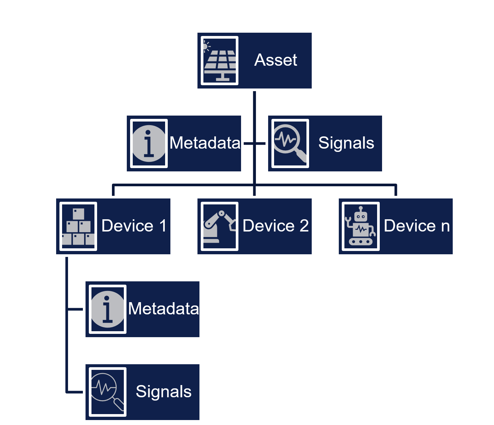

# Asset Model

Veracity Asset Model is a platform feature that allows services to store metadata about any asset such as solar plant, wind farm , vessel, etc. 
The purpose of Veracity Asset Model is to offer a single Asset registry enabling multiple services to access data about same asset. 

The model representing the asset (currently named site) consists of lists of metadata, signals and devices (components). A device has a type and the device type defines a set of metadata  and signals applicable for this device type.

<figure>
	
	<figcaption>Asset model</figcaption>
</figure>

Hierarchies can be build, for each instance, to represent different tree-structures of devices.

## Standard

The names of the metadata fields, their default values (if any), available values and units (if defined) and timeseries-names are defined in the standard used. 

The standard supports several technologies. I.e. The technology Solar can have its own asset models defined and the technology Wind can have its own asset models.

## Asset Model Web

[Veracity Asset Model](https://assetmodel.veracity.com/)