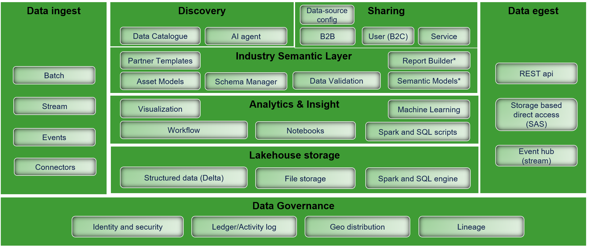

# Data Platform overview

Developed by DNV, the Veracity data platform is a secure, cloud-based solution designed to support efficient industry collaboration and accelerate digital transformation, with a particular focus on the maritime, oil and gas, and energy sectors.

The platform enables seamless integration and management of large-scale data from diverse sources, underpinned by robust governance frameworks such as role-based access control to ensure secure data sharing. It supports advanced analytics and AI capabilities, empowering users to extract actionable insights and drive data-informed decision-making.

Veracity connects users to a growing ecosystem of integrated partners, offering access to a wide array of datasets, APIs, and applications. This ecosystem fosters innovation and enhances operational efficiency by enabling scalable, data-driven solutions.

Key platform components include secure data ingestion, asset modeling, and the storage and consumption of both structured and unstructured data. Governance is maintained through comprehensive access controls and data-sharing protocols. Additionally, the platform facilitates data transformation, analytics, and AI services to support the development of new digital offerings.

By leveraging these capabilities, Veracity aims to advance sustainability, improve performance, and promote cross-sector collaboration.

Read more about the main concepts [here](concepts/datalake.md)

<figure>
    
    <figcaption>Veracity data platform</figcaption>
</figure>

*Planned to be delivered soon

See user guide for the portal [Data Workbench](https://developer.veracity.com/services/dataworkbench). 
