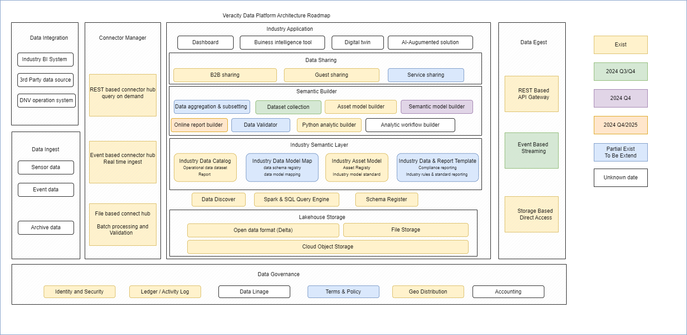

# Data Platform overview

The Veracity data platform, developed by DNV, is an independent, secure cloud-based platform designed to facilitate efficient industry collaboration and digital transformation, particularly in the maritime, oil and gas, and energy sectors.

It allows for seamless integration and management of large volumes of data from various sources, ensuring secure data sharing through robust governance mechanisms like role-based access control. The platform supports advanced analytics and AI services, enabling users to derive valuable insights from their data, and connects users with a growing ecosystem of integrated partners, providing access to a wide range of datasets, APIs, and applications. Overall, Veracity aims to enhance operational efficiency, sustainability, and innovation by leveraging data-driven insights and fostering collaboration across industries.

Veracity data platform offers several components and features that can be used when building a new service such as secure ingest, asset models, storage and consumption of structured and unstructured data. Data governance is handled by role based access control and data sharing. In addition we enable data transformation, analytics and AI services. 

<figure>
    
    <figcaption>Veracity data platform</figcaption>
</figure>
