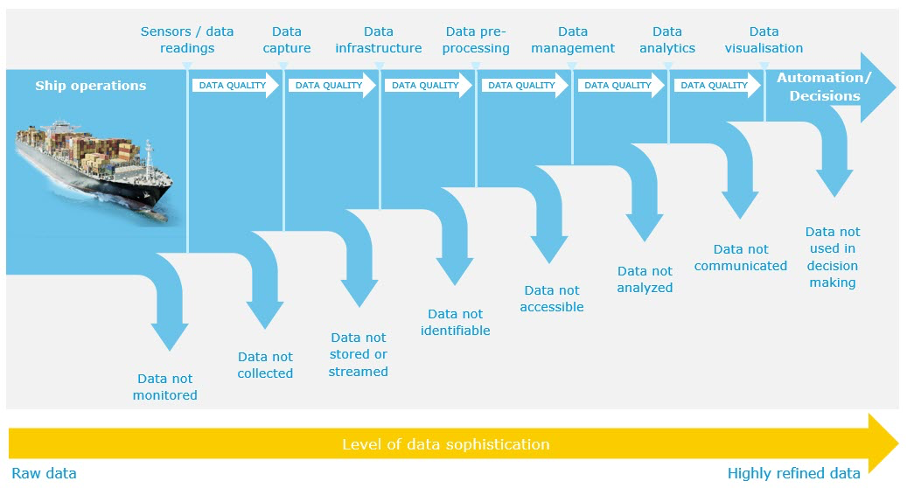
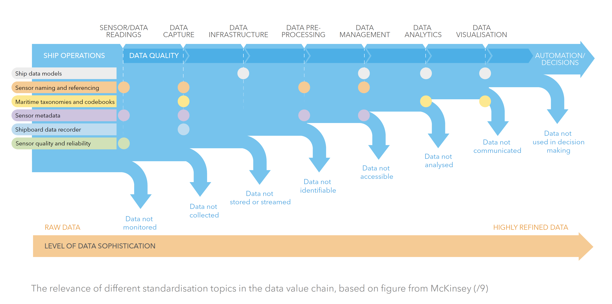

# Data Standards in Veracity

## Why do we use data standards?

The purpose of a standard is to provide a reliable basis allowing people to share similar expectations of a product or service. This helps to facilitate trade, through providing a framework for achieving economies. It also improves efficiency and interoperability through enhancing consumer protection and confidence.

Once a standard has been established it can be used to:

- Harmonise processes, procedures and designs
- Facilitate interoperability and integration
- Enhance transparency and traceability
- Provide a basis for third-party verification
- Transfer knowledge and share best practices
- Inform and accelerate regulatory developments

Standards can be developed by public or private actors. Within some areas standard setters compete, while in other areas there is one focal actor, typically a standard-setting body that is uncontested within its area of work. Such organisations include:

- The International Organization for Standardization (ISO)
- The International Electrotechnical Commission (IEC)
- The European Committee for Standardization (CEN)
- The European Committee for Electrotechnical Standardization (CENELEC)
- The International Accounting Standards Board (IASB)
- World Wide Web Consortium (W3C)
- The Internet Engineering Task Force (IETF)

In 2017, DNV issued a position paper that discussed the role of standards and how they could be used to improve data flows and enable digitalisation in the maritime field.  It addressed some of the challenges experienced in digital pilot projects such as incompatible tagging schemes and lack of meta data, in turn leading to reduced data quality and not being able to utilise the data effectively. The paper concluded that these problems could be alleviated by introducing standards and systematics into the processes of collection, storage and exchange of data.

<figure>
	
	<figcaption>Sensor Data Value Chain (McKinsey)</figcaption>
</figure>

You can download the position paper [here](https://www.dnvgl.com/publications/standardisation-as-an-enabler-of-digitalization-in-the-maritime-industry-101853) or see the [presentation](https://www.kystverket.no/globalassets/e-navigation/e-nav.no-2017/2017-ppt/1620-lag_dnv-gl.pdf) held at e-Nav.no conference in 2017.

## Which areas are affected by standards?

In a maritime context there are several areas that are affected by standards:

- Ship data models
- Sensor naming and referencing
- Maritime taxonomies and code books
- Sensor metadata
- Shipboard data recorder
- Sensor quality and reliability

Standardisation efforts will be necessary in these areas as well as others in order to improve data quality and reduce friction in the operational data value chain and to enable the growth of digital applications in the maritime industry.

## What does Veracity and DNV provide ?

Building on more than 150 years of experience in using and making standards together with lessons learnt through numerous ship digitalisation projects in recent years, DNV shares insights and thoughts on how standards can play a role within the collection of digital information from ships.

There are several ongoing data standard activities provided through DNV and the Veracity project:

### Operational Vessel Data

[Read about Operational Vessel Data.](operationalvesseldata.md)

### ISO 19847 and ISO 19848

- DNV (Maritime Class) can do certification services of 19847 data servers and network infrastructures handling ISO 19848 data files.

- Veracity will support ingest of IOT data following the ISO 19848 standard by end of May.  

[More information on ISO 19847 and ISO 19848.](iso19847iso19848.md)

### Vessel Information Structures (VIS) and Generic Product Model (Gmod)

Vessel Information Structures (VIS) and Generic Product Model (Gmod) are two standards offered by DNV as information source to be used in sensor naming in accordance with ISO 19848.

[More information about VIS/Gmod.](vesselinformationsystem.md)

### W3C/ OWL/ISO 15926:  Information models for assets.

These standards are being currently developed. There is also an initiative to develop an OWL2 (W3C) model of GMOD.

### FMI/FMU:  OSP project for simulation models.  

### Cyber security services offered by DNV

-	DNV type approval program for cyber secure components (DNV CP-031)
-	cyber secure class notation  (DNV Ship rules Pt 6 Ch 5 Sec 21)  

### Data quality
Algorithm/ AI verification.  

<figure>
	
	<figcaption>Data Standards Applications</figcaption>
</figure>

## Useful links

[Data standards in Norway - Standard.no ](http://standard.no/)
