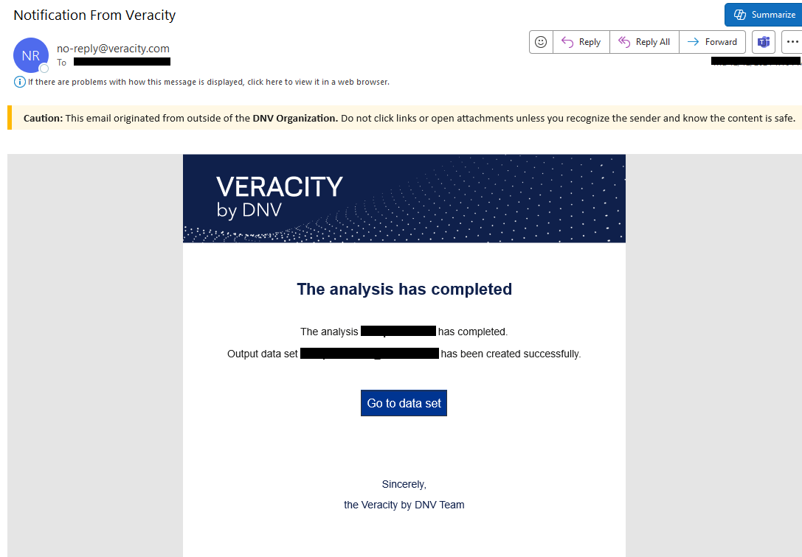
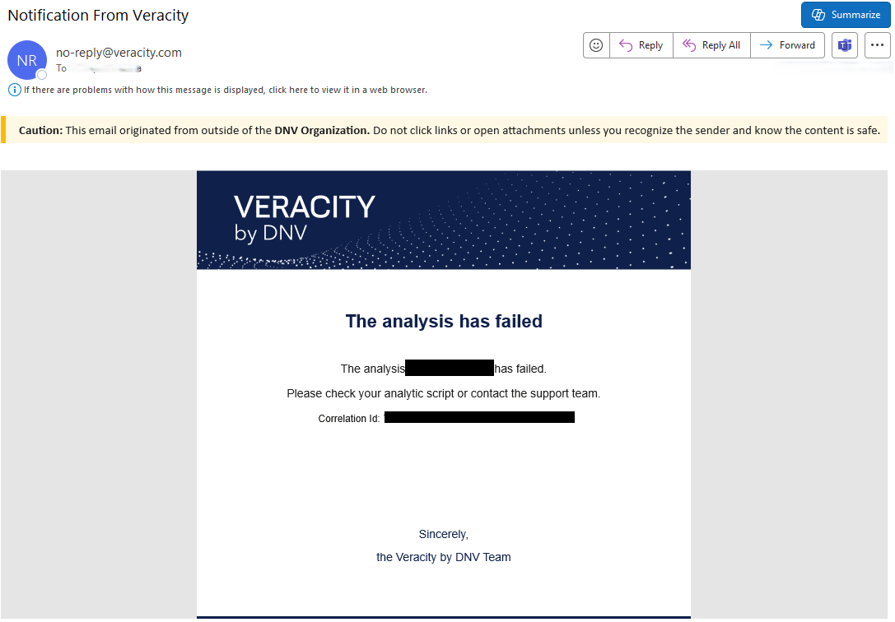
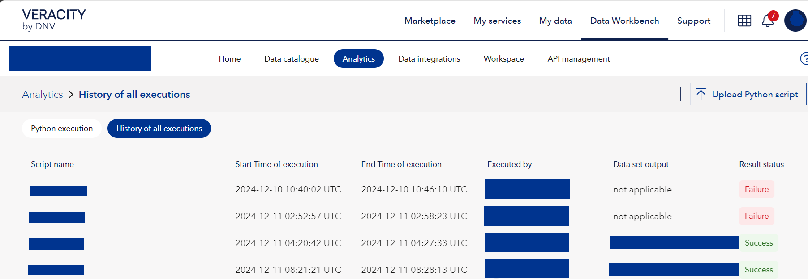

# Analytics

This page shows in your workspace only if it has a subscription for Analytics. Here, you use Python scripts to run analytics on your data sets.

The Analytics page has the following tabs:
* Python Execution
* History of all executions

## Python Execution

Here, if you are a workspace admin, you can:

* Upload Python scripts (1) and use them to analyze your data sets.
* See scripts (2).
* Download scripts (3).
* Delete scripts (4).
* Execute scripts (5).

However, if you have only reader access to this page, you can:
* See scripts (2).
* Download scripts (3).

<figure>
	
</figure>

Before you execute a script, download and examine a sample script to familiarize yourself with accessing data sets and assets models.
See how to [access data sets and assets models in data Workbench](https://developer.veracity.com/docs/section/dataplatform/analytics)

When you choose to execute a script, you can select the data sets on which it should run. Depending on the script, do analytics on the data sets, and more, it can produce one new dataset.

<figure>
	
</figure>

No matter python script succeeds or fails, you will receive a email.
Succeed email
<figure>
	
</figure>
Fail email
<figure>
	
</figure>

## History of all executions
In this tab, you can see the history of all Python scripts executed in your workspace.

<figure>
	
</figure>

You can see the error information for failed python script by moving the mouse to the right side and clicking the information icon.

