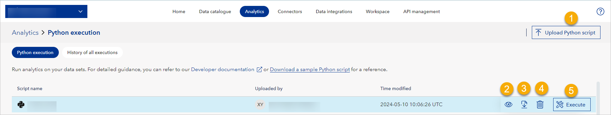

# Analytics

This page shows in your workspace only if it has a subscription for Analytics. Here, you use Python scripts to run analytics on your data sets.

The Analytics page has the following tabs:
* Python Execution
* History of all executions

## Python Execution

Here, if you are a workspace admin, you can:

* Upload Python scripts (1) and use them to analyze your data sets.
* See scripts (2).
* Execute scripts (3).

<figure>
	
</figure>

However, if you have only reader access to this page, you can:
* See scripts.

## History of all executions
In this tab, you can see the history of all Python scripts executed in your workspace.
<figure>
	
</figure>