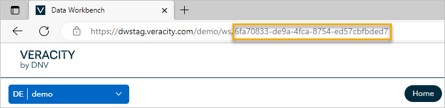
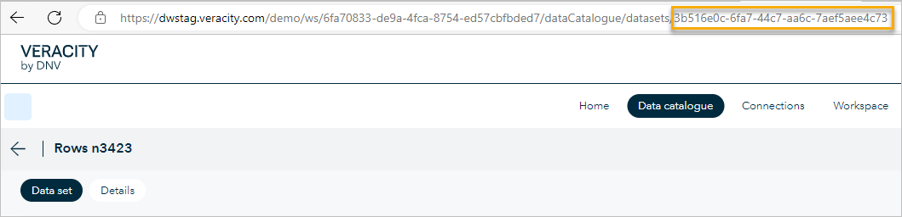

# API endpoints

You can use the following API endpoints for Data Workbench:
* [Schema endpoints](#schema-endpoints)
* [Workspace and tenant endpoints](#workspace-and-tenant-endpoints)
* [Data sets endpoints](#data-sets-endpoints)

To see response codes for the API, go [here](#response-codes).

## Workspace ID

To find your workspace ID, see the URL of your workspace in a browser. The part after ```ws/```is the ID of your workspace.

Note that 'workspaceId' is a string in UUID format.

<figure>
	
	<figcaption>The image shows where to find the ID of your workspace.</figcaption>
</figure>

## Schema endpoints
You can manage your workspace's schema with API calls. You can do CRUD operations for the following endpoints.

### To get a list of workspace schemas for a specific workspace
Call the https://api.veracity.com/veracity/dw/gateway/api/v1/workspaces/{workspaceId}/schemas endpoint. 

In the request, you must provide:
* [Authorization and authentication](authentication.md)
* [{workspaceId}](https://developer.veracity.com/docs/section/dataworkbench/apiendpoints#workspace-id)

To get the schema, add to the request `includeDefaultSchemaVersion=true`.

Below you can see an example of a successful response (code 200).

```json
    "result": [
        {
            "id": "7c312976-3d3d-4te3-9234-12f238f71234",
        "workspaceId": "00000000-0000-0000-0000-000000000000",
        "name": "DCS Period Summary",
        "description": "Aggregated emissions per DCS period including verification status, grouped by owner and flag",
        "industry": "Maritime",
        "isPredefined": true,
        "avatarColor": 55,
        "createdBy": "c44e1e55-fa3a-4553-b974-87eb50e41234",
        "createdOn": "2022-05-23T11:42:34.9558871Z",
        "lastModifiedBy": "c44e1e55-1232-4553-b974-87eb50e41234",
        "lastModifiedOn": "2022-05-23T11:42:34.9558871Z"
    },
 {
        "id": "2a0b9aa7-b7d5-4fbb-9a59-850459cd1234",
        "workspaceId": "e03c005e-1adf-456a-9d84-3f8694831234",
        "name": "TEST Name",
        "description": "TEST DESCRIPTION",
        "industry": "",
        "isPredefined": false,
        "avatarColor": 60,
        "createdBy": "2f3t7ee2-1234-4d25-af86-f5364fcb1234",
        "createdOn": "2022-06-07T06:49:35.5587386Z",
        "lastModifiedBy": "2f2e7ae3-1234-4d25-af86-f5364fcb1234",
        "lastModifiedOn": "2022-06-17T08:55:25.063984Z"
    }
```

### To get a schema by its ID
Call the following endpoint with the GET method.
`https://api.veracity.com/veracity/dw/gateway/api/v1/workspaces/{workspaceId}/Schemas/{schemaId}`

### To get schema version ID
Call the following endpoint with the GET method.

`https://api.veracity.com/veracity/dw/gateway/api/v1/workspaces/{workspaceId}/Schemas/schemaversions/{schemaVersionId}`

### To create a new schema
Call the `https://api.veracity.com/veracity/dw/gateway/api/v1/workspaces/{workspaceId}/Schemas/add` endpoint with the POST method.

Note that only a workspace admin can do this.

### To patch a schema (change name, short name, or description)
Call the following  endpoint with the PATCH method.
`https://api.veracity.com/veracity/dw/gateway/api/v1/workspaces/{workspaceId}/Schemas/{schemaId}`

Note that only a workspace admin can do this.

### To add schema version
Call the following endpoint with the POST method.
`https://api.veracity.com/veracity/dw/gateway/api/v1/workspaces/{workspaceId}/Schemas/schemaversions/add`

Note that only a workspace admin can do this.

### To make schema version default
Call the following endpoint with the PATCH method.
`https://api.veracity.com/veracity/dw/gateway/api/v1/workspaces/{workspaceId}/Schemas/{schemaId}/schemaversions/{schemaVersionId}`

Note that only a workspace admin can do this.

## Workspace and tenant endpoints

Each customer has one tenant in Data Workbench. A tenant can have multiple workspaces.

### To check what workspaces you can access within a tenant
Call the `https://api.veracity.com/veracity/dw/gateway/api/v1/tenants/{tenantId}/workspaces` endpoint with a GET method.


### To query activity logs for a workspace
Call the endpoint https://api.veracity.com/veracity/dw/gateway/api/v1/workspaces/{workspaceId}/ledger providing the ID of the workspace.

In the request, you must provide:
* [Authorization and authentication](authentication.md)
* [{workspaceId}](https://developer.veracity.com/docs/section/dataworkbench/apiendpoints#workspace-id)

You can add to the request a page size and page index, for example `PageSize=1&PageIndex=5`.

Below you can see an example of a successful response (code 200).

```json
    "result": [

        {

            "id": "3fa85f64-5717-4562-b3fc-2c963f66afa6",

            "workspaceId": "3fa85f64-5717-4562-b3fc-2c963f66afa6",

            "userId": "3fa85f64-5717-4562-b3fc-2c963f66afa6",

            "userName": "string",

            "resource": {

                "3fa85f64-5717-4562-b3fc-2c963f66afa6": "string"

            },

            "payload": {

                "additionalProp1": "3fa85f64-5717-4562-b3fc-2c963f66afa6",

                "additionalProp2": "3fa85f64-5717-4562-b3fc-2c963f66afa6",

                "eventType": "string"

            },

            "eventName": "string",

            "timestamp": "2023-05-24T08:45:08.1759463Z"

        }

    ],

    "pageIndex": 1,

    "pageSize": 1,

    "totalCount": 100,

    "totalPages": 100
```

### <a name="ingest"></a> To get data ingest endpoint for current workspace

Call the https://api.veracity.com/veracity/dw/gateway/api/v1/workspaces/{workspaceId}/Ingest endpoint providing the ID of the workspace.

In the request, you must provide:
* [Authorization and authentication](authentication.md)
* [{workspaceId}](https://developer.veracity.com/docs/section/dataworkbench/apiendpoints#workspace-id)

Below you can see an example of a successful response (code 200).

```json
Request-Context: appId=cid-v1:859301ec-5104-4138-985a-c996fc1ecd3e
X-Correlation-ID: 7799cc2c-8cf7-4170-95f3-275249f51b6f
Strict-Transport-Security: max-age=15724800; includeSubDomains
X-Content-Type-Options: nosniff
X-Frame-Options: SAMEORIGIN
X-XSS-Protection: 1; mode=block
Expect-CT: max-age=2592000; enforce; report-uri="https://veracitycommon.report-uri.com/r/d/ct/enforce"
Date: Mon, 13 Nov 2023 10:37:15 GMT
WWW-Authenticate: Bearer,Bearer
Content-Length: 0
```

### To create a workspace in a tenant
You can create a workspace belonging to a specified tenant by using the POST method and calling the following endpoint.

`https://api.veracity.com/veracity/dw/gateway/api/v1/tenants/{tenantId:guid}/workspaces`

Below you can see a sample request payload.

```json
{
     "name": "string",
     "description": "string"
}
```

Below you can see a sample response.

```json
{
  "id": "196a8ff4-dfbc-4ee7-ae08-4f38b84d9c86",
  "name": "SHANGHAI",
  "description": "WS SHANGHAI"
}
```

### To get workspace by its ID
You can retrieve a workspace through its ID by using the GET method and calling the following endpoint.
`https://api.veracity.com/veracity/dw/gateway/api/v1/workspaces/{workspaceId:guid}`

Below you can see a sample response.

```json
{
    "id": "6113fcaa-a29e-4804-b9a9-dac331676008",
    "name": "Workspace Name1",
    "description": "Workspace created by test1"
}
```


### To get all workspaces in a tenant
You can get all workspaces that belong to a specified tenant by using the GET method and calling the following endpoint.

`https://api.veracity.com/veracity/dw/gateway/api/v1/tenants/{tenantId:guid}/workspaces`

Below you can see a sample response.

```json
[
    {
        "id": "6113fcaa-a29e-4804-b9a9-dac331676008",
        "name": "Workspace Name1",
        "description": "Workspace created by test1"
    },
    {
        "id": "89a1fcaa-D43e-9802-c879-cad886785129",
        "name": "Workspace Name2",
        "description": "Workspace created by test2"
    }
]
```

### To get all users and role scopes in a tenant
You can get all users and their assigned role scopes in a specified tenant by using the GET method and calling the following endpoint.

`https://api.veracity.com/veracity/dw/gateway/api/v1/tenants/{tenantId:guid}/users/roles`

Below you can see a sample response.

```json
{
    "result": [
        {
            "userId": "ddbf7526-abc3-45e2-bfd9-a2223a431a12",
            "email": "name.surname@dnv.com",
            "name": "Name Surname",
            "isServicePrincipal": false,
            "roleScope": {
                "role": "administrator",
                "scopeType": "Tenant",
                "scopeRef": "c39867d7-a4c0-4ae2-8281-7d45936a3bec"
            }
        },
        {
            "userId": "e574383d-994e-4a3d-9a7d-5d76755552e1",
            "email": "Name.Surname@dnv.com",
            "name": "Name Surname",
            "isServicePrincipal": false,
            "roleScope": {
                "role": "reader",
                "scopeType": "Tenant",
                "scopeRef": "c39867d7-a4c0-4ae2-8281-7d45936a3bec"
            }
        }
    ],
    "pageIndex": 1,
    "pageSize": 2,
    "totalCount": 65,
    "totalPages": 33
}
```

### To get all users and role scopes in a workspace
You can get all users and their assigned role scopes in a specified workspace by using the GET method and calling the following endpoint.

`https://api.veracity.com/veracity/dw/gateway/api/v1/workspaces/{workspaceId:guid}/users/roles`

Below you can see a sample response.

```json
{
    "result": [
        {
            "userId": "ddbf7526-abc3-45e2-bfd9-a2223a431a12",
            "email": "name.surname@dnv.com",
            "name": "Name Surname",
            "isServicePrincipal": false,
            "roleScope": {
                "role": "administrator",
                "scopeType": "Workspace",
                "scopeRef": "c39867d7-a4c0-4ae2-8281-7d45936a3bec"
            }
        },
        {
            "userId": "e574383d-994e-4a3d-9a7d-5d76755552e1",
            "email": "Name.Surname@dnv.com",
            "name": "Name Surname",
            "isServicePrincipal": false,
            "roleScope": {
                "role": "reader",
                "scopeType": "Workspace",
                "scopeRef": "c39867d7-a4c0-4ae2-8281-7d45936a3bec"
            }
        }
    ],
    "pageIndex": 1,
    "pageSize": 2,
    "totalCount": 65,
    "totalPages": 33
}
```

## Data sets endpoints

<a name="datasetid"></a> Data set ID is a string in UUID format. 

To check the 'datasetId' for a data set:
1. In Data Workbench, go to **Data catalogue**.
2. Open a data set.
3. Copy the part of the URL after 'datasets'.

<figure>
	
	<figcaption>The ID of a data set .</figcaption>
</figure>

For example, for the URL https://dw.veracity.com/ws/6fa70833-de9a-4fca-8754-ed57cbfbded7/dataCatalogue/datasets/3b516e0c-6fa7-44c7-aa6c-7aef5aee4c73, the data set ID is 3b516e0c-6fa7-44c7-aa6c-7aef5aee4c73.

You can use the following endpoints:
* [Get all data sets for a workspace](#allData)
* [Get specific data sets by ID](#data)
* [Query for data sets by ID and with additional properties](#dataMore)
* [Query for activity logs for a data set](#ledger)

<a name="allData"></a>To get all available data sets (including those shared with you and added to your workspace), call the https://api.veracity.com/veracity/dw/gateway/api/v2/workspaces/{workspaceId}/datasets/query endpoint with the POST method.

In the request, you must provide:
* [Authorization and authentication](authentication.md)
* [{workspaceId}](https://developer.veracity.com/docs/section/dataworkbench/apiendpoints#workspace-id)

Below you can see a sample request body.

```json
   {
  "isBaseDataset": false,
  "pageIndex": 1,
  "pageSize": 10,
  "sortColumn": "Name",
  "sortDirection": "Descending",

  "createdAfter": "2023-01-01T00:00:00.000Z",
  "schemaVersionIds": ["89153dc4-2323-45c9-b70e-241503697315"]

```

Below you can see an example of a successful response (code 200).

```json
   
{
  "result": [{
    "id": "397ea7e9-e55e-41f6-a947-8faa71315d0d",
    "name": "zzzz Poseidon Principles (DCS FOC-R)",
    "description": "",
    "workspaceId": "f6627574-6a67-45d0-8895-b878313630d8",
    "connectionId": "67af728c-4fb0-4638-8758-ebd6f8857ad9",
    "createdBy": "a226d3f8-eb45-4230-a0c1-1b4082176a30",
    "createdOn": "2023-11-14T14:00:03.7159724Z",
    "lastModifiedBy": "a226d3f8-eb45-4230-a0c1-1b4082176a30",
    "lastModifiedOn": "2023-11-14T14:00:03.7159724Z",
    "schemaInfo": {
      "schemaVersionId": "89153dc4-2323-45c9-b70e-241503697315",
      "schemaName": "DCS Period Summary v1"
    },
    "queries": [{
      "column": "PERIOD_START_DATE",
      "filterType": "GreaterOrEqual",
      "filterValues": ["2021-01-01T00:00:00.0000000Z"]
    }, {
      "column": "PERIOD_END_DATE",
      "filterType": "LessOrEqual",
      "filterValues": ["2022-01-01T00:00:00.0000000Z"]
    }],
    "columns": ["IMO", "VESSEL_NAME", "PERIOD_START_DATE", "PERIOD_END_DATE", "HOURS_UNDERWAY", "DISTANCE", "GROSS_TONNAGE", "DEADWEIGHT", "ICE_CLASS", "VESSEL_FLAG", "DATA_CLASSIFICATION", "VESSEL_TYPE_PP", "YEAR_OF_BUILD", "EEDI", "EEXI", "CONSUMPTION_MDO", "CONSUMPTION_MGO", "CONSUMPTION_LFO", "CONSUMPTION_HFO", "CONSUMPTION_LPGP", "CONSUMPTION_LPGB", "CONSUMPTION_LNG", "CONSUMPTION_METHANOL", "CONSUMPTION_ETHANOL", "CONSUMPTION_OTHER", "OTHER_TYPE_CARBON_FACTOR"],
    "isBaseDataset": false,
    "tags": {}
  }, {
    "id": "ce0fecfa-e7ff-47e1-b409-c5d3ecd327dd",
    "name": "testtestesttest",
    "description": "",
    "workspaceId": "f6627574-6a67-45d0-8895-b878313630d8",
    "connectionId": "67af728c-4fb0-4638-8758-ebd6f8857ad9",
    "createdBy": "ef56da93-753d-422a-89d7-d9f8fc42bce1",
    "createdOn": "2023-04-20T08:28:29.6010341Z",
    "lastModifiedBy": "ef56da93-753d-422a-89d7-d9f8fc42bce1",
    "lastModifiedOn": "2023-04-20T08:28:29.6010341Z",
    "schemaInfo": {
      "schemaVersionId": "89153dc4-2323-45c9-b70e-241503697315",
      "schemaName": "DCS Period Summary v1"
    },
    "queries": [{
      "column": "IMO",
      "filterType": "List",
      "filterValues": ["9253856", "9253870"]
    }, {
      "column": "PERIOD_START_DATE",
      "filterType": "GreaterOrEqual",
      "filterValues": ["2021-01-01T00:00:00.0000000Z"]
    }, {
      "column": "PERIOD_END_DATE",
      "filterType": "LessOrEqual",
      "filterValues": ["2022-01-01T00:00:00.0000000Z"]
    }],
    "columns": ["IMO", "VESSEL_NAME", "PERIOD_START_DATE", "PERIOD_END_DATE", "HOURS_UNDERWAY", "TOTAL_REPORTED_TIME", "CO2_EMITTED_MT", "DISTANCE", "GROSS_TONNAGE", "NET_TONNAGE", "DEADWEIGHT", "PROPULSION_POWER", "AE_POWER", "ICE_CLASS", "VESSEL_FLAG", "VESSEL_TYPE", "VESSEL_TYPE_OTHER", "VESSEL_CATEGORY_PP", "DATA_CLASSIFICATION", "AIS_DISTANCE", "AIS_DURATION", "AIS_CO2_EMITTED"],
    "isBaseDataset": false,
    "tags": {}
  }, {
    "id": "d8f961ac-51ca-42c0-8b50-62bc27528871",
    "name": "testkk Poseidon Principles (DCS FOC-R)",
    "description": "",
    "workspaceId": "f6627574-6a67-45d0-8895-b878313630d8",
    "connectionId": "67af728c-4fb0-4638-8758-ebd6f8857ad9",
    "createdBy": "a226d3f8-eb45-4230-a0c1-1b4082176a30",
    "createdOn": "2023-11-09T09:13:08.0898667Z",
    "lastModifiedBy": "a226d3f8-eb45-4230-a0c1-1b4082176a30",
    "lastModifiedOn": "2023-11-09T09:13:08.0898667Z",
    "schemaInfo": {
      "schemaVersionId": "89153dc4-2323-45c9-b70e-241503697315",
      "schemaName": "DCS Period Summary v1"
    },
    "queries": [{
      "column": "PERIOD_START_DATE",
      "filterType": "GreaterOrEqual",
      "filterValues": ["2022-01-01T00:00:00.0000000Z"]
    }, {
      "column": "PERIOD_END_DATE",
      "filterType": "LessOrEqual",
      "filterValues": ["2023-01-01T00:00:00.0000000Z"]
    }],
    "columns": ["IMO", "VESSEL_NAME", "PERIOD_START_DATE", "PERIOD_END_DATE", "HOURS_UNDERWAY", "DISTANCE", "GROSS_TONNAGE", "DEADWEIGHT", "ICE_CLASS", "VESSEL_FLAG", "DATA_CLASSIFICATION", "VESSEL_TYPE_PP", "YEAR_OF_BUILD", "EEDI", "EEXI", "CONSUMPTION_MDO", "CONSUMPTION_MGO", "CONSUMPTION_LFO", "CONSUMPTION_HFO", "CONSUMPTION_LPGP", "CONSUMPTION_LPGB", "CONSUMPTION_LNG", "CONSUMPTION_METHANOL", "CONSUMPTION_ETHANOL", "CONSUMPTION_OTHER", "OTHER_TYPE_CARBON_FACTOR"],
    "isBaseDataset": false,
    "tags": {}
  }, {
    "id": "f4258eb5-7ad3-4068-95d1-22c02512a578",
    "name": "testingkinga",
    "description": "",
    "workspaceId": "f6627574-6a67-45d0-8895-b878313630d8",
    "connectionId": "67af728c-4fb0-4638-8758-ebd6f8857ad9",
    "createdBy": "a226d3f8-eb45-4230-a0c1-1b4082176a30",
    "createdOn": "2023-02-15T13:16:01.1120865Z",
    "lastModifiedBy": "a226d3f8-eb45-4230-a0c1-1b4082176a30",
    "lastModifiedOn": "2023-02-15T13:16:01.1120865Z",
    "schemaInfo": {
      "schemaVersionId": "89153dc4-2323-45c9-b70e-241503697315",
      "schemaName": "DCS Period Summary v1"
    },
    "queries": [{
      "column": "IMO",
      "filterType": "List",
      "filterValues": ["1234567", "9999995"]
    }],
    "columns": ["IMO", "VESSEL_NAME", "PERIOD_START_DATE", "PERIOD_END_DATE", "HOURS_UNDERWAY", "TOTAL_REPORTED_TIME", "DISTANCE", "GROSS_TONNAGE", "NET_TONNAGE", "DEADWEIGHT", "PROPULSION_POWER", "AE_POWER", "AIS_DISTANCE", "AIS_DURATION", "AIS_CO2_EMITTED"],
    "isBaseDataset": false,
    "tags": {}
  }, {
    "id": "eb9939e9-4652-4273-829d-d74f4233712b",
    "name": "testBug7",
    "description": "",
    "workspaceId": "f6627574-6a67-45d0-8895-b878313630d8",
    "connectionId": "67af728c-4fb0-4638-8758-ebd6f8857ad9",
    "createdBy": "b497e4a0-177d-4178-97c6-b27383b288a9",
    "createdOn": "2023-03-03T14:58:08.1962849Z",
    "lastModifiedBy": "b497e4a0-177d-4178-97c6-b27383b288a9",
    "lastModifiedOn": "2023-03-03T14:58:08.1962849Z",
    "schemaInfo": {
      "schemaVersionId": "89153dc4-2323-45c9-b70e-241503697315",
      "schemaName": "DCS Period Summary v1"
    },
    "queries": [],
    "columns": ["IMO", "VESSEL_NAME", "PERIOD_START_DATE", "PERIOD_END_DATE", "HOURS_UNDERWAY", "TOTAL_REPORTED_TIME", "CO2_EMITTED_MT", "DISTANCE", "GROSS_TONNAGE", "NET_TONNAGE", "DEADWEIGHT", "PROPULSION_POWER", "AE_POWER", "ICE_CLASS", "VESSEL_FLAG", "VESSEL_TYPE", "VESSEL_TYPE_OTHER", "VESSEL_CATEGORY_PP", "DATA_CLASSIFICATION", "AIS_DISTANCE", "AIS_DURATION", "AIS_CO2_EMITTED"],
    "isBaseDataset": false,
    "tags": {}
  }, {
    "id": "2f68615f-5d8a-42e0-8f0e-90a7c6f89ba6",
    "name": "testBug6",
    "description": "",
    "workspaceId": "f6627574-6a67-45d0-8895-b878313630d8",
    "connectionId": "67af728c-4fb0-4638-8758-ebd6f8857ad9",
    "createdBy": "b497e4a0-177d-4178-97c6-b27383b288a9",
    "createdOn": "2023-03-03T14:53:04.3776665Z",
    "lastModifiedBy": "b497e4a0-177d-4178-97c6-b27383b288a9",
    "lastModifiedOn": "2023-03-03T14:53:04.3776665Z",
    "schemaInfo": {
      "schemaVersionId": "89153dc4-2323-45c9-b70e-241503697315",
      "schemaName": "DCS Period Summary v1"
    },
    "queries": [],
    "columns": ["IMO", "VESSEL_NAME", "PERIOD_START_DATE", "PERIOD_END_DATE", "HOURS_UNDERWAY", "TOTAL_REPORTED_TIME", "CO2_EMITTED_MT", "DISTANCE", "GROSS_TONNAGE", "NET_TONNAGE", "DEADWEIGHT", "PROPULSION_POWER", "AE_POWER", "ICE_CLASS", "VESSEL_FLAG", "VESSEL_TYPE", "VESSEL_TYPE_OTHER", "VESSEL_CATEGORY_PP", "DATA_CLASSIFICATION", "AIS_DISTANCE", "AIS_DURATION", "AIS_CO2_EMITTED"],
    "isBaseDataset": false,
    "tags": {}
  }, {
    "id": "6cc87d24-9a16-49d6-af17-caccda32f5d5",
    "name": "testBug5",
    "description": "qi.rui.mary.ma@dnv.com",
    "workspaceId": "f6627574-6a67-45d0-8895-b878313630d8",
    "connectionId": "67af728c-4fb0-4638-8758-ebd6f8857ad9",
    "createdBy": "b497e4a0-177d-4178-97c6-b27383b288a9",
    "createdOn": "2023-03-03T14:50:19.3431098Z",
    "lastModifiedBy": "b497e4a0-177d-4178-97c6-b27383b288a9",
    "lastModifiedOn": "2023-03-03T14:50:19.3431098Z",
    "schemaInfo": {
      "schemaVersionId": "89153dc4-2323-45c9-b70e-241503697315",
      "schemaName": "DCS Period Summary v1"
    },
    "queries": [],
    "columns": ["IMO", "VESSEL_NAME", "PERIOD_START_DATE", "PERIOD_END_DATE", "HOURS_UNDERWAY", "TOTAL_REPORTED_TIME", "CO2_EMITTED_MT", "DISTANCE", "GROSS_TONNAGE", "NET_TONNAGE", "DEADWEIGHT", "PROPULSION_POWER", "AE_POWER", "ICE_CLASS", "VESSEL_FLAG", "VESSEL_TYPE", "VESSEL_TYPE_OTHER", "VESSEL_CATEGORY_PP", "DATA_CLASSIFICATION", "AIS_DISTANCE", "AIS_DURATION", "AIS_CO2_EMITTED"],
    "isBaseDataset": false,
    "tags": {}
  }, {
    "id": "59fe3529-aa70-4d7b-b4c2-4290b05243b7",
    "name": "testBug4",
    "description": "qi.rui.mary.ma@dnv.com",
    "workspaceId": "f6627574-6a67-45d0-8895-b878313630d8",
    "connectionId": "67af728c-4fb0-4638-8758-ebd6f8857ad9",
    "createdBy": "b497e4a0-177d-4178-97c6-b27383b288a9",
    "createdOn": "2023-03-03T14:46:35.4585816Z",
    "lastModifiedBy": "b497e4a0-177d-4178-97c6-b27383b288a9",
    "lastModifiedOn": "2023-03-03T14:46:35.4585816Z",
    "schemaInfo": {
      "schemaVersionId": "89153dc4-2323-45c9-b70e-241503697315",
      "schemaName": "DCS Period Summary v1"
    },
    "queries": [],
    "columns": ["IMO", "VESSEL_NAME", "PERIOD_START_DATE", "PERIOD_END_DATE", "HOURS_UNDERWAY", "TOTAL_REPORTED_TIME", "CO2_EMITTED_MT", "DISTANCE", "GROSS_TONNAGE", "NET_TONNAGE", "DEADWEIGHT", "PROPULSION_POWER", "AE_POWER", "ICE_CLASS", "VESSEL_FLAG", "VESSEL_TYPE", "VESSEL_TYPE_OTHER", "VESSEL_CATEGORY_PP", "DATA_CLASSIFICATION", "AIS_DISTANCE", "AIS_DURATION", "AIS_CO2_EMITTED"],
    "isBaseDataset": false,
    "tags": {}
  }, {
    "id": "e87a4e55-5a76-4124-830f-a4093f56d172",
    "name": "testBug3",
    "description": "",
    "workspaceId": "f6627574-6a67-45d0-8895-b878313630d8",
    "connectionId": "67af728c-4fb0-4638-8758-ebd6f8857ad9",
    "createdBy": "b497e4a0-177d-4178-97c6-b27383b288a9",
    "createdOn": "2023-03-03T14:33:05.8142741Z",
    "lastModifiedBy": "b497e4a0-177d-4178-97c6-b27383b288a9",
    "lastModifiedOn": "2023-03-03T14:33:05.8142741Z",
    "schemaInfo": {
      "schemaVersionId": "89153dc4-2323-45c9-b70e-241503697315",
      "schemaName": "DCS Period Summary v1"
    },
    "queries": [{
      "column": "IMO",
      "filterType": "List",
      "filterValues": ["9999996"]
    }, {
      "column": "PERIOD_START_DATE",
      "filterType": "GreaterOrEqual",
      "filterValues": ["2020-01-01T00:00:00.0000000Z"]
    }, {
      "column": "PERIOD_END_DATE",
      "filterType": "LessOrEqual",
      "filterValues": ["2020-12-31T00:00:00.0000000Z"]
    }],
    "columns": ["IMO", "VESSEL_NAME", "PERIOD_START_DATE", "PERIOD_END_DATE", "HOURS_UNDERWAY", "TOTAL_REPORTED_TIME", "CO2_EMITTED_MT", "DISTANCE", "GROSS_TONNAGE", "NET_TONNAGE", "DEADWEIGHT", "PROPULSION_POWER", "AE_POWER", "ICE_CLASS", "VESSEL_FLAG", "VESSEL_TYPE", "VESSEL_TYPE_OTHER", "VESSEL_CATEGORY_PP", "DATA_CLASSIFICATION", "AIS_DISTANCE", "AIS_DURATION", "AIS_CO2_EMITTED"],
    "isBaseDataset": false,
    "tags": {}
  }, {
    "id": "37f6097d-ea3f-4885-bb5a-b5579f50f16e",
    "name": "test4",
    "description": "test4",
    "workspaceId": "f6627574-6a67-45d0-8895-b878313630d8",
    "connectionId": "67af728c-4fb0-4638-8758-ebd6f8857ad9",
    "createdBy": "ba30865c-f5b7-40ed-9f2b-b54198daea95",
    "createdOn": "2023-02-01T06:08:02.358094Z",
    "lastModifiedBy": "ba30865c-f5b7-40ed-9f2b-b54198daea95",
    "lastModifiedOn": "2023-02-01T06:08:02.358094Z",
    "schemaInfo": {
      "schemaVersionId": "89153dc4-2323-45c9-b70e-241503697315",
      "schemaName": "DCS Period Summary v1"
    },
    "queries": [{
      "column": "PERIOD_START_DATE",
      "filterType": "GreaterOrEqual",
      "filterValues": ["2023-01-01T00:00:00.0000000Z"]
    }, {
      "column": "PERIOD_END_DATE",
      "filterType": "LessOrEqual",
      "filterValues": ["2023-02-01T00:00:00.0000000Z"]
    }],
    "columns": ["IMO", "VESSEL_NAME", "PERIOD_START_DATE", "PERIOD_END_DATE", "HOURS_UNDERWAY", "TOTAL_REPORTED_TIME", "CO2_EMITTED_MT", "DISTANCE", "GROSS_TONNAGE", "NET_TONNAGE", "DEADWEIGHT", "PROPULSION_POWER", "AE_POWER", "ICE_CLASS", "VESSEL_FLAG", "VESSEL_TYPE", "VESSEL_TYPE_OTHER", "VESSEL_CATEGORY_PP", "DATA_CLASSIFICATION", "AIS_DISTANCE", "AIS_DURATION", "AIS_CO2_EMITTED"],
    "isBaseDataset": false,
    "tags": {}
  }],
  "pageIndex": 1,
  "pageSize": 10,
  "totalCount": 272,
  "totalPages": 28
}
```

<a name="data"></a>To get a specific data set by its ID (including data sets shared with you and added to your workspace), call the https://api.veracity.com/veracity/dw/gateway/api/v2/workspaces/{workspaceId}/datasets/{datasetId} endpoint. 

In the request, you must provide:
* [Authorization and authentication](authentication.md)
* [{workspaceId}](https://developer.veracity.com/docs/section/dataworkbench/apiendpoints#workspace-id)
* [{datasetId}](#datasetid)

Below you can see an example of a successful response (code 200).

```json
{
"id": "3fa85f64-5717-4562-b3fc-2c963f66afa6",
"name": "string",
"description": "string",
"workspaceId": "3fa85f64-5717-4562-b3fc-2c963f66afa6",
"connectionId": "3fa85f64-5717-4562-b3fc-2c963f66afa6",
"createdBy": "3fa85f64-5717-4562-b3fc-2c963f66afa6",
"createdOn": "2022-08-10T14:37:47.568Z",
"lastModifiedBy": "3fa85f64-5717-4562-b3fc-2c963f66afa6",
"lastModifiedOn": "2022-08-10T14:37:47.568Z",
"schemaInfo": {
"schemaVersionId": "3fa85f64-5717-4562-b3fc-2c963f66afa6",
"schemaName": "string"
},
"queries": [
       {
           "column": "string",
           "filterType": "string",
           "filterValues": [
               "string"
           ]
       }
],
"columns": [
"string"
],
"isBaseDataset": true
}
```

<a name="dataMore"></a>To query for data by workspace and data set ID (including data sets shared with you and added to your workspace), call the https://api.veracity.com/veracity/dw/gateway/api/v2/workspaces/{workspaceId}/datasets/{datasetId}/query endpoint. 

**For a tutorial on this endpoint**, go [here](tutorial/tutorialq.md).

In the request, you must provide:
* [Authorization and authentication](authentication.md)
* [{workspaceId}](https://developer.veracity.com/docs/section/dataworkbench/apiendpoints#workspace-id)
* [{datasetId}](#datasetid)

Below you can see an example of a request.

```json
{
"pageIndex": 0,
"pageSize": 0,
"columnFilter": [
"string"
],
"queryFilters": [
       {
           "column": "string",
           "filterType": "string",
           "filterValues": [
               "string"
           ]
       }
   ],
"sorting": {
       "column": "string",
       "order": "Ascending"
   }
} 
```

Below you can see an example of a successful response (code 200).

```json
    {
    "data": [

        {}

    ],

    "pagination": {

        "pageIndex": 1,

        "pageSize": 10,

        "totalPages": 10,

        "totalCount": 100

    }
}
```

<a name="ledger"></a>To query activity logs (ledgers) for a dataset, call the https://api.veracity.com/veracity/dw/gateway/api/v1/workspaces/{workspaceId}/datasets/{datasetId}/ledger endpoint providing the ID of the workspace and the dataset.

In the request, you must provide:
* [Authorization and authentication](authentication.md)
* [{workspaceId}](https://developer.veracity.com/docs/section/dataworkbench/apiendpoints#workspace-id)
* [{datasetId}](#datasetid)

You can add the following to the request:
* Page size and index, for example, `PageSize=1&PageIndex=5`.

Below you can see an example of a successful response (code 200).

```json
    "result": [
        {
            "id": "3fa85f64-5717-4562-b3fc-2c963f66afa6",
            "workspaceId": "3fa85f64-5717-4562-b3fc-2c963f66afa6",
            "userId": "3fa85f64-5717-4562-b3fc-2c963f66afa6",
            "userName": "string",
            "resource": {
                "3fa85f64-5717-4562-b3fc-2c963f66afa6": "string"
            },
            "payload": {
                "additionalProp1": "3fa85f64-5717-4562-b3fc-2c963f66afa6",
                "additionalProp2": "3fa85f64-5717-4562-b3fc-2c963f66afa6",
                "eventType": "string"
            },
            "eventName": "string",
            "timestamp": "2023-05-24T08:45:08.1759463Z"
        }
    ],
    "pageIndex": 1,
    "pageSize": 1,
    "totalCount": 100,
    "totalPages": 100
```

### To query share owners by data set ID list
You can query who shared the data sets with you so that you understand the data set context by using the POST method and calling the following endpoint.

`https://api.veracity.com/veracity/dw/gateway/api/v1/{workspaceId:guid}/shares/sharedBy/Query`

Below you can see a sample request payload.

```json
{
"datasetIds": [
    "3fa85f64-5717-4562-b3fc-2c963f66afa6"
  ]
}
```

Below you can see a sample response.

```json
[ {
        "datasetId": "f80b0de1-3b1d-4a64-aa4d-88d6073ff1cd",    // ID of the data set
        "sharedBy": {
            "id": "3fa85f64-5717-4562-b3fc-2c963f66afa6",   // ID of the shared user
            "sharedByType": "User",
            "name": "User Name"  // Name of the shared user
        }
    },
    {
        "datasetId": "6113fcaa-a29e-4804-b9a9-dac331676ee8",    // ID of the data set
        "sharedBy": {
            "id": "a1d9ef10-39c3-4d3a-8c33-241a0b1138a1",   // ID of the shared workspace
            "sharedByType": "Workspace",
            "name": "Workspace Name"  // Name of the shared workspace
        }
    }]
```

Note that:
* If the data sets were shared with a person, you must be this person or the person who initiated the share. 
* If the data sets were shared with a workspace, you must be a member of this workspace.

### To download SoC from a data set
You can download Statement of Compliance (SoC) PDF file from a data set based on workspaceId, datasetId, and documentId.

To download SoC, call the following endpoint using your [workspaceId](https://developer.veracity.com/docs/section/dataworkbench/apiendpoints#workspace-id), [datasetId](https://developer.veracity.com/docs/section/dataworkbench/apiendpoints#data-sets-endpoints) (see Data set endpoints), and documentId.

`https://api.veracity.com/veracity/dw/gateway/api/v2/workspaces/{workspaceId}/datasets/documents/download`

Below you can see a sample request payload.

```json
{
"datasetId": "DatasetId",
"documentId": "DocumentId"
}
```

To get documentID, call the `https://api.veracity.com/veracity/dw/gateway/api/v2/workspaces/{workspaceId}/datasets/{datasetId}/query` endpoint. In the response, locate the **File_Link** field and copy it; this **is the documentId**.

## Sample Python for calling the endpoints
You can use the sample Python code below to call Data Workbench endpoints.

```json
import requests

# Configuration
client_id = "YOUR_CLIENT_ID"
client_secret = "YOUR_CLIENT_SECRET"
subscription_key = "YOUR_SUBSCRIPTION_KEY"
workspace_id = "YOUR_WORKSPACE_ID"
dataset_id = "YOUR_DATASET_ID"

# Query endpoint URL    
query_endpoint = f"https://api.veracity.com/veracity/dw/gateway/api/v2/workspaces/{workspace_id}/datasets/{dataset_id}/query"

# Token URL for authentication 
token_url = "https://login.microsoftonline.com/dnvglb2cprod.onmicrosoft.com/oauth2/token"

# Token payload for authentication request
token_payload = {
    "grant_type": "client_credentials",
    "client_id": client_id,
    "client_secret": client_secret,
    "resource": "https://dnvglb2cprod.onmicrosoft.com/83054ebf-1d7b-43f5-82ad-b2bde84d7b75"
}

# Function to retrieve access token
def get_token():
    try:
        response = requests.post(token_url, data = token_payload)
        return response.json()["access_token"]
    except Exception as e:
        print(f"Failed to retrieve access token: {e}")

# Headers for the API request    
headers = {
    'Content-Type': 'application/json',
    'Ocp-Apim-Subscription-Key': subscription_key,
    'Authorization': f"Bearer {get_token()}"
}

# Payload for the query request
query_payload = {
  # Request body
  # Add properties as needed
  # See documentation 
}

# Function to call the query endpoint and return the response as a dictionary object
def call_query_endpoint(url):
    try:
        response = requests.post(url = url, headers = headers, json = query_payload)
        response.raise_for_status()
        return response.json()
    except requests.exceptions.HTTPError as e:
        print(f"HTTP error occurred: {e}")
    except requests.exceptions.RequestException as e:
        print(f"An error occurred during the request: {e}")
    except Exception as e:
        print(f"error occured: {e}")

# Call the query endpoint and retrieve the result
query_res_dict = call_query_endpoint(query_endpoint)
print(query_res_dict)

''' 
Response Schema:

{
  "type": "object",
  "properties": {
    "data": {
      "type": "array",
      "items": {}
    },
    "pagination": {
      "type": "object",
      "properties": {
        "pageIndex": {
          "type": "integer",
          "format": "int32"
        },
        "pageSize": {
          "type": "integer",
          "format": "int32"
        },
        "totalPages": {
          "type": "integer",
          "format": "int32"
        },
        "totalCount": {
          "type": "integer",
          "format": "int32"
        }
      },
      "additionalProperties": false
    }
  },
  "additionalProperties": false
}
'''
```

## Response codes

You can get the following response codes when you send API calls:

* 200 code when the request was successful. Returns Query Data Found.
* 201 code when the resource was successfully created.
* 400 code for the invalid model. See schemas to find out the correct model to use in your API call.
* 401 code when you are unauthorized to access a resource.
* 404 code when the resource was not found.
* 500 code for an internal server error.
* 502 when you have called a bad gateway.
