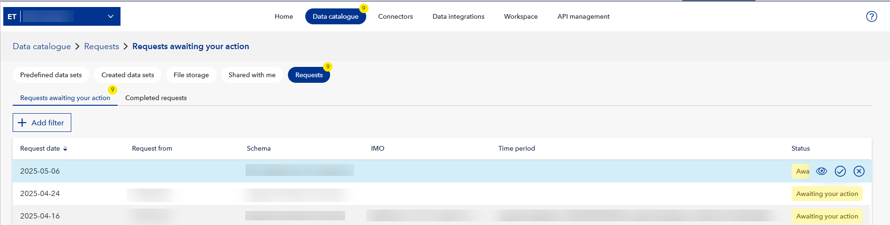

# Data catalogue

To see data sets available in your workspace, go to the **Data Catalogue** tab. 

The **Predefined data sets** tab shows data sets that are queried by data integrations from their corresponding source systems. These data sets are inherited, and you cannot modify them. However, you can use them to create new data sets.

The **Created data sets** tab shows the data sets that workspace members created.

The **File storage** tab shows the files uploaded to the workspace and lets you download them. Note that this feature is only available for the workspaces that have a subscription for File storage.

The **Shared with me** tab shows the data sets that were shared with you. You cannot modify the original data sets that were shared with you. However, you can copy those data sets and modify the copies.

## Data set ID and actions
When you open a data set, you can find its ID in the URL after `datasets`. For example, in the URL `https://dw.veracity.com/veracity/ws/f6427539-6y63-41d0-8795-b878213631d8/dataCatalogue/datasets/4f7rfb44-b632-4d78-843f-0j15a66k8944`, the part after `datasets/` is the data set ID, which is `4f7rfb44-b632-4d78-843f-0j15a66k8944` in our example.

When you open a data set, in the top right corner, you can select the following action icons.
1. Data set info: See data set name and its description.
2. Edit table properties: Disable or enable column picker and select what data columns to show.
3. Filter: Apply and clear the filters available for the data set.
4. Save:**Save** the current view of the data set (including applied filters and shown columns) or **Save as new** to create a new data set with the applied filters and shown data columns.
5. Download: Download the data set as a CSV or Excel file.
6. Share: Share the data set with someone else.
7. Delete: If you are an admin, delete the data set.

 Note that, depending on your [member role](workspace.md), you might not see some icons.

<figure>
	
	<figcaption>Action icons for data sets.</figcaption>
</figure>

## Types of data sets
Data sets can be saved and shared as:
* Data live streams (dynamic) dynamic: When there is a change in a data set, it gets automatically updated.
* Snapshots: When you download a data set, you get a snapshot of the data. That is, the downloaded data set contains the state of the data from the time when it was downloaded.

In Data catalogue > Created data sets, you see the following types of data sets:
* **Created**: Data sets created in your workspace.
* **Shared**: Data sets shared with you or your workspace. You cannot modify them (but you can create a copy and modify it), and the original sharer has decided if you can share this data set with others.
* **Uploaded**: Data sets created from CSV files. 
	* If you have a  Schema management subscription, when uploading a new data set, you must select a schema with an active locked version to validate your file against. The columns in the file must match the schema definition before the data set can be created.

You can check the data set type in the **Type** column.

## Tags for data sets

You can add tags to data sets so that you can find the data sets you are looking for easier and faster. You can also edit and delete tags.

To edit or delete tags for a data set, open the data set, go to the **Details** tab, and next to **Tags**, select the pencil icon. To delete a tag, select the **X** icon next to its name. To edit a tag, remove the old one and create a new tag.

To add a tag to a data set:

1.In **Data catalogue**, open the data set.
2.Go to the **Details** tab.
3. Under **Tags**, select **Add tags**.
4. Enter key and value, and then select **Add**.
5. To save the tag, select **Save and close**.

Note that you can also add tags when you are creating a new data set.

For example, if you want to add a tag 'Tonnage : 5000':
1. For key, enter 'Tonnage'.
2. For value, enter '5000'.

Each data set can have up to 100 tags. For each tag, the key length should be between 1 and 20 characters and the maximum value length is  50 characters.

## To create a data set
To create a derived data set:
1. Select an existing data set.
2. Apply filters to get relevant data.
3. Save the data set.

Veracity suggests using an existing template for creating your data sets. The templates are shown in the **Home** tab under the navigation menu. Note that a template can contain one or more data sets.

To create a new data set from a template:
1. In the **Home** tab, select a template.
2. If there is more than one data set in the template, select a data set.
2. In the right corner, select the **Save as new** icon and save a copy of the data set.
3. Edit the data set to suit your needs. Consider using "Edit table properties" (the pencil icon) and filters (the three vertical lines icon).
4. Optionally, to download the data set from as a CSV file, in the right corner, select the **Download** icon.

## To upload a data set from a CSV file
If you are an [admin](workspace.md), you can upload a data set from a CSV file.

To upload a data set from a CSV file:
1. In the **Data catalogue** tab, go to the **Predefined data sets** or **Created data sets** tab, and select **Upload new data set**.  
2. In the first dialog, upload a CSV file by dragging and dropping it or selecting it from your computer.  
3. In the next dialog, select a schema with an active locked version to validate your file against. You can search for schemas by name or open schema details before selecting one.  
4. The system validates your file against the schema. If there are errors, they must be fixed before you can continue.  
5. When validation succeeds, enter a unique data set name and, optionally, a description.  
6. Select **Upload**. You will return to the Data catalogue, where a toast notification shows upload progress. The toast updates until the upload is complete, and it displays whether the upload succeeded or failed (with an error ID if failed).

Note that steps 3,4,and 5 applies if your workspace has Schema management subscription.

Note that now you have created a data set you can share with other users.

## To share a data set
1. In the **Data catalogue** tab, open the data set you want to share.
2. In the top right corner, select the share icon.
3. Under **Share access with**, enter the email address of the person or workspace you want to share the data set with. Alternatively, select the contact list icon to choose the recipient from the list of previously used contacts.
4. Optionally, to allow the recipient to share the data set with other people, tick the box next to **Allow recipients to share this data set with others**. You can revoke the sharing permission later.
5. Optionally, under **Add note to recipient**, add a message to the person with whom you are sharing the data set.
6. To share the data set, select the **Share** button. The recipient will receive an email notification with a link to the data set.

Note that:
* You can share a data set with workspace only if someone from your workspace has already shared a data set with the target workspace and its admin has added it to the target workspace.

## To request sharing a data set
You can ask a data provider to share a data set with your workspace. A data provider has stored large amounts of data, such as time series data (IoT) for solar plants, and they can share a subset of this data with you.

**Note that** if you do not see the **Request data** button, your workspace is not subscribed to any data providers that support this feature. To enable it, contact Data Workbench support and request access to the "data request" feature for a specific provider subscription.

To request that a data provider shares a data set with you:
1. In Data Workbench UI, go to **Data catalogue**.
2. In the upper right corner, select **Request data**. 
3. In the window that shows, under **Data set name**, enter a name for the data set you want to create. 
4. Under **Data provider**, select a data provider. 
5. Fill in other fields in the form.
6. To send your data request, select **Request** 

Your data request will be processed, and when it's complete, you will see your new data set with the requested data in your workspace's **Data Catalogue** in the **Created data sets** subtab.

Below are detailed information on the fields in a data request:
* For **Data provider**, you can select only one data provider from the providers subscribed to your Data Workbench.
* For **Portfolio**, a portfolio is a grouping of sites (assets), and you can select only one portfolio.
* A **Site** is an asset (for example, a solar plant or a windmill), and you can select only one.
* For **Device type**, you can add one or multiple devices based on site (for example, a transformer or inverter). A device is a different component of the site that can provide data (usually, it is time series data).
* For **Add parameters**, each device type has different parameters that can be configured for the request, and a parameter can only be selected once for a device type. A parameter is one data channel where time series data are logged. There can be many parameters per device. A parameter can only have one value at any given time, for example, for a car's speedometer a parameter can be the current speed of the car in kilometers per hour. 
* For **Aggregation**, each parameter has an aggregation setting (for example, default, min, max). A parameter can only have one aggregation for a device type. This is how data is aggregated given the granularity time period; for example, "min" would aggregate with the lowest value recorded in the time period (for example, within 5 minutes if that was the granularity)
* For **Granularity**, this is the time unit for the granularity. For example, it can be in minutes.
* For **Interval**, select the start and end date for the data you are requesting. For example, you can request data from 20 January 2024 to 10 March 2024. 

## To handle incoming data set share requests

When someone requests access to one of your data sets, the request will appear in the **Requests** tab of the **Data Catalogue**.
<figure>
	
</figure>

This tab includes two views:
- **Requests awaiting your action** - shows incoming data set share requests that you can respond to.
- **Completed requests** - shows all past requests and their outcomes.

You'll also receive an **email notification** when a new request is sent to your workspace.

In the **Requests awaiting your action** view:
- You can select **Add filter** to narrow requests by **Schema** or **Request from**.
- You can hover over the request's status to see available actions or click the request date to open full details.
- You can either **Accept** or **Decline** the request.

### What happens when you respond

- If you **accept** the request:
  - A data set is created in both your workspace and the requestor’s workspace.
  - The data set will be visible in the requestor's **Data Catalogue**.
- If you **decline**, the request is rejected and the data set is **not** shared. This action **cannot be undone**.

Even after a request has been accepted, you can still **revoke access** later:
1. Go to the **Completed requests** view.
2. Hover over the approved request.
3. Select the **Decline** icon to withdraw access.

## To modify, save, and share a data set
1. In the **Data catalogue** tab, open the data set you want to modify.
2. Modify the data set.
3. In the top right corner, select the share icon.
4. In **Data set name**, you name the new (modified) data set you create.
5. In **Share access with**, you select with whom you want to share the data set.
6. If you tick the box saying 'Allow recipients to share this data set with others', they can reshare the data set.
7. Optionally, you can add **tags** to the data set.
8. Optionally, you can add a **description** to the data set.
9. Optionally, you can add a **Note to recipient**. This message will be sent together with the link to the shared data set.
10. To save your new data set and share it, select the **Save and share** button.

To see how to save and share a new data set, click on the image below to play the video.

## To update a data set
You can update a data set only if it is listed under **Created data sets** in the **Data catalogue** and its type is **Uploaded**.  

To update a data set:
1. In the **Data catalogue**, go to **Created data sets** and open a data set of the **Uploaded** type.  
2. If your workspace has the **Schema management** subscription, you will see the **Update data set** button in the top right corner. Select it.  
3. In the dialog window that opens:  
   - **Upload a CSV file** - Drop or select a file. The file must be in CSV format, no larger than 1 GB, use commas as delimiters, include headers for all columns, and have a filename without special characters.  
   - **Validate the file against the schema** - The uploaded file is compared with the schema used for the data set. If the columns do not match, an error message is shown and the update cannot proceed.  
   - **Choose how to apply the data** - If validation succeeds, you can select the update method. The available options depend on whether the schema defines key columns:  
     * *No key columns*: Add data, Overwrite data.  
     * *Key columns set*: Update data, Delete data, Overwrite data.  
   - **Confirm changes** - For *Delete* and *Overwrite*, a confirmation dialog is shown. Progress and results are displayed with toasts.  

### Concurrent updates
If another admin modifies the same data set (for example, by sharing it or saving a filtered view) while an update is in progress, their changes will apply to the version of the data set that existed before the update.

## To see data sets shared with you
To see data sets shared with you, in the **Data catalogue** tab, go to the **Shared with me** tab.

Note that:
* You cannot edit data sets that are shared with you.
* You can reshare the data sets only if the person who has shared them has enabled resharing.
* If you apply filter to a data set and then reshare it, the receiver will see only as much as the filters allow. For example, you can have a data set with information on your ten vessels but apply filters that show only two relevant ships and then share it with your business partner.

## To add a shared data set to your workspace

1. Open the data set that was shared with you. You can follow the link from the email notification you received or find it in the "Shared with me" tab.
2. Select the **Add to your workspace** button and then select a workspace.
3. Select the button to go forward. This will add the data set to your workspace.

Note that, to add a shared data set to a workspace, you must be an admin of this workspace.

## To revoke access to a data set
To revoke access to a data set:
1. Go to the data set.
2. Go to the **Details** tab.
3. Under **Shared with**, select the pencil icon. A pop-up window with the list of users will appear.
4. In the row with the user's or workspace's name, to revoke their access, select the **X** icon. After that, the icon changes to the "Undo" icon. If you have revoked access by accident, select the "Undo" icon to revert it.
5. Select the **Save and Close** button.

When you revoke a user's or workspace's access to a data set, they are notified about that by email. Also, if they have reshared the data set with other people, they will loose access to the data set too.

## File storage
Note that this feature is only available for the workspaces that have a subscription for File storage. You can [purchase File storage for Veracity Data Workbench here](https://store.veracity.com/veracity-file-storage-data-workbench).

[Go here for File storage documentation](filestorage/filestorage.md).