# Data Validator and Schema manager
Now, you can set up validation rules for your folders in File storage, and have automated validation checks when you upload new data.

How does it work? You create schemas in Schema manager, and then you use them to set up validation for folders with Data Validator.
This helps you ensure the quality and consistency of your data by identifying data quality problems early.

## To get started
To use Data Validator, you will need the following:
* A Data Workbench workspace in which you are workspace admin.
* A File Storage subscription.
* Subscriptions to Schema Management, Rule Management, and File Validation.
If you need help in getting them or checking everything is configured correctly, contact Data Workbench support.

## Schema manager
Schema manager is where you define the schemas that you will later use for validating folders in your File storage.

Schema manager has two tabs:
- Schemas: A list of schemas used in your workspace.
- Validation rules: Reusable validation rules for your schemas.

### To access Schema manager
1. Navigate to the **Data catalogue** page.
1. Select **Schema manager** in the upper right corner.

<figure>
	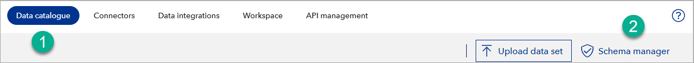
</figure>

### Schemas tab overview
In the **Schemas** tab, you can:
- Filter schemas to find the schema you need (1).
- Sort schemas by name (2).
- Sort schemas by their last update date (3).
- Sort schemas by their availability, either predefined or custom (4).
- Sort schemas by their version number (5).
- See details of a schema (6).
- Create a new schema (7).

To sort by a column (descending or ascending), click on the column name.

<figure>
	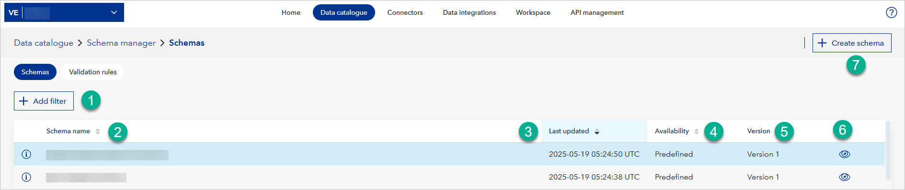
</figure>

### Validation rules tab overview
In the **Validation rules** tab, you can:
- Filter validation rules to find the rule you need (1).
- Sort validation rules by name (2).
- Sort validation rules by data type they validate (3).
- Sort validation rules by the error message they return (4).
- Sort validation rules by their availability, either predefined or custom (5).
- See details of a validation rule (6).
- Edit a validation rule (7)
- Delete a validation rule (8)
- Create a new validation rule (9).

To sort by a column (descending or ascending), click on the column name.

<figure>
	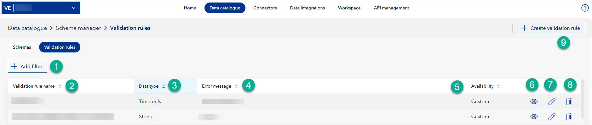
</figure>

## To create a new schema
1. In **Schema manager**, select **Create schema** in the upper right corner.
1. Fill in the **Name** and, optionally, **Short name** for the schema. Choose descriptive names that reflect the data you will be working with.
1. Optionally, under **Description**, describe the purpose of this schema and its intended use.
1. Select **Add column** to define a column.

### To define columns and set their validation rules
Below is a screenshot of the popup for adding column definition and validation.
<figure>
	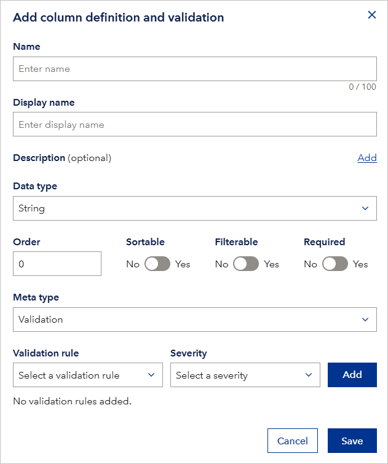
</figure>

For each column:
1. Fill in the **Name (internal name)**: this is a required field and should be unique within the schema. It's used for referencing the column in expressions or code.
2. Fill in the **Display name (user-friendly name)**: this is how the column will be presented in the user interface. It's limited to 100 characters.
3. Optionally, add a **Description**: for the column to provide more context. Select **Add** to expand the description field.
4. Select the appropriate **Data Type**: (for example, Boolean, Decimal, Int64) from the dropdown menu. This defines the kind of data the column is expected to hold.
5. Set the **Order** of the column in the dataset. '0' means it will be the first column.
6. Configure the column properties using the toggles:
   - **Sortable**: Enable if you want users to be able to sort the data by this column.
   - **Filterable**: Enable if you want users to be able to filter the data based on this column's values.
   - **Required**: Enable if the column must have a value for every row in the dataset. **This is a critical validation rule** since missing a required column will cause validation to fail.
7. Select the **Meta type** for the column:
   - **Validation**: Choose this option to apply validation rules to this column to ensure data quality and consistency.
   - **FallbackIndicator**:  Choose this to mark or track which columns have had fallback values applied during validation. This might be useful for auditing or understanding how data has been modified.
   - **Timestamp**: Choose this to automatically record the date and time when the validation was executed.
8. If you selected **Validation** as the Meta type:
   - Select a **Validation rule**: from the dropdown menu. This dropdown will list the `column validators` that you've already created in your workspace. You can use the filter to search for specific rules by name.
9. Select the **Severity level**: from the dropdown menu:
   - **Correction**: If the data doesn't match the rule, it will be automatically corrected using the fallback value defined in the `column validator`.
   - **Error**: If the data doesn't match the rule, the entire row will be flagged as an error and removed from the output result.
   - **Warning**: If the data doesn't match the rule, the row will be flagged as a warning, but it will still be kept in the output result.
10. Select **Add**: to associate the selected validation rule and severity with the column. You'll see the added rule below.
11. Repeat steps 3-4 for all columns in your data.
12. Select **Save**: A toast message will confirm successful saving.
13. Select the newly created **schema**: to open Schema details.

### FallbackIndicator meta type
A column can have its "Meta type" set to `FallbackIndicator`. If you want to better understand how to use it, see the explanation below.

1.  **Validation rule with correction severity:** You create a validation rule (let's call it "MustBeValidEmail") and set its severity to "Correction". Crucially, you also define a fallback value (for example, an empty string "" or a placeholder like "invalid@email.com").
2.  **Data fails validation:** A user uploads data, and a particular cell in the "Email" column fails the "MustBeValidEmail" validation rule (for example, it's missing the "@" symbol).
3.  **Correction action:** Because the severity is "Correction", Data Validator *automatically* replaces the invalid email value in the *output data* with the fallback value you defined (e.g., ""). The original input data remains unchanged.
4.  **FallbackIndicator marks the change:** If you define a separate column with its Meta type set to `FallbackIndicator` (for example, a column called "Email_Fallback"), Data Validator will populate this column in the output data. For the rows where a correction was made, the corresponding cell in the "Email_Fallback" column will contain a "Y" to indicate that a correction was applied to the "Email" column in that row.
5.  **User can see the correction:** When the user reviews the validated *output data*, they can see both the corrected value (e.g., "") in the "Email" column and the "Y" in the corresponding "Email_Fallback" column, clearly indicating that a fallback was applied. This allows them to understand that the data they are viewing might not be exactly what was originally uploaded.

**Example:**

*   Let's say you have a column named "IsActive" with "Data type" set to "Boolean" and "Meta type" set to "Validation", and a separate column named "IsActive_Fallback" with "Data type" set to "Boolean" and "Meta type" set to "FallbackIndicator".
*   If a user uploads a value of "1" (which is not a valid Boolean) in the "IsActive" column, and your validation rule corrects it to "True" (your fallback value), then Data Validator adds a "Y" to the corresponding cell in the "IsActive_Fallback" column in the output data. This "Y" indicates that a correction was made for that specific row and column.
*   This helps users understand that the data has been modified automatically.

**Input Data:**

| IsActive |
| :------- |
| 1        |

**Output Data:**

| IsActive | IsActive_Fallback |
| :------- | :---------------- |
| True     | Y                 |

### To validate rows
1.  Ensure you have at least two columns with the **Validation meta type** added to your schema. Row validation requires columns to check against.
2.  Scroll down to the **Row validation** section of the schema editor.
3.  Select **Add row** to open the "Add row validation" popup.
4.  Fill in the **Name** for the row validation rule. This should be descriptive and unique within the schema.
5.  Optionally, add a **Description** for the row validation rule. Select **Add** to expand the description field.
6.  Select the **Row validation type** from the dropdown menu:
    *   **RequiredIfNotNull:** If *any* of the "Column(s) to check" have a value (are not null), then the "Column(s) to affect" must *all* or *at least one* (depending on the logical operator) have a value as well.
    *   **RequiredIfRegexMatch:** If *any* of the "Column(s) to check" match the specified regular expression, then the "Column(s) to affect" must *all* or *at least one* (depending on the logical operator) have a value as well. Specify this condition in the **Regex pattern** field.
    *   **RequiredIfSumExceedsThreshold:** If the sum of the values in the "Column(s) to check" exceeds a specified threshold, then the "Column(s) to affect" must *all* or *at least one* (depending on the logical operator) have a value as well. Specify this threshold in the **Threshold** field; note that you can enter up to 16 digits.
7.  In the **Column(s) to check** section, select the columns that will trigger the validation. Use the dropdown menu to choose from the available columns.
8.  In the **Column(s) to affect** section, select the columns that are subject to the validation.
9.  Select the **Logical operator** between "Column(s) to affect":
    * **And:** All "Column(s) to affect" must have a value.
    * **Or:** At least one of the "Column(s) to affect" must have a value.
10. Enter the **Error message** to be displayed if the row validation fails.
11. Select **Cancel** to discard the row validation rule or **Save** to add it to the schema.
12. Select **Save** in the main schema editor to save all schema changes, including the new row validation rule.

## To edit a schema
Note that you cannot edit schemas with "Availability" set to "Predefined" since those are schemas that Data Workbench team has defined for you according to your business needs.

To edit a schema:
1. In **Schema manager**, find the schema you want to edit. You can use filters (**Add filters**) and sort by schema name, their last updated date, or availability.
2. Select the pencil icon in the row corresponding to the schema you want to edit. This will open the schema editor.
3. Under the **Versions** section, you'll see a dropdown menu listing the available versions of the schema. Select the version you want to work on.
4. Alternatively, if you want to create a new version based on an existing one:
    * Select the **Create new version** button.
    * Fill in the **Version name** and optionally a **Version description** for the new version.
    * Select **Save**. This will duplicate the selected version and let you edit the new version without modifying the original.
5. Modify the schema as needed. You can:
    * Add, edit, or delete columns in the **Column definition and validation** section.
    * Change the schema **Name** or **Description**.
6. To activate a specific version of the schema:
    * Select the desired version from the **Versions** dropdown.
    * Select the **Activate version** button. Data Validator always uses the most recent activated schema version for validating data.
7. If you want to discard all changes made during the current editing session, select the **Reset** button at the bottom of the editor.
8. Once you're satisfied with the changes, select **Save** to update the schema.

## To lock a schema
Workspace admins can lock a schema version to prevent unintended edits. To do so, under **Versions**, on the left side, select the **Lock this version** button.

Note that:
- Once locked, the schema version cannot be edited.
- All fields and buttons related to editing will be disabled.
- You can still create a new schema version and make edits there.
- Locking a schema does not affect whether it is active or inactive.

<figure>
	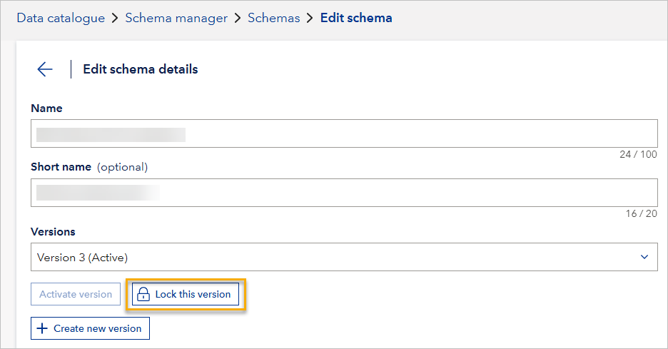
</figure>

## To create validation rules
You can create validation rules and reuse them in your schema validation to avoid defining the same rule multiple times.

To create a validation rule:
1. **In Schema manager**: select the Validation rules tab.
2. **Select Create validation rule**: in the upper right corner.
3. **Fill in the Name**: for the validation rule (for example, "Required Email"). This is a required field and should be unique.
4. **Define the validation conditions**: You can use one or more of the following options:
   - **Data type (optional)**: Select the expected data type from the dropdown menu (for example, String, Integer, Boolean, Date). This is optional; if not specified, the data type will not be checked during validation.
   - **Min length (optional)**: Enter the minimum allowed length for string values. This field is only applicable if you've selected "String" as the data type or haven't specified a data type.
   - **Max length (optional)**: Enter the maximum allowed length for string values. This field is only applicable if you've selected "String" as the data type or haven't specified a data type.
   - **Min (optional)**: Enter the minimum allowed numerical value. This field is only applicable if you've selected a numerical data type (Integer, Float, etc.) or haven't specified a data type.
   - **Exclusive min**: Select "Yes" if you want the minimum value to be exclusive (meaning values equal to the minimum are invalid). Select "No" if you want the minimum to be inclusive. This field is only relevant if you've provided a "Min" value.
   - **Max (optional)**: Enter the maximum allowed numerical value. This field is only applicable if you've selected a numerical data type (Integer, Float, etc.) or haven't specified a data type.
   - **Exclusive max**: Select "Yes" if you want the maximum value to be exclusive. Select "No" if you want it to be inclusive. This field is only relevant if you've provided a "Max" value.
   - **Pattern (optional)**: Enter a regular expression to define an allowed pattern for string values (for example, for validating email or phone number formats). This field is only applicable if you've not selected "Boolean" as the data type.
   - **Enum (optional)**: Add a value one by one. For example, you might enter "US, CA, MX" for a country code field. This field is useful for restricting values to a predefined set. Select Add to add the enum values.
   - **Fallback value (optional)**: Enter a default value that will be used if the data fails validation and you've set the "Severity" to "Correction" when applying the validation rule to a column. This is useful for automatically correcting invalid data. The information icon next to the field clarifies its function.
5. **Must not be empty**: Select "Yes" to specify that the field cannot be empty. Select "No" if empty values are acceptable.
6. **Error message**: Enter the message to be displayed if the data does not pass the validation. Be descriptive and user-friendly. Use magic numbers {0}, {1}, {2}, and {3} for dynamic messages (column name, value, row index, rule name).
7. Optionally, to cancel the changes, select Cancel.
8. To save the changes in the validation rule, select **Save**.

## To connect validation rules to a schema
1. In **Schema manager**, select the **pencil icon** next to your schema.
2. Select the **pencil icon** next to the column you want to validate.
3. In the **Meta type** dropdown, select **Validation**.
4. In the **Validation rule** dropdown, select the appropriate validation rule.
5. In the **Severity** dropdown, choose:
   - **Error**: The row will be removed if validation fails.
   - **Warning**: The row will be kept, but flagged.
   - **Correction**: The value will be replaced with the fallback value if validation fails.
6. Select **Add**. The rule will appear at the bottom.
7. Repeat steps 2-6 for all columns needing validation.
8. Select **Save** to save the schema with validation rules.

## Data Validator in File storage
In File storage, you can set up validation for folders, and use a schema saved in your workspace to validate input data and return validated output data inside this folder.

If you need to edit or create a new schema, go to the section of this document on **Schema manager**.

## To recognize a folder with data validation enabled
A folder with validation enabled will have an icon showing a tick (check mark) inside the folder. Below you can see a folder without validation (1) and a folder with validation set  (2).
<figure>
	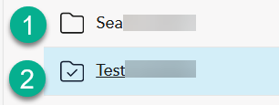
</figure>

## Tags and validation information
In the **Tags** column, you can see the tags associated with the schema used for validating a folder.

If you are a workspace admin, you can remove and add the tags by clicking on a tag and using the dialog window that shows.
<figure>
	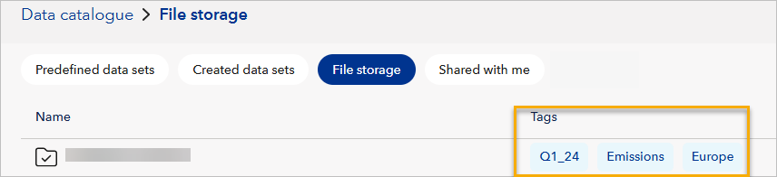
</figure>

You can select the three dots in the row with the folder's name to open **Validation information** that shows:
- What schema is used for validation.
- What tags are assigned to this folder.
- The description of the validation.

If you are a workspace admin, you can change the schema used for validation, edit its description, and add or remove the tags.

<figure>
	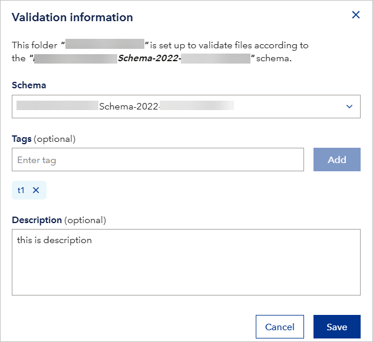
</figure>

## To set up validation for a folder
1. Navigate to **Data catalogue**.
1. Go to **File storage**.
1. Choose a folder for which you want to set up validation and select three dots in the row with it.
1. Select **Set up validation**.

<figure>
	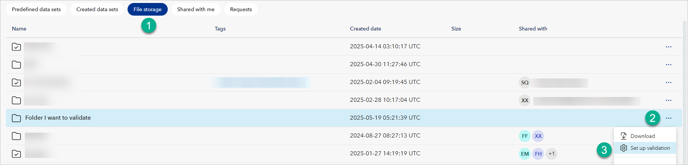
</figure>

When you set up a validation for a folder, Data Workbench will create two subfolders inside it and name it after your folder. However, one subfolder will have the word "input" added and another will have "output" added. 

Now, you can upload your files to the input subfolder and they will be automatically validated and you will see validation results in the output folder.

## To remove validation for a folder
1. Choose a folder for which you want to remove validation and select three dots in the row with it.
1. Select **Remove validation**.

<figure>
	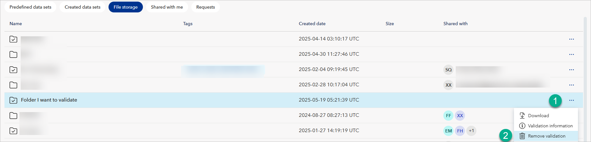
</figure>

## To upload and validate data
1. Enter the folder you just set up validation for.
2. Enter the "input" folder.
3. Select Upload files.
4. Select your CSV data file.
5. Select Upload.
6. You will see a toast message in the bottom right saying **Validation in progress**. Wait until it changes to **Validation finished**.
7. Expand the toast message and under **File name**, click the name of your file. It will open validation report.
8. Consider analyzing and fixing errors and warnings.
9. Optionally, select **Download report** to download the report in the JSON format.

Below is a sample validation report.
<figure>
	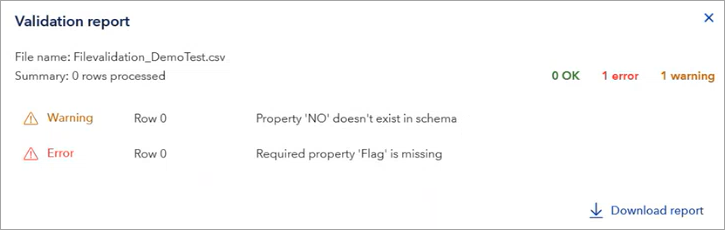
</figure>

## To get a validated data file
After validation, you can get the validated data file from the output folder from the **Results** subfolder.

As a result of data validation, the output folder is populated with:
* An **Archive** folder containing a copy of the file you uploaded.
* A **Log** folder with detailed log information for the validation.
* A **Results** folder with the output after validation. You can select the three dots in the row with this file, and download it as a CSV file. For example, if the data file you uploaded had some rows that were marked as errors in the validation, those rows would be removed from the output data file.
* A **Summary** folder with a summary of data validation, its logs, and so on.