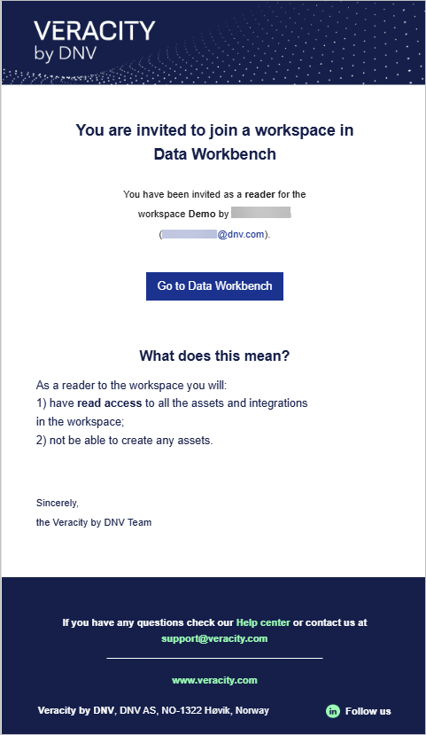
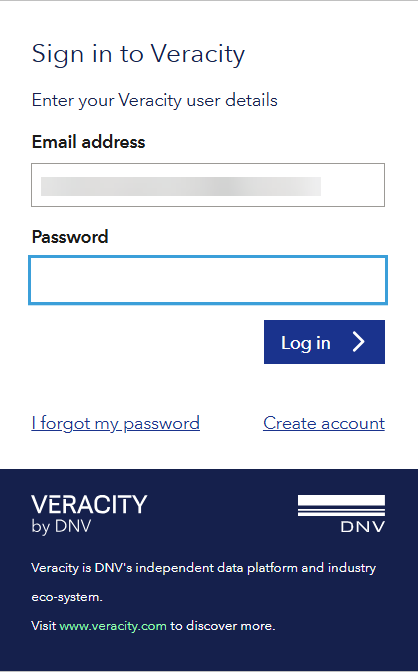

# What is Data Workbench?
Data Workbench lets you:
* Get access to data and use it in your applications.
* Securely share your data and use data shared by others.
* Monitor who uses your data and revoke access to it.
* Build dashboards and reports on top of the data.
* Work with scalable data streams and self-defined non-time-series data streams.

See [a video overview of Data Workbench here](https://help-center.veracity.com/en/articles/8494632-video-a-quick-overview-of-data-workbench).

## Help Center and tutorials
See our [Help Center](https://help-center.veracity.com/en/collections/3824716-data-workbench) and [Data Workbench video tutorials](https://help-center.veracity.com/en/collections/6552033-data-workbench-video-tutorials) for an easy overview of how to use Data Workbench.

If you are a developer, you might want to check:
* [How to query data](tutorial/tutorialq.md).
* [How to call API endpoints](tutorial/tutorial2.md).

## Tenants and workspaces
Each company or a B2C customer has one tenant in Data Workbench. A tenant can have multiple workspaces. Each workspace has members. Workspace members can be admins or readers.

First admins are added when your company [purchases Data Workbench](https://store.veracity.com/data-workbench) and they can be tenant admins or workspace admins. Tenant admins can invite users to join their tenant and any workspace in it, and workspace admins can only invite to their workspace. For details, see [Members and access levels](workspace.md).

If you are a tenant admin, see [how to manage your tenant](tenantpage.md).

## To start using Data Workbench
To use Data Workbench, you need:
- An **invitation to** join a **workspace** or a **tenant**.
- A **Veracity account** to sign into Data Workbench.

Once a workspace admin invites you, you'll receive an email from Veracity with:
- The name of the workspace you're invited to join.
- Your assigned role (admin or reader).
- The name and email of the person who invited you.
- A **Go to Data Workbench** button.

<figure>
	
</figure>

#### To accept an invitation and join a workspace
1. Click **Go to Data Workbench** in the email.  
2. If you have a Veracity account:
   - Enter your password and select **Log in**.  
   - If you forgot your password, select **I forgot my password** to reset it.
3. If you don't have a Veracity account: 
   - Select **Create account**.  
   - Confirm your email address, set a password, and select **Sign up**.  
   - Check your inbox for a verification code and enter it to complete registration.
   - After verifying, return to the invitation email and click **Go to Data Workbench** again to sign in.

<figure>
	
</figure>

## Data integrations
 Data Workbench fetches data from external data sources by using data integrations. A data integration:
* Is an integration layer between a data provider and the Data Workbench. 
* Uses an API exposed by the provider to query data, and transforms it into a unified format used in Data Workbench.
* Is authorized on the provider's side and follows their authorization policy.
* If the provider enables downloading binary data, a data integration stores this data into cloud file stores, so that it can used by customers.
 
To see available data integrations in your workspace, go to the **Data integrations** tab. 

Once you have a data integration set up, the Data Catalogue will show the predefined data sets queried from the corresponding source system.

### To become a data provider
To become a data provider and integrate with Data Workbench, contact the Data Workbench team for assistance.

To integrate, you will need to implement a standardized API that consists of mandatory and optional endpoints that cover REST API verbs, paths, and contracts for request and response payloads.

Note that:
* The API allows only the REST protocol.
* You need to host the API in your own environment.
* You need to allow Data Workbench to access this API. If you have a firewall, adjust the rules accordingly.

The Data Workbench team will cooperate with you on gathering the requirements for creating a data integration. Expect to discuss:
* Technical aspects for server-to-server communication such as base URL of your API, server-to-server API keys, and more.
* Schemas that should be supported by the data integration. Data Workbench queries data for a certain schema, and your API also needs the schema to decide how to satisfy the request.
* Custom settings for each schema.
* Definition of settings that must be provided with a new data integration.

Also, you need to create data integrations. Currently, the Data Workbench team does it for you, but Veracity plans to make it self service.

### Data restrictions
Data Workbench can impose restricions on access to data. For each data integration, Veracity can configure a definition of mandatory settings that its data integrations must follow. These settings are represented by a dictionary (string<=>string) meaning they can contain any data (authorization data, environment data, etc). 

## Data catalogue
To see data sets available in your workspace, go to the **Data Catalogue** tab. For detailed documentation, go [here](datacatalogue.md).

## Using APIs
You can integrate APIs with Data Workbench. See:
* [How to start using APIs with Data Workbench](apimanagement.md).
* [API endpoints you can use](apiendpoints.md).
* [How to authenticate and authorize your API calls](authentication.md).

## Activity logs
Data Workbench logs certain events, and gives you access to [activity logs](workspace.md).
