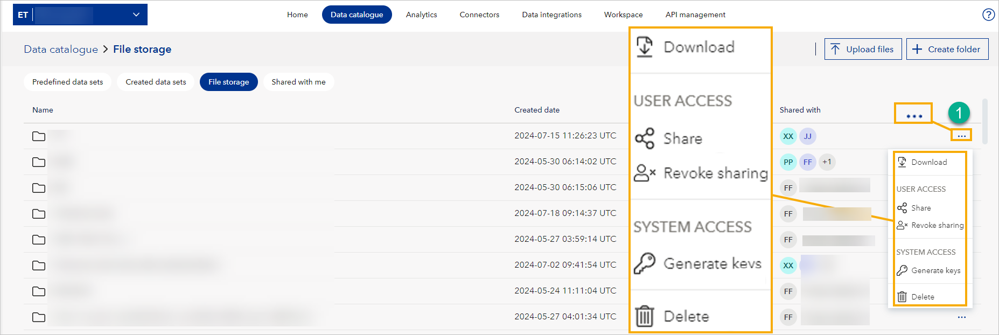
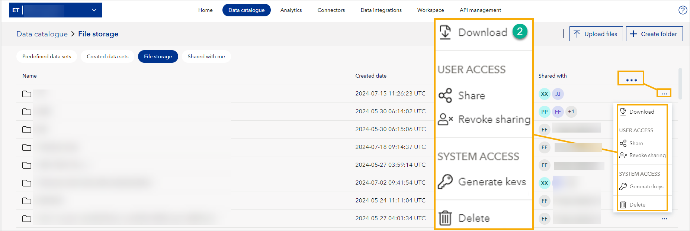
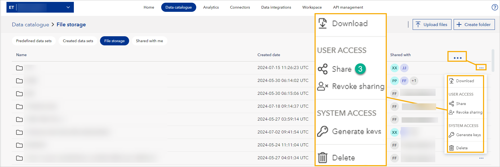
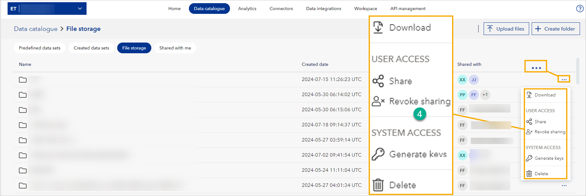
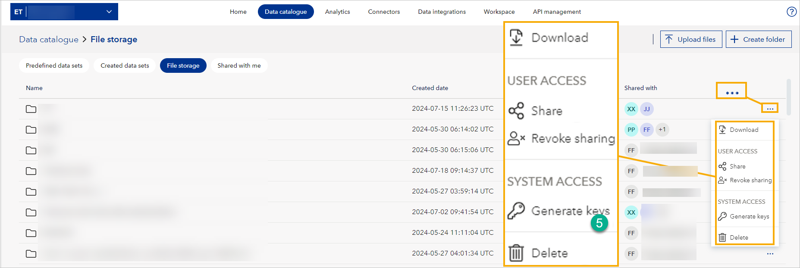
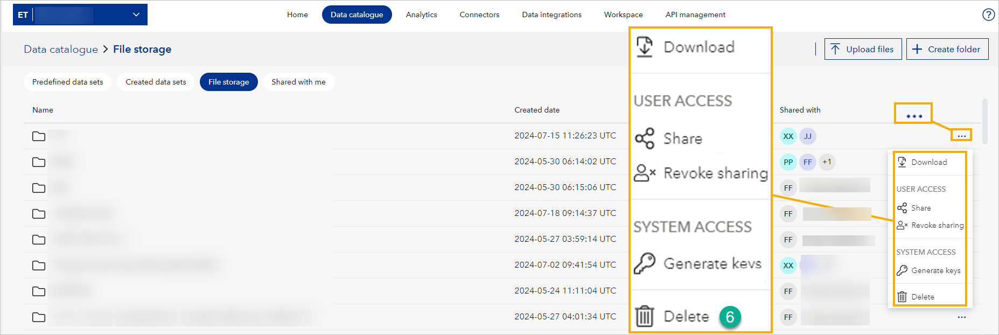
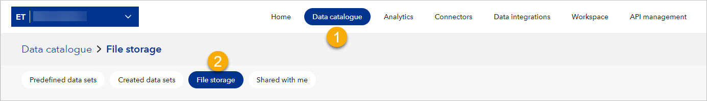

# Migrating from Data Fabric

## Account activation process
Before you can start using Data Workbench with storage functionality, your account needs to be activated. Once you have completed the subscription purchase, Veracity will set up your account. Once the setup is complete, you will receive an activation email. After receiving this email, you can begin using Data Workbench with full storage capabilities.

## File storage

In your [Data Catalogue](datacatalogue.md), you can find a tab called **File storage** and use it for uploading, sharing, and accessing files. 

For each file, you can find the three dots in the row with the file (1) and open the action menu.

<figure>
	
</figure>

The action menu lets you:
- Download the file (2).

<figure>
	
</figure>

- Share the file (3). After sharing, the recipient will see the file in the **Shared with me** tab in Data catalogue.

<figure>
	
</figure>

- Revoke access (4) to the file.

<figure>
	
</figure>

- As an admin, generate SaS keys (5) for accessing files through external systems.

<figure>
	
</figure>

- As a file owner, delete (6) the files you uploaded.

<figure>
	
</figure>

## Migrating from Data Fabric?
File Storage is replacing Data Fabric. If you are migrating from Data Fabric:
1. Follow the [migration guide](../datafabric/tutorials/download-my-data.md) to download your data manually.
2. Upload your data to File Storage.

## Need Support?
If you need any support:
1. Visit [Help Center](https://help-center.veracity.com/en/collections/3824716-data-workbench) where you will find articles and video tutorials on Data Workbench.
2. Contact the [support team](mailto:support@veracity.com) for assistance.

## To go to File storage
1. In your workspace, go to **Data catalogue** page.
2. Select the **File storage** tab.

<figure>
	
	<figcaption>Location of File Storage.</figcaption>
</figure>

## To upload files
1. In the top right corner, select **Upload files**. You can upload multiple files at once.
2. Select the coloured circle with the file icon and select the files from your computer. Alternatively, drag and drop files.
3. Select **Upload**.

## Folders
In File storage, you can use folders to organize files. If you are a workspace admin, you can create folders.

To create a folder:
1. In the top right corner, select **Create folder**.
2. Name the folder.
3. Select **Save**.

## To share files and folders
1. In a row with a file or folder to share, select three dots and then **Share**.
2. In the window that shows, under **Share access with**, add the email address of the person with whom you are sharing the file or folder.
	1. Optionally, to allow further sharing, tick the tickbox that reads "Allow recipients to share...".
	1. Optionally, add a **Note to recipient**.
1. Select the **Share** button.

Shared files and folders show in Data catalogue in the **Shared with me** tab.

## To revoke access to shared files or folders
1. In a row with a file or folder to share, select three dots and then **Revoke sharing**.
2. Next to the person who's access you're revoking, select the X icon.
1. Select the **Save and Close** button to complete the revoking.

## To delete files and folders
If you are a workspace admin, you can delete files and folders. To do so:
1. In the row with the file or folder you want to delete, on the right, select three dots.
2. Select **Delete**.
3. In the window that shows, confirm by selecting **Delete**.

Note that deleting is permanent, and cannot be undone.

## To download files and folders
If you are a workspace reader or admin, you can download files and folders. To do so:
1. In the row with the file or folder you want to download, on the right, select three dots.
2. Select **Download**.

## To generate a SAS token
If you are a workspace admin, you can generate access keys to files and folders and use them in external systems. To do so:
1. In the row with a file or folder you want to generate a SAS token for, on the right, select three dots.
2. Under **Set access level**, choose access level (read or read and write).
3. Optionally, under **Set access start**, choose a date from which this file or folder should be accessible.
4. Under **Set access end**, choose a date from which this file or folder will no longer be accessible.
5. Select **Generate key** and a new field called **Access key** will show.
6. Select **Copy key**. 