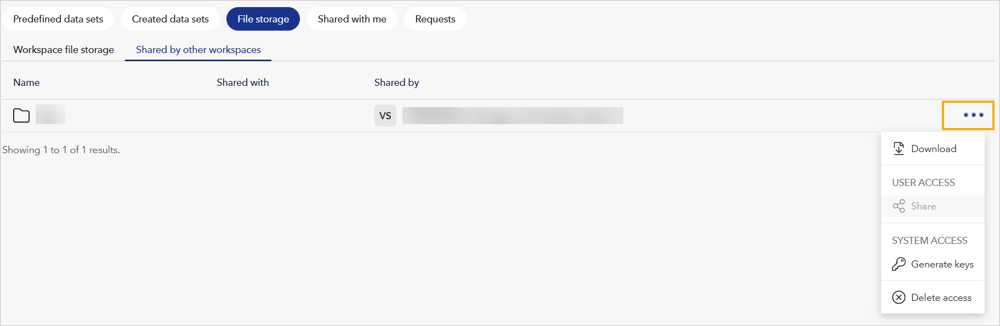
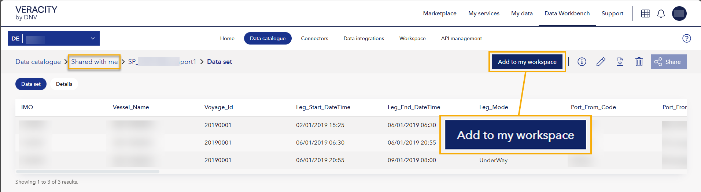

# File storage
In your [Data Catalogue](../datacatalogue.md), you can find a tab called **File storage** and use it for uploading, sharing, and accessing files. If you don't see it, you may not have the subscription for File storage, but you can contact the [support team](mailto:support@veracity.com) for assistance.

**If you want to access it via API**, see [File storage API endpoints in API docs](../apiendpoints.md).
Note you can [connect File storage with Azure Storage Explorer](ase.md).

## To go to File storage
1. In your workspace, go to the **Data catalogue** page.
2. Select the **File storage** tab.

<figure>
	
	<figcaption>Location of File Storage.</figcaption>
</figure>

## File storage tabs
File storage is divided into the following tabs:
- **Workspace file storage** - Files and folders belonging to this workspace.
- **Shared by other workspaces** - Files and folders shared with this workspace by other workspaces. For details, see the corresponding section at the bottom of this document.

## Folders
In File storage, you can use folders to organize files. If you are a workspace admin, you can create folders.

> **Note**  
> You cannot rename or move folders. However, you can delete them if you are a workspace admin.

To create a folder:
1. In the top right corner, select **Create folder**.
2. Name the folder.
3. Select **Save**.

## To upload files
1. In the top right corner, select **Upload files**. You can upload multiple files at once.
2. Select the coloured circle with the file icon and select the files from your computer. Alternatively, drag and drop files.
3. Select **Upload**.

## Access levels
When you share a file or folder, you assign access to recipients:

- **Read access** allows recipients to view and download the content.
- **Read and write access** allows recipients to modify content, and also generate SAS keys.
- **Only workspace admins** can generate SAS keys. If you give **read-only** access, the recipient will **not** be able to generate SAS keys.

SAS key creation by a recipient is **logged in the original sharer’s workspace** under **Activity log**.

> 🔒 If you share a folder with someone and they delete it, it will only be removed from **their** workspace. The original remains unaffected.

## Action menu in File storage
For each file, you can find the three dots in the row with the file and open the action menu (1). In the menu, you can:
* Download the file (2).
* Share the file (3). After sharing, the recipient will see the file in the Shared with me tab in Data catalogue.
* Revoke access (4) to the file.
* Generate SAS keys (5) for accessing files through external systems.
* As a file owner, delete (6) the files you uploaded.

<figure>
	

## To share files and folders
1. In a row with a file or folder to share, select three dots and then **Share**.
2. In the window that shows, under **Share access with**, add the email address of the person with whom you are sharing the file or folder.
	1. Optionally, to allow further sharing, tick the tickbox that reads "Allow recipients to share...".
	1. Optionally, add a **Note to recipient**.
3. Select the **Share** button.
  
> Shared files and folders show in the **Shared with me** tab in the Data catalogue.  
> If the recipient deletes the shared folder, it only disappears from their workspace; the original folder in your workspace remains unchanged.

Note that you cannot share a file or folder with higher access level than you have:
- If you have **read and write access** to a file or folder, you can share it with **read** or **read and write** access.
- If you have **read** access to a file or folder, you can only share it with **read** access.

### To share with other workspaces
You can now share files and folders directly with another workspace under the same tenant.

To do this:
1. In **Data catalogue > File storage**, locate the file or folder you want to share.
2. Select the three dots next to the item and choose **Share**.
3. Under **Share access with**, select the people icon, and choose a workspace from the list or search for one.
4. Under **Set access level**, choose access level (**Read** or **Read and write**).
5. Optionally, under **Note to recipient**, add a note for the person with whom you are sharing the file or folder.
6. Select **Share**.

Shared files will appear in the recipient workspace under **Shared by other workspaces**.

**Note that** users can reshare only if the original sharer allowed it and you cannot share a file or folder with higher access level than you have.

## To revoke access to shared files or folders
1. In a row with a file or folder you shared, select three dots and then **Revoke sharing**.
2. Next to the person whose access you're revoking, select the X icon.
3. Select the **Save and Close** button to complete the revoking.

You can revoke access at any time.

## To delete files and folders
If you are a workspace admin, you can delete files and folders. To do so:
1. In the row with the file or folder you want to delete, on the right, select three dots.
2. Select **Delete**.
3. In the window that shows, confirm by selecting **Delete**.

Note that deleting is permanent and cannot be undone.

## To download files and folders
If you are a workspace reader or admin, you can download files and folders. To do so:
1. In the row with the file or folder you want to download, on the right, select three dots.
2. Select **Download**.

## To generate SAS tokens
A workspace user can generate a SAS key only if they have **read and write** access to a file or folder. Whenever they generate it, it is logged in their workspace's **Activity log**.

To generate a SAS key:
1. In the row with a file or folder you want to generate a SAS token for, on the right, select three dots.
2. Under **Set access level**, choose access level (read or read and write).
3. Under **Set access end**, choose a date from which this file or folder will no longer be accessible.
4. Select **Generate key** and a new field called **Access key** will show.
5. Select **Copy key**.

> 💡 **Best practices**:  
> - Only generate SAS tokens for users or systems that need external access.  
> - Use short expiration periods and the minimum required access level.  
> - Revoke tokens when they are no longer needed.

## To revoke all SAS keys
Workspace admins can revoke all SAS keys:

1. In **Data catalogue > File storage**, open the action menu (three dots in the top-right corner).
2. Select **Revoke all keys**.
3. In the dialog that shows, choose which keys to revoke:
   - **Revoke all read access keys**
   - **Revoke all read and write access keys**

## Shared by other workspaces tab
Workspaces organized under the same tenant as your workspace can share with it files and folders, and you will find them in the "Share by other workspaces" tab with the following information:
- **Name** - The name of the file or folder.
- **Shared with** - People and workspaces who also have access to this file or folder.
- **Shared by** - The workspace that has originally shared this file or folder.

<figure>
	
	<figcaption>Screenshot of the Shared by other workspaces tab.</figcaption>
</figure>

To manage a shared item, select the three dots next to it and you will be able to:
- **Download** - Download the file or folder.
- **Share** - Share the file or folder with your partner (only possible if the original sharer allowed it).
- **Generate keys** - Generate access keys to this file or folder.
- **Delete access** - Revoke access to the file or folder for all members of this workspace.

- You can take the following actions, based on your workspace role and access level:

| Actions           | Admin with ReadWrite access | Admin with Read access | Reader with Read access | Reader with ReadWrite access |
|------------------|-----------------------------|-------------------------|--------------------------|------------------------------|
| Download         | ✓                           | ✓                       | ✓                        | ✓                            |
| Share            | ✓*                          | ✓*                      | ✓*                       | ✓*                           |
| Revoke sharing   | ✓*                          | ✓*                      | ✓*                       | ✓*                           |
| Generate keys    | ✓                           | ✗                       | ✗                        | ✗                            |
| Delete access    | ✓                           | ✓                       | ✗                        | ✗                            |
| Create Folder    | ✓                           | ✗                       | ✗                        | ✗                            |
| Upload Files     | ✓                           | ✗                       | ✗                        | ✗                            |
| Delete Folder/File | ✓                         | ✗                       | ✗                        | ✗                            |

✓* Actions marked with an asterisk are only available if the original sharer enabled reshare permissions, or if the user previously reshared the item.

### To add shared files to your workspace (admin only)
If you are an admin of one or more workspaces, you can now **add shared files or folders to your own workspace** for easier navigation and access management.

To do this:
1. Go to **File storage > Shared with me**.
2. Open the shared file or folder and select **Add to my workspace**.
3. In the popup, choose your workspace from the list.

<figure>
	
	<figcaption>Screenshot showing where is the Add to workspace button.</figcaption>
</figure>

The file or folder will disappear from your **Shared with me** tab and appear in your main **File storage** tab, under **Shared by other workspaces**.

## Need support?
If you need any support:
1. Visit [Help Center](https://help-center.veracity.com/en/collections/3824716-data-workbench) where you will find articles and video tutorials on Data Workbench.
2. Contact the [support team](mailto:support@veracity.com) for assistance.
