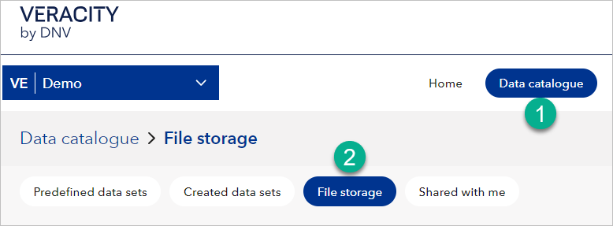
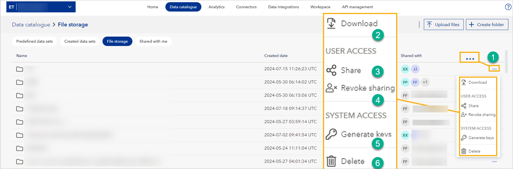

# File storage
In your [Data Catalogue](../datacatalogue.md), you can find a tab called **File storage** and use it for uploading, sharing, and accessing files. If you don't see it, you may not have the subscription for File storage, but you can contact the [support team](mailto:support@veracity.com) for assistance.

**If you want to access it via API**, see [File storage API endpoints in API docs](../apiendpoints.md).
Note you can [connect File storage with Azure Storage Explorer](ase.md).

## To go to File storage
1. In your workspace, go to the **Data catalogue** page.
2. Select the **File storage** tab.

<figure>
	
	<figcaption>Location of File Storage.</figcaption>
</figure>

## Folders
In File storage, you can use folders to organize files. If you are a workspace admin, you can create folders.

> **Note**  
> You cannot rename or move folders. However, you can delete them if you are a workspace admin.

To create a folder:
1. In the top right corner, select **Create folder**.
2. Name the folder.
3. Select **Save**.

## To upload files
1. In the top right corner, select **Upload files**. You can upload multiple files at once.
2. Select the coloured circle with the file icon and select the files from your computer. Alternatively, drag and drop files.
3. Select **Upload**.

## Access levels
When you share a file or folder, you assign access to recipients:

- **Read access** allows recipients to view and download the content.
- **Read and write access** allows recipients to modify content, and also generate SAS keys.
- **Only workspace admins** can generate SAS keys. If you give **read-only** access, the recipient will **not** be able to generate SAS keys.

SAS key creation by a recipient is **logged in the original sharer’s workspace** under **Activity log**.

> 🔒 If you share a folder with someone and they delete it, it will only be removed from **their** workspace. The original remains unaffected.

## Action menu in File storage
For each file, you can find the three dots in the row with the file and open the action menu (1). In the menu, you can:
* Download the file (2).
* Share the file (3). After sharing, the recipient will see the file in the Shared with me tab in Data catalogue.
* Revoke access (4) to the file.
* Generate SAS keys (5) for accessing files through external systems.
* As a file owner, delete (6) the files you uploaded.

<figure>
	

## To share files and folders
1. In a row with a file or folder to share, select three dots and then **Share**.
2. In the window that shows, under **Share access with**, add the email address of the person with whom you are sharing the file or folder.
	1. Optionally, to allow further sharing, tick the tickbox that reads "Allow recipients to share...".
	1. Optionally, add a **Note to recipient**.
3. Select the **Share** button.
  
> Shared files and folders show in the **Shared with me** tab in the Data catalogue.  
> If the recipient deletes the shared folder, it only disappears from their workspace; the original folder in your workspace remains unchanged.

Note:
- Recipients with **read access** cannot generate SAS keys.
- Recipients with **read and write access** can generate SAS keys, but cannot share the file or folder to another workspace.
- If workspace-to-workspace sharing is enabled, recipients in a different workspace may generate SAS keys with their own credentials — this is logged in your Activity log.

## To revoke access to shared files or folders
1. In a row with a file or folder you shared, select three dots and then **Revoke sharing**.
2. Next to the person whose access you're revoking, select the X icon.
3. Select the **Save and Close** button to complete the revoking.

You can revoke access at any time.

## To delete files and folders
If you are a workspace admin, you can delete files and folders. To do so:
1. In the row with the file or folder you want to delete, on the right, select three dots.
2. Select **Delete**.
3. In the window that shows, confirm by selecting **Delete**.

Note that deleting is permanent and cannot be undone.

## To download files and folders
If you are a workspace reader or admin, you can download files and folders. To do so:
1. In the row with the file or folder you want to download, on the right, select three dots.
2. Select **Download**.

## To generate a SAS token
If you are a workspace admin, you can generate access keys (SAS tokens) to files and folders and use them in external systems. To do so:
1. In the row with a file or folder you want to generate a SAS token for, on the right, select three dots.
2. Under **Set access level**, choose access level (read or read and write).
3. Under **Set access end**, choose a date from which this file or folder will no longer be accessible.
4. Select **Generate key** and a new field called **Access key** will show.
5. Select **Copy key**.

> 💡 **Best practices**:  
> - Only generate SAS tokens for users or systems that need external access.  
> - Use short expiration periods and the minimum required access level.  
> - Revoke tokens when they are no longer needed.

You can also revoke all SAS tokens at once using the **Revoke all SAS keys** option from the file/folder menu.

## Need Support?
If you need any support:
1. Visit [Help Center](https://help-center.veracity.com/en/collections/3824716-data-workbench) where you will find articles and video tutorials on Data Workbench.
2. Contact the [support team](mailto:support@veracity.com) for assistance.
