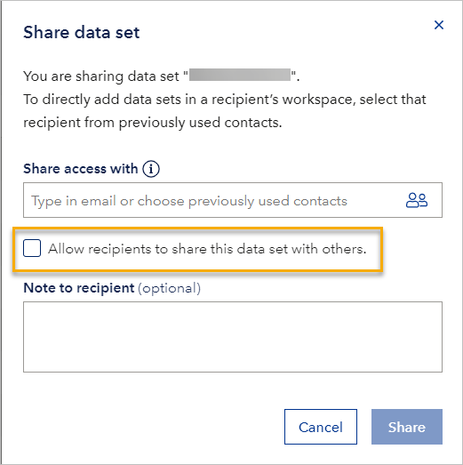

# April 2024 fourth release

Read this page to learn what has changed in Veracity Data Workbench with the fourth April 2024 release.

## New features
This section covers new features.

### Control resharing when sharing data sets with workspaces
Now, when sharing a data set with a workspace, you can decide if it can be further shared with other business partners. To allow resharing, tick the box next to **Allow recipients to share this data set with others**. 

However, if you want this data set to be only available to the workspace you shared it with, leave the box unticked.

<figure>
	
</figure>

Note that:
* Sharing data sets with business partners was introduced in [September 2023](releasesept23trd.md); since then, you could allow or disallow further data set sharing when sharing a data set with a user. Now, you can do the same when sharing a data set with a workspace. 
* If data set resharing was disallowed when the data set was shared, you can still make the data set available in the target workspace by using the API.