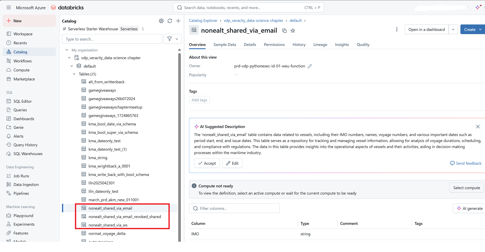

# Data Workbench April 2025 release
Read this page to learn what has changed in Veracity Data Workbench's April 2025 release.

## New features
This section covers new features.

### Added tags column
Now, in File storage, when you have a folder with validation enabled:
- In the **Tags** column, you can see the tags associated with the schema used for validating a folder.
- If you are a workspace admin, you can remove and add the tags by clicking on a tag and using the dialog window that shows.
<figure>
	
</figure>

### Added Validation information
You can select the three dots in the row with the folder's name to open **Validation information** that shows:
- What schema is used for validation.
- What tags are assigned to this folder.
- The description of the validation.

If you are a workspace admin, you can change the schema used for validation, edit its description, and add or remove the tags.
<figure>
	
</figure>

### Running Analytics on Shared Datasets

If the data you want access to from Analytics is not in the related Data Workbench workspace, but in another workspace in Veracity Data platform then sharing is recommended. Set up a share on workspace level from one Veracity workspace to another (B2B sharing). If Workspace B has analytics enabled and when sharing on workspace level from workspace A to Workspace B; data from workspace A is available in Databricks catalog.




### Writing Back Data From Databricks to Dataworkbench
We have released a Veracity Data Workbench Python SDK for integration between the Databricks workspace and the Data Workbench workspace. For this first release it provides a save method for creating datasets. The library is automatically installed on cluster startup. To write a pyspark DataFrame from a Notebook to the Data Catalogue, you can run the following in a notebook:

```python
from dataworkbench import DataCatalogue

df = spark.createDataFrame([("a", 1), ("b", 2), ("c", 3)], ["letter", "number"])

datacatalogue = DataCatalogue()
datacatalogue.save(
    df,
    "Dataset Name",
    "Description",
    tags={"environment": ["test"]}
)
```

For more details, see the [tutorial](https://developer.veracity.com/docs/section/dataplatform/analytics/analyticsdevelopment#synchronize-with-datasets-in-data-workbench) or the [library repository](https://github.com/veracity/DataWorkbench)

## Changes in existing features
This section covers changes in existing features.

### Schema version locking
Now, if you are a workspace admin, you can lock a schema version to prevent further edits.

- When you edit a schema in Data Catalogue > Schema Manager > Schemas, you can use the **Lock this version** button, which is under **Versions** on the left side.
- This button is only available if the schema has been created in the current workspace.
- When you select **Lock this version**, a confirmation prompt informs you that:
  - Once locked, the schema version cannot be edited.
  - All fields and buttons related to editing will be disabled.
  - You can still create a new schema version and make edits there.
- Locking a schema does not affect whether it is active or inactive.

<figure>
	
</figure>

### Validation rule dialog improvements
We have improved the UI for the **Create Validation Rule** and **Edit Validation Rule** dialogs to enhance usability.

- 'Data Type' is now a mandatory field.
- Input fields now dynamically adjust based on the selected data type.

