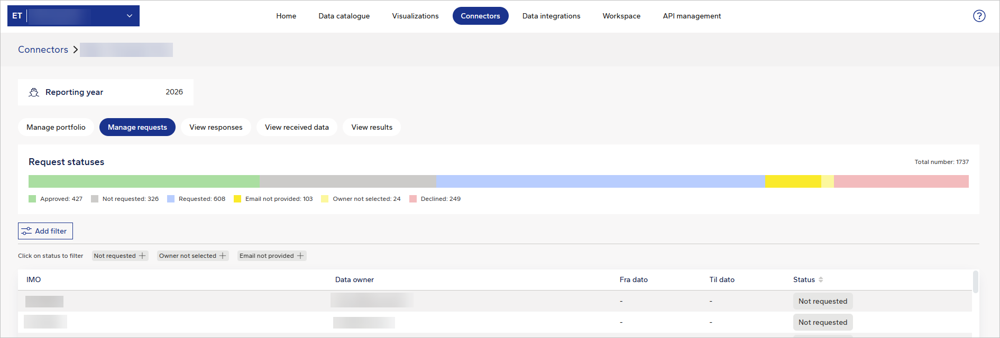

## Data Workbench Connectors, Security, and UI Improvements

This release introduces updates to request management, UI behaviour, and security across the Data Workbench.

## Requests dashboard: step-level management view
Now, on the Connectors page, when you open a connector of the RequestDataPartner type (in the **Services** section), a new dashboard is available in the Manage Requests and View responses views.
This dashboard allows you to monitor and manage requests.

<figure>
	
</figure>

## Requests dashboard: status count API
A new API endpoint has been introduced to provide the count of share requests by status within a workspace.

- Added endpoint: `workspaces/{workspaceId}/shareRequests/statusCount`
- Returns aggregated counts for:
  - Approved
  - Declined
  - Requested
  - Email not provided
  - Owner not selected (group-based count)
  - Not requested
  - Abandoned
- The total count excludes abandoned requests.

For details on this endpoint, check [API specification](https://docs.veracity.com/apis/platform/dataworkbenchv2) under section **ShareRequestsV2**.

## Connectors page: data quality feedback section expanded by default
The Connectors page has been updated to make relevant connectors more visible:
- The Data partners with data quality feedback loop section is now expanded when you open the Connectors page.
- You can immediately see connectors in this category without expanding the section manually.

## Security: removal of automapper dependency
An unused dependency has been removed from the web application.

- Removed automapper from the web codebase.
- Addressed findings identified in security scans.

## Request management: corrected Reader role behaviour
Issues related to Reader-role permissions in the request management view have been resolved.

- Previously:
  - Users with read-only access could see action buttons (for example: Provide email, Request data, Select data owner).
  - These users could interact with the UI elements.
  - The backend rejected the actions (HTTP 403), meaning the actions could not actually be completed.
- Now:
  - Action buttons and row-level actions are not visible for Reader users.
  - The UI no longer suggests that these actions are available to users without the required permissions.

## Data collection: UI improvements
We have introduced the following improvements in the Data collection UI:

- The blue default configuration line is now displayed above the grey source data.
- The end of the configuration line is clearly visible.
- Grey text is now centrally aligned.
- The second section loads only after selecting vessels and is removed when no vessels are selected.
- Dropdowns display full values without truncation.

## Schema management: validation fix in column search
An issue with validation when searching schema column names has been resolved.

## Security: backend and application improvements
Several security-related improvements have been applied across the application.

Updated security-related HTTP headers.
Addressed issues identified during security scans.
Improved input validation to strengthen request handling.
Resolved backend issues affecting application stability.

