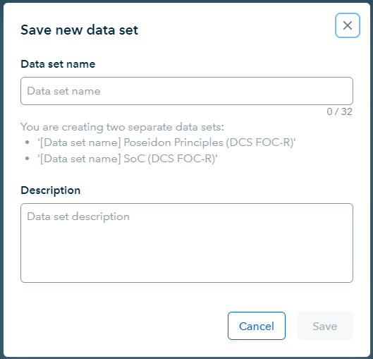
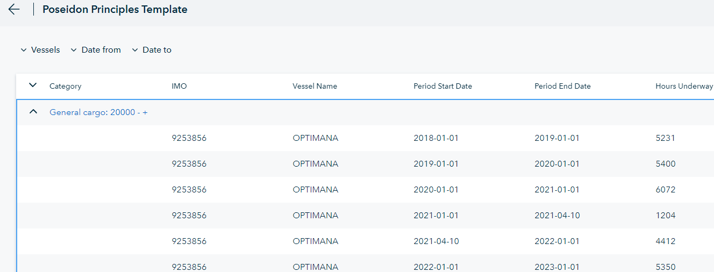
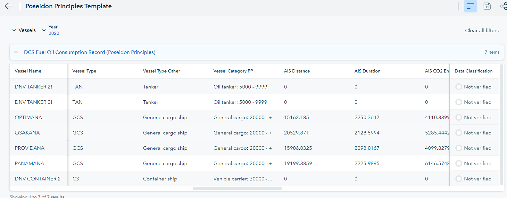
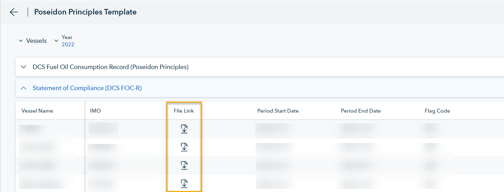

# August 2023 release

Release date: August 2023

Read this page to learn what has changed in Veracity Data Workbench with the August 2023 release. Most of the changes happened within the Poseidon Principles template page. To access it, sign in to your Data Workbench, and from the **Home Page**, select Poseidon Principles Template. 

## Changes in existing features
This section covers changes in existing features.

## See only the templates you can use
In preparation for new customer categories, we have made templates accessible only if you can use them (that is, you have access to their data source).

## Filter by year for Poseidon template page
Now, on the Poseidon Principles template page, you do not have to set the "from" and "to" date to see data for a year. Instead, you can pick a single year for which you want to see the data.

## Create data sets for DCS Period and Statement of Compliance for Poseidon
Now, for the Poseidon Principles template page, when you create data sets, two data sets are created. One is based on DCS Period Summary and the other on Statement of Compliance. The latter requieres having an MPP SoC Connector configured. If you do not have it, the data set based on Statement of Compliance will not be created. 

You can see which data sets are being created in the dialog window as shown below.

<figure>
	
</figure>

## Removed expanding / contracting for Poseidon Principles table
Previously, the Poseidon Principles table was expanding and contracting based on vessel category as shown below.
<figure>
	
</figure>

Now,the table is flat and looks like below.
<figure>
	
</figure>

## Added Statement of Compliance table in Poseidon
Now, the Poseidon Principles template page has a State of Compliance table that contains links to certificates for statement of compliance for fuel oil consumption reporting and operational carbon intensity rating. The image below shows the links for downloading the certificates.
<figure>
	
</figure>

## Show only verified data in DCS Period Summary in Poseidon
Now, on the Poseidon Principles template page in DCS Period Summary, we have added a filter that is automatically applied and uses the Data Classification column to show you only verified data.

## Technical changes for filterable columns
Now, you:
* Can deselect a column that can be filtered if there is no filter applied to the column.
* Can deselect a column after removing the filter you applied on it.
* Cannot apply a filter on a column if the column is deselected.
Also, we have added tooltips with explanations.