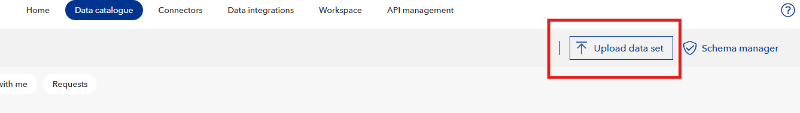
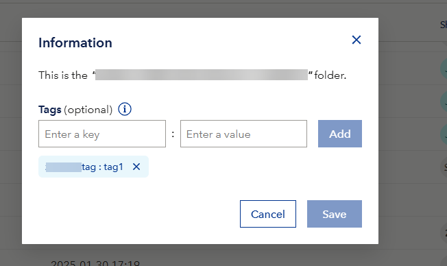
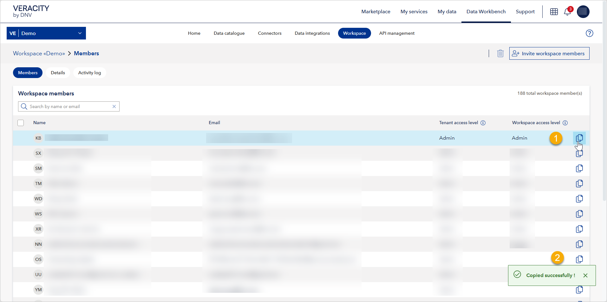

# August 2025 fourth release
Read this page to learn what has changed in Veracity Data Workbench with the August 2025 fourth release. 

## New features

### MFA for tenant management page
We've added an MFA (multi-factor authentication) check before you access the tenant management page. This means that you may need to use your second layer of authentication before you can load this page.

## Changes in existing features

### Enable Upload data set for workspaces with schema management subscription
Now, if a workspace has schema management subscription, its users will see the **Upload data set** button when they open **Data catalogue**.

<figure>
	
</figure>

## Bugs fixed

### Tags field not expanded
Files and folders with tags should show the tags field in an expanded view. This wasn't working consistently, but it's now fixed.

<figure>
	
</figure>

### Inconsistent behavior of the Copy email button
The **Copy email** button now works consistently across the tenant administration and workspace members pages: it copies the email and shows a confirmation message.

<figure>
	
</figure>
