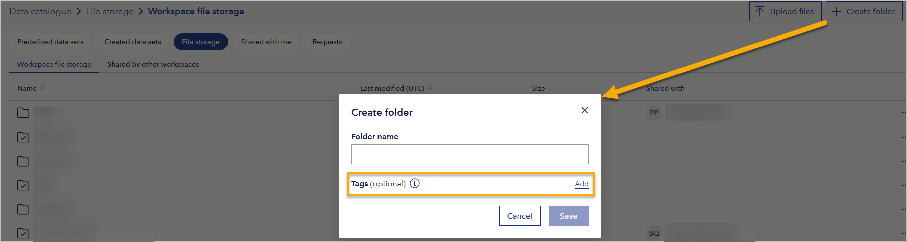
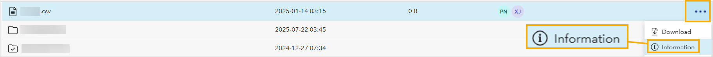
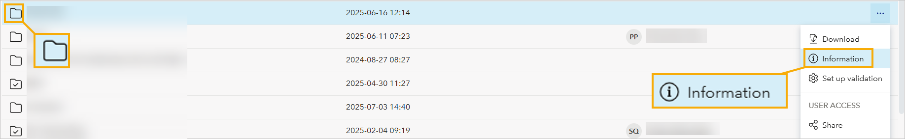
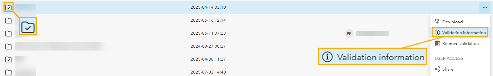
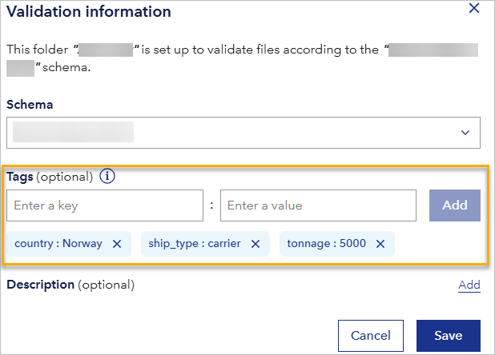

# August 2025 second release
Read this page to learn what has changed in Veracity Data Workbench with the August 2025 second release. 

## Add metadata to folders  
You can now add metadata as tags when creating folders in **File storage**: 
1. In the top right corner, select **Create folder**.
2. In the line with the **Tags** heading, select **Add**.
3. Add the tags.
4. Select **Save**.

<figure>
	
</figure>

Metadata (tags) makes it easier to identify and organize content.  

## Add metadata to files
To add metadata to a file:
1. In the line with the file, select the action menu (three dots).
2. Select **Information**.

<figure>
	
</figure>

3. In the **Tags** section, select **Add**.
4. Add the tags (metadata).
5. Select **Save**.

## Sort by Name or Last modified
You can now sort files by their **Name** or **Last modified** date by clicking on the column name.

## Hidden tags column  
We no longer show the **Tags** column in the **File storage** table. Tags are still available from the action menu for a file or folder when you select **Information** or **Validation information**. 

## Validation information dialog 
The action menu (three dots menu) now changes depending on the folder's validation status:  
- For folders without [validation](../datavalidator.md) enabled, the menu shows **Information**.
<figure>
	
</figure>

- For folders with [validation](../datavalidator.md) enabled, the menu shows **Validation information**.  
<figure>
	
</figure>

When opened, both **Information** and **Validation information** show metadata in the **Tags** section.

## View and change metadata
To see the metadata (tags), in the line with a folder or file, select the action menu (three dots) and then **Information** or **Validation information** and locate the **Tags** section.

If you are a workspace admin, you can also add new tags and remove them by selecting an X icon next to their names. If you are a reader, you can only view tags.

<figure>
	
</figure>

## Updated toast messages for tags  
We have refreshed some of the toast messages shown when you add or update tags to provide clearer feedback.