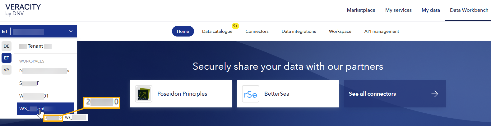
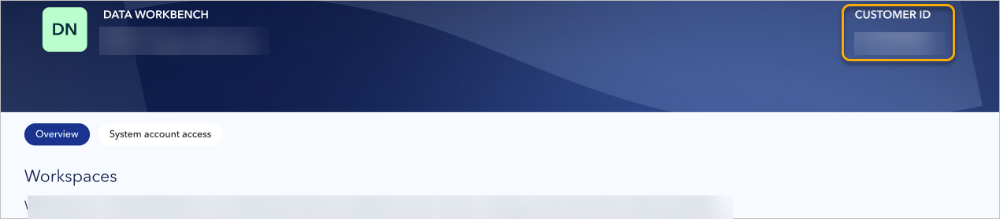
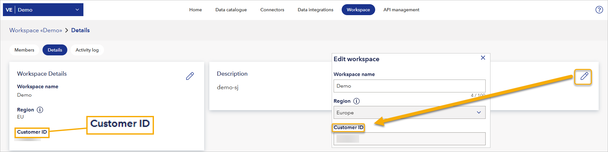
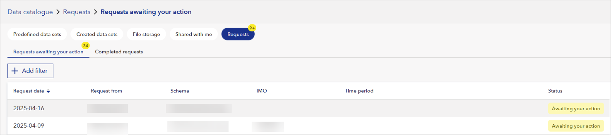

# August 2025 release
Read this page to learn what has changed in Veracity Data Workbench with the August 2025 third release. 

## Find your customer ID
In Data Workbench, the customer ID uniquely identifies your tenant and is the same across all workspaces in that tenant.

You can find the customer ID in several places:
- In the tenant picker, however over your workspace name.

<figure>
	
</figure>

- In the tenant picker, select **Administration page**, and locate the **Customer ID** in the right corner of the top banner.
<figure>
	
</figure>

- On the **Workspace** page, open the **Details** tab and check the number below **Customer ID**.
	- Alternatively, in the **Description** section, select the editing icon and read your **Customer ID** in the dialog that opens.

<figure>
	
</figure>

## Entire data request row clickable
In **Data Catalogue > Requests > Requests awaiting your action**, now you can click anywhere in the row with a request to share a data set to open the details of this request.

<figure>
	
</figure>