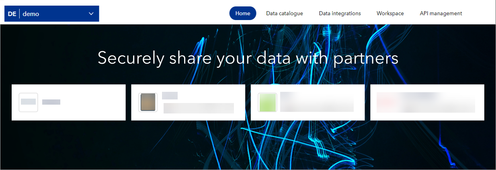

# February 2024 release

Read this page to learn what has changed in Veracity Data Workbench with the February 2024 release. This release is focused on Solution Partner, so the changes are related to from whom you get your data and how you can share your data with your trusted partners.

## New features
This section covers new features.

### See what connectors you're using
Now, on your workspace's Home page, below the navigation, you see the connectors you're using. In other words, you see from whom you are getting your data. You can select the connector tile to learn more about it.

If you need a connector configured in your workspace, request it from the Data Workbench team.

Below is an example.

<figure>

</figure>

### See connector banners
Now, when a template page is loaded, under the navigation menu, you see a banner for the connector you are using. You can close the banner if you want to. The banner shows some information about the connector and may link to its Marketplace page.

### Use connector template
Now, you can use template pages for connectors to share data sets more efficiently. In connector templates (Solution Partner templates), you can save and share data sets in bulk. You see a list of the data sets you're sharing and saving, and you can only share them with your verified contacts (users or workspaces) to avoid accidentally sharing data with people outside of your trust network.

### Info banner on connector template pages
Now, when you are on a page of a connector template, there is an informational banner at the top that explains what a connector template page is and how you can use it.

## Changes in existing features
This section covers changes in existing features.

### Longer data set names
We have increased the maximum length of a data set name from 64 to 128 characters.

## Exceptions for the Poseidon and SCC templates
The following changes don't apply to Poseidon and SCC templates:
* There are no verified contacts when you share data sets, and you can share the data sets with any Data Workbench user or workspace.

