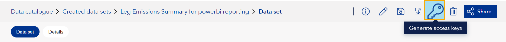

# February 2025 fourth release
Read this page to learn what has changed in Veracity Data Workbench with the fourth February 2025 release.

## New features
This section covers new features.

### Generate read-only SAS token for Uploaded data sets
Tenant and workspace admins can now generate read-only SAS tokens for Uploaded data sets. This allows controlled access to data for external users or applications. Note that you cannot generate SAS tokens for shared or derived data sets.

To generate a SAS token, call the `https://api.veracity.com/veracity/dw/gateway/api/v1/workspaces/{workspaceId}/datasets/{datasetsId}/sas?expiresOn=UTCtime` endpoint with the GET method. 

The `expiresOn` parameter should be in the format `2024-12-14T23:59:59.000Z`. The API will return a SAS token string.

### Generate access keys button for Uploaded data sets
Workspace admins can now generate read-only SAS tokens for all Uploaded data sets directly from the Data Catalogue. To do so:
1. Go to Data catalogue > Created data sets.
1. Open a data set.
1. In the top right corner, select the **Generate access keys** icon.

<figure>
	
</figure>

### Access Databricks from Data Workbench
If Databricks is enabled for your workspace, you will see the **Analytics** page in the top navigation menu. To be redirected to your Databricks, open the Analytics page and click the button labeled **Launch Databricks workspace**.

### Improved share button visibility
The "Share" button is now more visible in the UI and consistently positioned  on the right side of the actions for data set details and shared data set details pages.

### Adjusted shared with dialog submit button
The 'Shared with' dialog's submit button now adapts its text based on the sharing context, with a 'Close' button replacing it for view-only options

## Changes in existing features

### Deprecated and new SAS token endpoints
We have deprecated the following version 1 endpoint for SAS token generation:
* `POST https://api.veracity.com/veracity/dw/gateway/api/v1/workspaces/{workspaceId}/storages/sas`
Note that this endpoints still works but we recommend using its version 2.

Now, use version 2 endpoints for SAS token generation:
* To generate a SAS token for internal storage without connection settings, call the `https://api.veracity.com/veracity/dw/gateway/api/v2/workspaces/{workspaceId}/storages/sas` endpoint with the POST method.
* To generate a SAS token for external storage with connection settings, call the `https://api.veracity.com/veracity/dw/gateway/api/v2/workspaces/{workspaceId}/storages/external/sas` endpoint with the POST method.

Note that:
* The `https://api.veracity.com/veracity/dw/gateway/api/v2/workspaces/{workspaceId}/shares/{shareId}/storages/sas` endpoint, called with the GET method, has a different return type compared to Version 1.
* You can check [what is internal and external storage in this document](https://developer.veracity.com/docs/section/dataplatform/storage/files).

## Bug fixes

### Corrected file/folder sharing toast message
The success toast message when sharing a folder from File Storage now accurately states that a folder has been shared, not a file.

### Corrected revoke access toast message
The toast message that shows when revoking access to a folder or file from File Storage now correctly refers to the folder or file, not a data set.