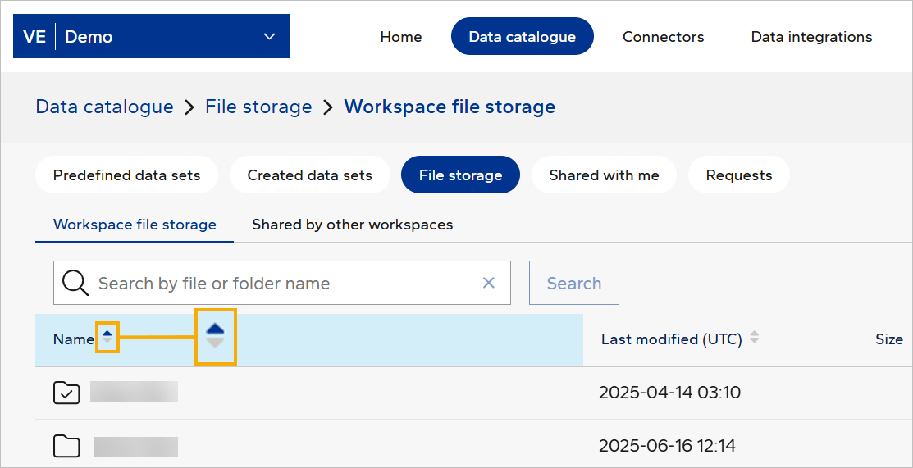

# February 2026 second release
Read this page to learn what has changed in Veracity Data Workbench with the February 2026 second release.

## New Features
This section covers new features.

### Search by file and folder name in File Storage
Now, in Data catalogue > File storage, you can use the search bar to find the file or folder you need.

<figure>
	
</figure>

**Note:** Depending on your file structure, you might not see the search bar. This typically occurs if your file structure is simple and you have few files.

### Filter by file and folder name in File Storage
In Data catalogue > File storage, you can filter files and folders by their names. To do so, click the header of the **Name** column.

<figure>
	
</figure>

## Changes in Existing Features
This section covers changes in existing features.

### Email templates update
We have updated the name 'Data Workbench' to 'Veracity Data Workbench' in three email templates. The affected templates are:
* Request for data sharing
* Workspace member invitation
* Tenant member invitation