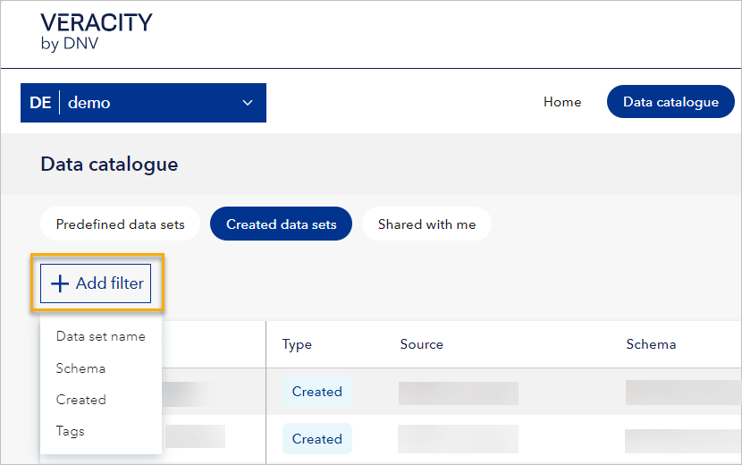

# January 2024 release

Read this page to learn what has changed in Veracity Data Workbench with the January 2024 release.

## New features
This section covers new features.

### New filters in Data catalogue

Now, in the Data catalogue tab, you can select the **Add filter** button and add the following filters:
* **Data set name**. This is a free text partial match and is case insensitive. This means that you can write just a part of the name of the data set, and you don't need to think whether it is in capital or small letters, and you will get the data set you are looking for.
* **Schema**. You can use text search to find the schema(s) you want to filter by or select them from the list.
* **Created** meaning filter by the time the data set was created. Optionally, you can add start and end dates.
* **Tags** meaning the data set key (search with text), and after finding and selecting a matching key, you can select the value you want to filter by. 

Note that:
* In the **Predefined data sets** tab, you can use the **Data set name** and **Schema** filter.
* In the **Created data sets** tab, you can use all the filters.
* In the **Shared with me** tab, there is no 'Add filter' button.

<figure>
	
</figure>