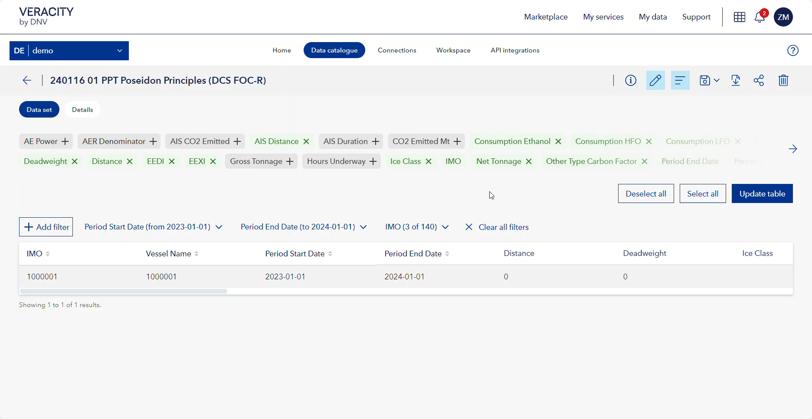

# January 2024 release

Read this page to learn what has changed in Veracity Data Workbench with the January 2024 second release.

## Changes in existing features
This section covers changes in existing features.

### Share and save data sets in one window
Previously, when you wanted to modify and share a data set, you had to save it as a new data set and then use the sharing option. Now, you can modify a data set, select the **Share** button, and do everything in one window. 

Note that this change does not affect sharing templates (we are not changing this flow). 

When you modify a data set and select the share button:
* In **Data set name**, you name the new (modified) data set you create.
* In **Share access with**, you select with whom you want to share the data set.
* If you tick the box saying 'Allow recipients to share this data set with others', they can reshare the data set.
* Optionally, you can add **tags** to the data set.
* Optionally, you can add a **description** to the data set.
* Optionally, you can add a **Note to recipient**. This message will be sent together with the link to the shared data set.

To save your new data set and share it, select the **Save and share** button.

#### See how to save and share a new data set
Click on the image below to play the video.

