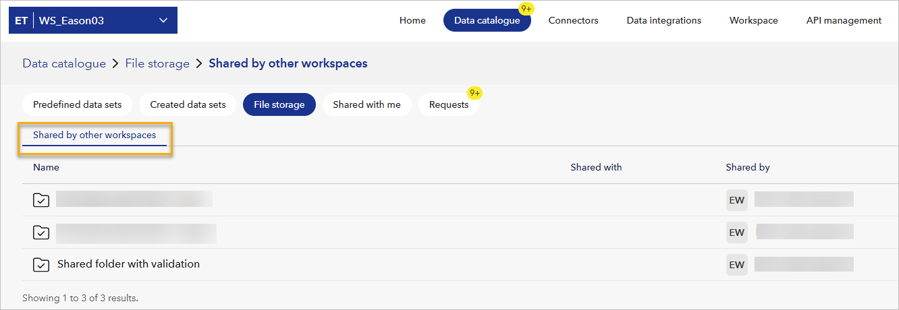

# July 2025 second release
Read this page to learn what has changed in Veracity Data Workbench with the July 2025 second release. 

## New features 

### Run validations on shared folders between workspaces
Data Validator now works with File storage folders that have been shared with your workspace by other workspaces within the same tenant. You will see them in File storage in the **Shared by other workspaces** tab.

<figure>
	
</figure>

This means you can:
- Upload files into a shared input folder from another workspace.
- Automatically detect the output folder and validation schema based on internal configuration.
- Use validation just like on your own workspace's folders even though the input and output folders belong to a different workspace.

This opens the door for:
- Cross-team collaboration where one team manages schemas and validation rules.
- Centralized validation for external data pipelines.
- Seamless integration across teams using shared folders.

**Note that** for validation to work, the input and output folders must both be shared with your workspace.

### Visual indicators for validation-enabled shared folders
Folders shared with your workspace now clearly show if they are configured for validation by having a **check mark icon** in all folders and subfolders that have validation enabled.

In addition to the check mark icon, you'll also see a **Validation information** option after selecting the three dots in the row with the folder.
This opens a read-only dialog showing the schema, tags, and description used for validation to help you confirm the folder's validation setup.

### Better upload experience with real-time feedback
When you upload files to a shared input folder:
- Data Workbench automatically checks whether validation is enabled and where the output will go.
- You'll see toast messages confirming validation has started or finished.
- After the upload completes, you can view the output result or download the validation summary from the output folder just like you would when using a folder in your own workspace.

This lets you confidently upload to shared folders and understand what happens next.

## Changes in existing features

### Configuration metadata now available in shared folder details
If a shared folder is used for validation, its metadata now includes:
- `validatorConfiguration` (if present).
- Schema ID, name, tags, and folder paths.

## Bug fixes

### Subfolders no longer return misleading validation metadata
Validation configuration is now only returned for:
- The **parent** folder that was explicitly set up for validation.
- The **input** subfolder.
- The **output** subfolder.

All other subfolders will not show validation metadata, preventing confusion in nested folder structures.