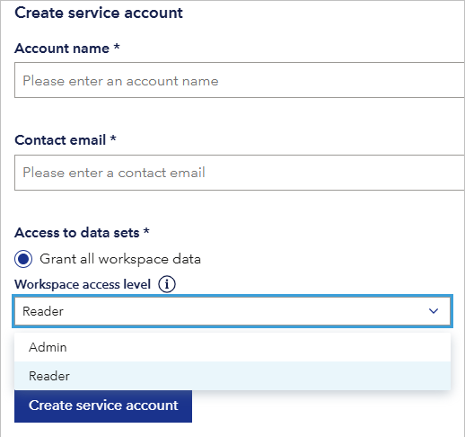

# July 2025 third release
Read this page to learn what has changed in Veracity Data Workbench with the July 2025 third release. 

## New features

### Choose Admin or Reader access when creating a service account
Now, when you create a service account granting it access to all workspace data, you must choose whether it should have **Admin** or **Reader** access to this data.

<figure>
	
</figure>

### View and change access level for service accounts
When you **edit** a service account that has full workspace access:
  - You can **view and change** the **Workspace Access Level** (Reader or Admin) under **Access to data sets**
  - If you switch to **Select data sets manually**, the role will automatically change to **Guest**, and the dropdown will be hidden.

### Access level for existing accounts
All existing service accounts have been automatically assigned the Reader access level to maintain compatibility.

## Workspace access level
The access level defines what the service account can do in the workspace.
- **Guest** – Assigned automatically when "Select data sets manually" is chosen. Guest accounts can only access the specific data sets shared with them. They cannot perform actions that require workspace-level or tenant-level permissions. Calls to such endpoints will return a `403 Forbidden` error.
- **Reader** – View-only access to the workspace. The service account can read data but cannot invite users, connect services, or modify any content or settings.
- **Admin** – Full access to manage the workspace. The service account can create and modify data sets and files, invite users, manage permissions, and adjust all settings and content.
