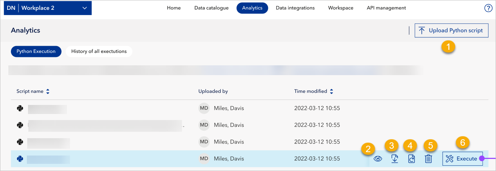

# June 2024 release

Read this page to learn what has changed in Veracity Data Workbench with the June 2024 release. 

This release adds the **Analytics page** and lets you upload Python scripts to analyze your data sets. However, if you don't see the Analytics page in your workspace, it means it's not included in your subscription.

## New features
This section covers new features.

### Analytics page
We have added a new page called "Analytics". 

If you are a workspace admin, you can:
* Upload Python scripts and use them to analyze your data sets (1).
* See scripts (2).
* Download scripts (3).
* Reupload scripts (4).
* Delete scripts (5).
* Execute scripts (6).

<figure>

</figure>

Also, in the **History of all executions tab**, you can see all previous executions.

However, if you have only reader access to this page, you can:
* See scripts.
* Download scripts.

### Improved navigation with breadcrumbs
We have added breadcrumbs in many parts of the UI to improve navigation.