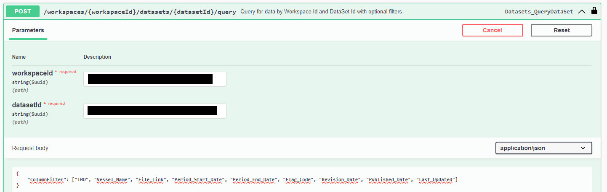

# June 2024 third release

Read this page to learn what has changed in Veracity Data Workbench with the June 2024 third release.

## New features
This section covers new features.

### Download SoC from a data set
We have added an endpoint for downloading Statement of Compliance (SoC) PDF file based on workspaceId, datasetId, and documentId.

To dowload SoC, call the following endpoint using your [workspaceID](https://developer.veracity.com/docs/section/dataworkbench/apiendpoints#workspace-id), [datasetID](https://developer.veracity.com/docs/section/dataworkbench/apiendpoints#data-sets-endpoints) (see Data set endpoints), and documentID.
`https://api.veracity.com/veracity/dw/gateway/api/v2/workspaces/{workspaceId}/datasets/documents/download`

To get documentID, call the `https://api.veracity.com/veracity/dw/gateway/api/v2/workspaces/{workspaceId}/datasets/{datasetId}/query` endpoint. 
<figure>
	
</figure>
