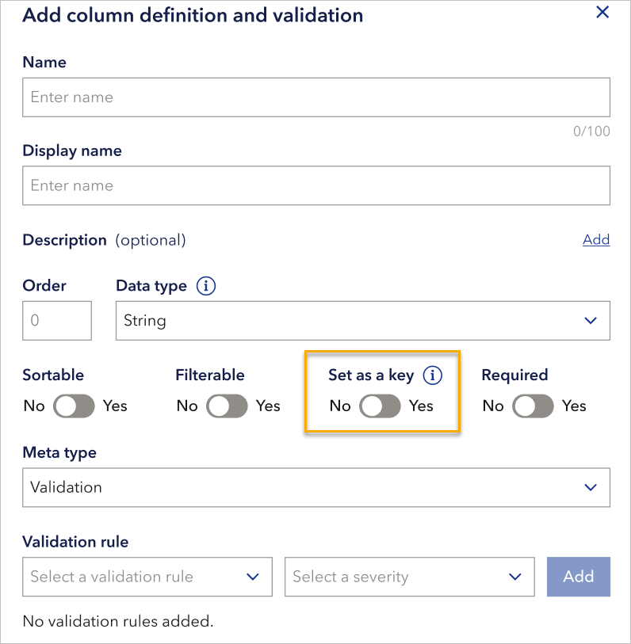

# June 2025 release
Read this page to learn what has changed in Veracity Data Workbench with the June 2025 release.

These improvements make schema management clearer, improve accuracy when ordering data, and fix usability issues in data sharing and tagging.

## New features

### Set key columns for schemas
When creating or editing a schema column, you can now define a **key column** directly in the dialog. This makes it easier to indicate which column uniquely identifies rows and allows support for row-level updates and deletions.

You can:
- Set a column as a key when creating or editing it with the **Set as a key** toggle.
- See key indicators in both edit and reader views.
- View the key status in the list of schema columns.

<figure>
	
</figure>

### Improved tooltip and data type dropdowns
The schema and validation rule dialogs now display clearer tooltips for data types. This helps explain the differences and improve usability when setting rules or editing schema columns.

## Bugs fixed

### Incorrect time added to end date in data orders
Previously, when users ordered data from GPM, the end date unintentionally included a time component set to the current time. This led to inconsistent results. Now, the date is sent without an unexpected time value, ensuring the interval matches what the user selected.

### Error when re-sharing already shared files
A visual issue in the sharing dialog caused the system to attempt to re-share files that were already shared, resulting in errors. The UI now correctly prevents this action by disabling the “Share” option when the file has already been shared with the same user.

### Unnecessary tag dialog shown with no hidden tags
Previously, a tag dialog was unnecessarily shown even when there were no hidden tags. This has been corrected. The dialog is now only shown when hidden tags are available, improving the experience when managing tags in the UI.