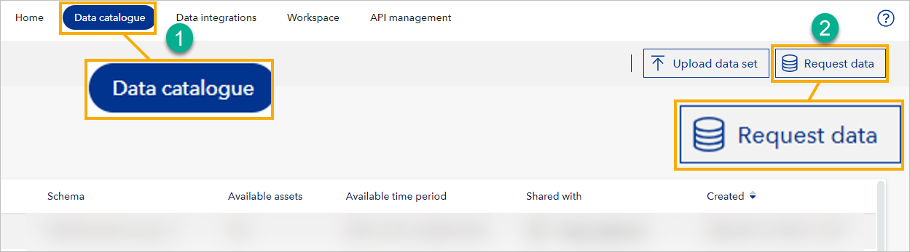

# March 2024 release

Release date: March 2024

Read this page to learn what has changed in Veracity Data Workbench with the March 2024 release.

## New features
This section covers new features.

### Request data from UI
Now, as a workspace admin, you can ask a data provider to share a data set with your workspace. A data provider has stored large amounts of data, such as time series data (IoT) for solar plants, and they can share a subset of this data with you.

<figure>
	
</figure>

To request that a data provider shares a data set with you:
1. In Data Workbench UI, go to **Data catalogue**.
2. In the upper right corner, select **Request data**. 
3. In the window that shows, under **Data set name**, enter a name for the data set you want to create. 
4. Under **Data provider**, select one data provider from the providers subscribed to your Data Workbench.
5. Fill in other fields in the form. 
7. Consider ticking **Run Python execution analytics** and and selecting a script; this will transform the data you receive, giving it more contextualization and thus increasing its quality and relevance.
6. To send your data request, select **Request** 

Your data request will be processed, and when it's complete, you will see your new data set with the requested data in your workspace's **Data Catalogue** in the **Created data sets** subtab.

For detailed help on the fields in the form, [see documentation for how to request sharing a data set](../datacatalogue.md).